# Lumina Agentic AI & MCP Architecture

[](https://python.org)
[](https://github.com/langchain-ai/langgraph)
[](https://modelcontextprotocol.io)
[]()
[]()

This document provides a complete, implementation-level reference for Lumina's **multi-agent AI pipeline** (`agentic_ai/`) and **standalone MCP server** (`mcp_server/`). It covers architecture, data flow, state management, tool routing, configuration, deployment, and extension points.

---

## Table of Contents

- [System Overview](#system-overview)
- [Design Philosophy](#design-philosophy)
- [High-Level Architecture](#high-level-architecture)
- [Pipeline Architecture](#pipeline-architecture)
  - [Assembly Line Flow](#assembly-line-flow)
  - [LangGraph State Machine](#langgraph-state-machine)
  - [Conditional Routing & Retry Logic](#conditional-routing--retry-logic)
- [Agent Deep Dive](#agent-deep-dive)
  - [Planner Agent](#1-planner-agent)
  - [Researcher Agent](#2-researcher-agent)
  - [Analyzer Agent](#3-analyzer-agent)
  - [Synthesizer Agent](#4-synthesizer-agent)
  - [Validator Agent](#5-validator-agent)
  - [Executor Agent](#6-executor-agent)
  - [Reviewer Agent](#7-reviewer-agent)
- [State Management](#state-management)
  - [PipelineState Schema](#pipelinestate-schema)
  - [AgentState Lifecycle](#agentstate-lifecycle)
  - [Message History](#message-history)
- [MCP Server Architecture](#mcp-server-architecture)
  - [Protocol Overview](#protocol-overview)
  - [Server Components](#server-components)
  - [Tool Registry](#tool-registry)
  - [Resource System](#resource-system)
  - [Prompt Library](#prompt-library)
  - [Middleware Chain](#middleware-chain)
  - [Transport Layer](#transport-layer)
- [MCP Client Integration](#mcp-client-integration)
  - [Connection Modes](#connection-modes)
  - [Per-Agent Tool Mapping](#per-agent-tool-mapping)
  - [Tool Adapter Pattern](#tool-adapter-pattern)
  - [Intelligent Tool Routing](#intelligent-tool-routing)
- [Complete Tool Catalog](#complete-tool-catalog)
- [Configuration Reference](#configuration-reference)
  - [Pipeline Configuration](#pipeline-configuration)
  - [MCP Server Configuration](#mcp-server-configuration)
  - [Environment Variables](#environment-variables)
- [Monitoring & Observability](#monitoring--observability)
- [Deployment](#deployment)
  - [Local Development](#local-development)
  - [Docker Deployment](#docker-deployment)
  - [Cloud Deployment](#cloud-deployment)
- [Extension Guide](#extension-guide)
  - [Adding a New Agent](#adding-a-new-agent)
  - [Adding a New MCP Tool](#adding-a-new-mcp-tool)
  - [Custom Tool Routing Rules](#custom-tool-routing-rules)
- [Security Model](#security-model)
- [Error Handling & Recovery](#error-handling--recovery)
- [Performance Characteristics](#performance-characteristics)

---

## System Overview

Lumina's agentic subsystem consists of two packages that work together:

| Package | Language | Purpose | Key Technology |
|---------|----------|---------|----------------|
| `agentic_ai/` | Python | Multi-agent pipeline that plans, researches, analyzes, executes, and reviews complex tasks | LangGraph, LangChain |
| `mcp_server/` | Python | Standalone tool server exposing 32 tools, 7 resources, and 6 prompts via Model Context Protocol | MCP SDK, asyncio |

The pipeline is a **consumer** of the MCP server. Through an in-process MCP client, every pipeline agent has access to real tools — file I/O, code search, web fetching, Git operations, knowledge-base queries — rather than relying solely on LLM reasoning.

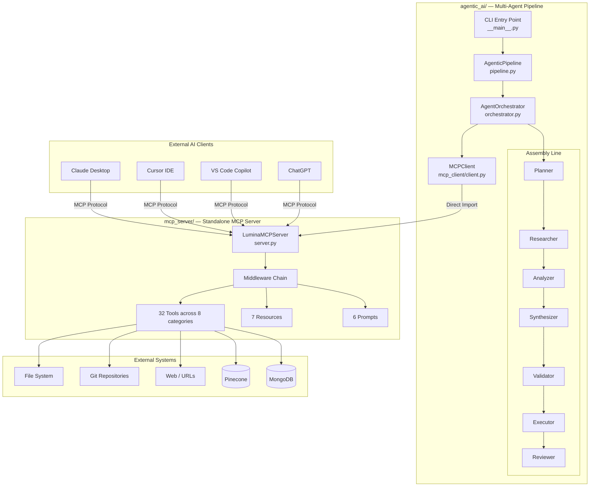

---

## Design Philosophy

| Principle | Implementation |
|-----------|---------------|
| **Assembly Line** | Agents execute in a fixed order, each receiving and enriching a shared state object |
| **Config-Driven** | All behavior is controlled through YAML files, not hardcoded values |
| **Tool-Augmented** | Agents call real tools (via MCP) rather than hallucinating capabilities |
| **Fail-Safe** | Validation gates with automatic retry loops prevent low-quality output from propagating |
| **Protocol-Standard** | MCP compliance means any compatible client can use Lumina's tools without custom integration |
| **Separation of Concerns** | The MCP server is a standalone, independently deployable package |

---

## High-Level Architecture

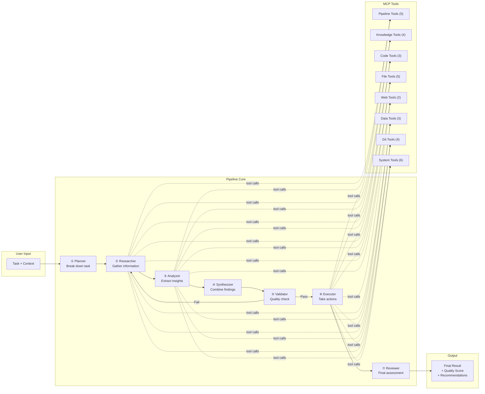

---

## Pipeline Architecture

### Assembly Line Flow

The pipeline uses LangGraph's `StateGraph` to define a directed graph of agent nodes. Each agent receives the full `PipelineState`, enriches it, and passes it forward.

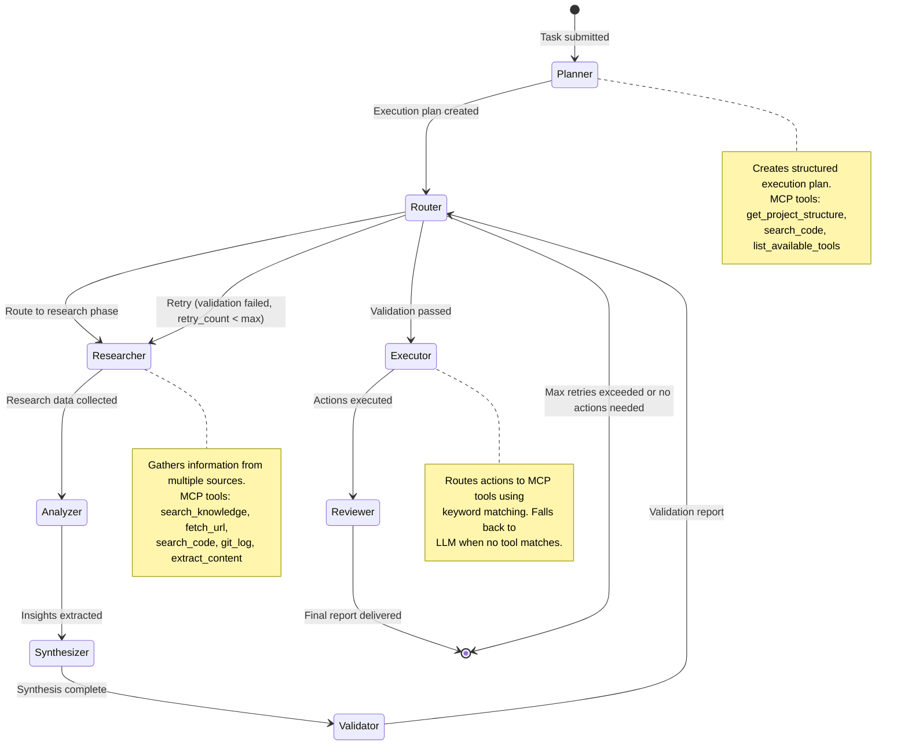

### LangGraph State Machine

The orchestrator builds a compiled `StateGraph` with explicit edges:

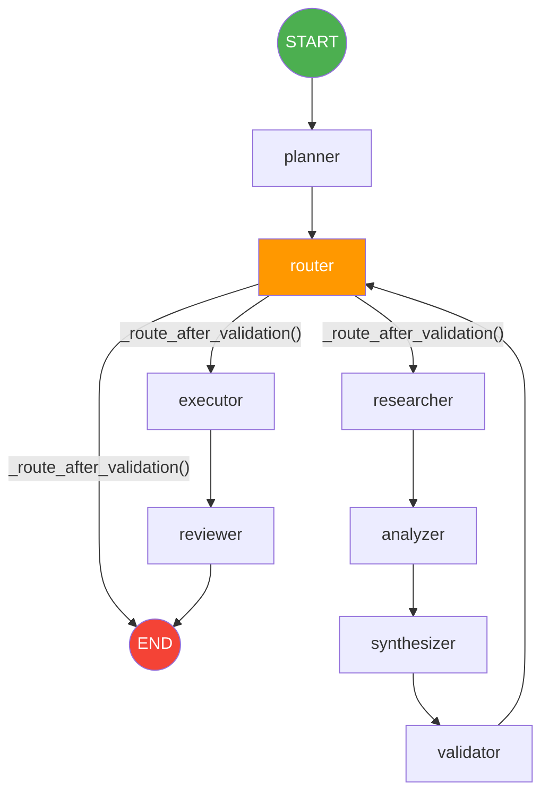

**Graph construction** (from `orchestrator.py`):

```python
graph = StateGraph(PipelineState)

# Add 7 agent nodes + 1 router
graph.add_node("planner", self._create_agent_node("planner"))
graph.add_node("researcher", self._create_agent_node("researcher"))
graph.add_node("analyzer", self._create_agent_node("analyzer"))
graph.add_node("synthesizer", self._create_agent_node("synthesizer"))
graph.add_node("validator", self._create_agent_node("validator"))
graph.add_node("executor", self._create_agent_node("executor"))
graph.add_node("reviewer", self._create_agent_node("reviewer"))
graph.add_node("router", self._router)

graph.set_entry_point("planner")

# Linear assembly line edges
graph.add_edge("planner", "router")
graph.add_edge("researcher", "analyzer")
graph.add_edge("analyzer", "synthesizer")
graph.add_edge("synthesizer", "validator")
graph.add_edge("validator", "router")
graph.add_edge("executor", "reviewer")
graph.add_edge("reviewer", END)

# Conditional routing from router node
graph.add_conditional_edges("router", self._route_after_validation, {
    "researcher": "researcher",
    "executor": "executor",
    "end": END,
})
```

### Conditional Routing & Retry Logic

The `_route_after_validation()` method implements a quality gate:

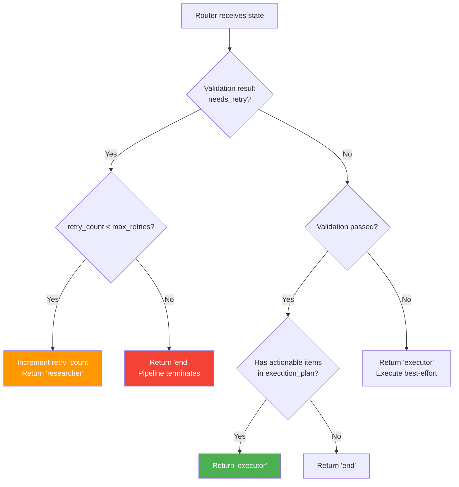

The retry loop sends the pipeline back to the **Researcher** stage, not just the Validator, ensuring fresh data is gathered before re-analysis.

---

## Agent Deep Dive

All agents extend `BaseAgent(ABC)` which provides:

- `execute(state: PipelineState) -> PipelineState` — the main entry point
- Shared LLM instance injection
- Tool list injection (including MCP tools)
- Structured logging

### 1. Planner Agent

**File:** `agents/planner.py`
**Purpose:** Analyze the incoming task and produce a structured execution plan.

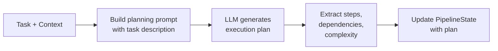

**MCP Tools Available:** `get_project_structure`, `search_code`, `read_file`, `list_available_tools`, `health_check`

**Output:** Structured plan with numbered steps, agent sequence, and estimated complexity.

### 2. Researcher Agent

**File:** `agents/researcher.py`
**Purpose:** Gather information from multiple sources using MCP tools and LLM reasoning.

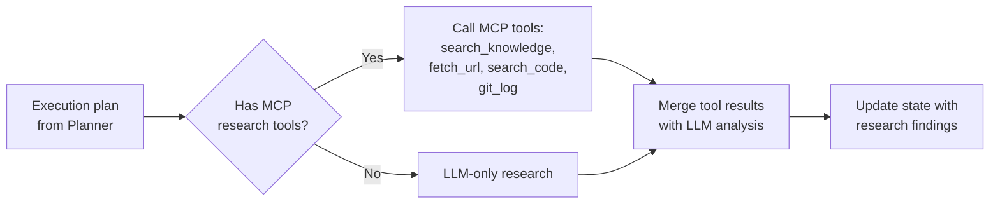

**MCP Tools Available:** `search_knowledge`, `search_code`, `read_file`, `fetch_url`, `extract_content`, `list_directory`, `search_files`, `get_project_structure`, `git_log`

The researcher uses `_use_research_tools()` to intelligently select which MCP tools to call based on the task context. It builds tool-specific arguments (e.g., extracting search queries from task descriptions) and merges tool results with LLM analysis.

### 3. Analyzer Agent

**File:** `agents/analyzer.py`
**Purpose:** Analyze research data and extract actionable insights.

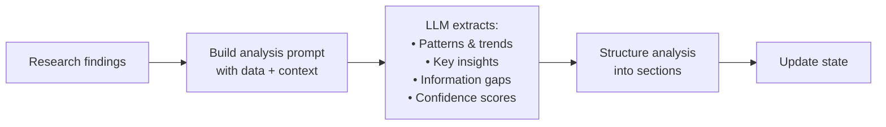

**MCP Tools Available:** `analyze_file`, `search_code`, `read_file`, `parse_csv`, `parse_json`, `transform_data`

**Output:** Structured analysis with sections, insights array, confidence score (0.0–1.0), and identified gaps.

### 4. Synthesizer Agent

**File:** `agents/synthesizer.py`
**Purpose:** Combine all information from previous agents into a coherent synthesis.

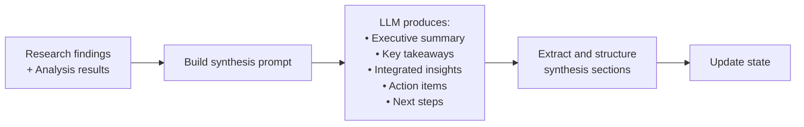

**MCP Tools Available:** `search_knowledge`, `read_file`, `fetch_url`

**Output:** Summary, takeaways list, integrated insights, actionable items, and recommended next steps.

### 5. Validator Agent

**File:** `agents/validator.py`
**Purpose:** Quality gate that determines if the pipeline output meets standards.

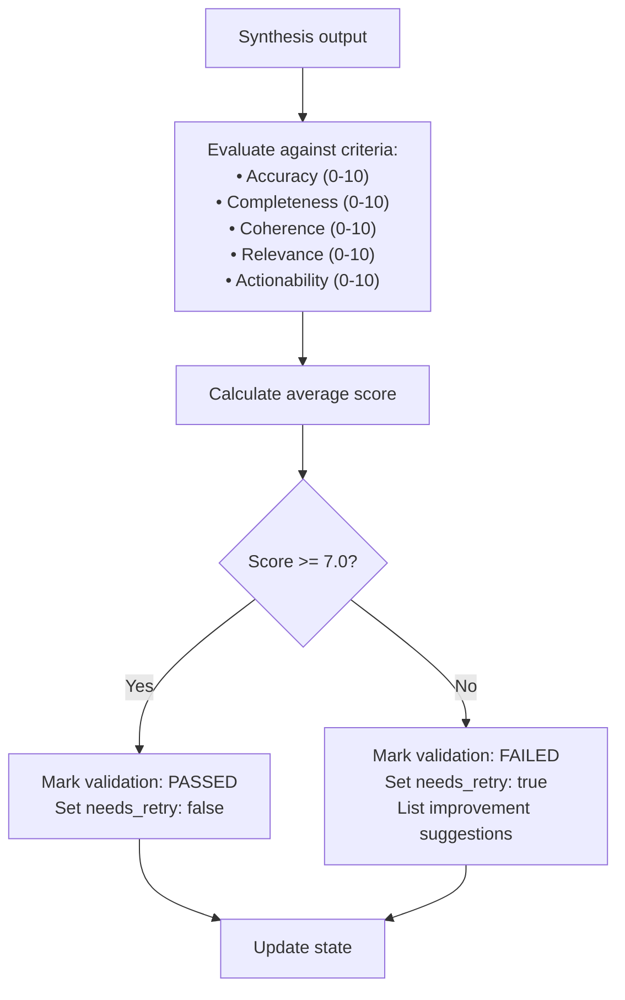

**MCP Tools Available:** `search_code`, `read_file`, `analyze_file`, `environment_check`

**Output:** Validation report with per-criteria scores, pass/fail flag, issues list, and improvement suggestions. Triggers retry loop on failure.

### 6. Executor Agent

**File:** `agents/executor.py`
**Purpose:** Execute concrete actions using MCP tools, with LLM fallback.

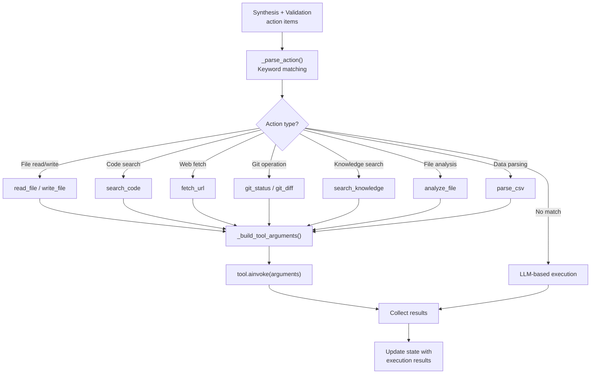

**Keyword-to-Tool Routing Table:**

| Keywords in Action | MCP Tool Invoked |
|-------------------|------------------|
| `read`, `open`, `view`, `inspect` + `file`, `document` | `read_file` |
| `write`, `save`, `create`, `output` + `file` | `write_file` |
| `search`, `find`, `grep` + `code` | `search_code` |
| `fetch`, `download`, `http`, `url`, `web` | `fetch_url` |
| `git`, `commit`, `diff`, `status` | `git_status` |
| `knowledge`, `rag`, `knowledge base` | `search_knowledge` |
| `analyse`, `analyze` + `file` | `analyze_file` |
| `csv`, `data`, `parse` | `parse_csv` |
| *(no match)* | LLM-based reasoning |

### 7. Reviewer Agent

**File:** `agents/reviewer.py`
**Purpose:** Final quality assessment and report generation.

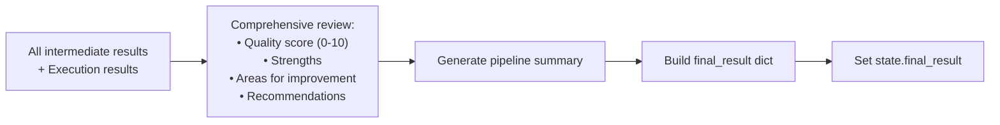

**MCP Tools Available:** `read_file`, `git_diff`, `git_log`, `search_code`, `analyze_file`, `get_server_metrics`

**Output:** The `final_result` dictionary containing summary, quality score, strengths, improvements, recommendations, and a pipeline execution summary.

---

## State Management

### PipelineState Schema

The pipeline uses LangGraph's `TypedDict` state with the `Annotated[List, operator.add]` pattern for message accumulation:

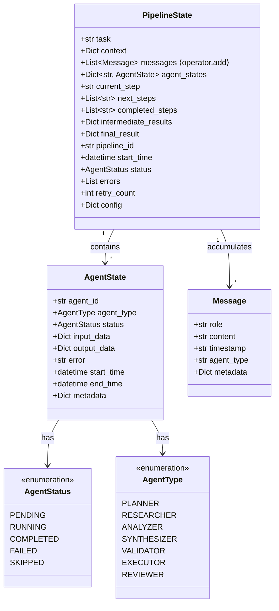

### AgentState Lifecycle

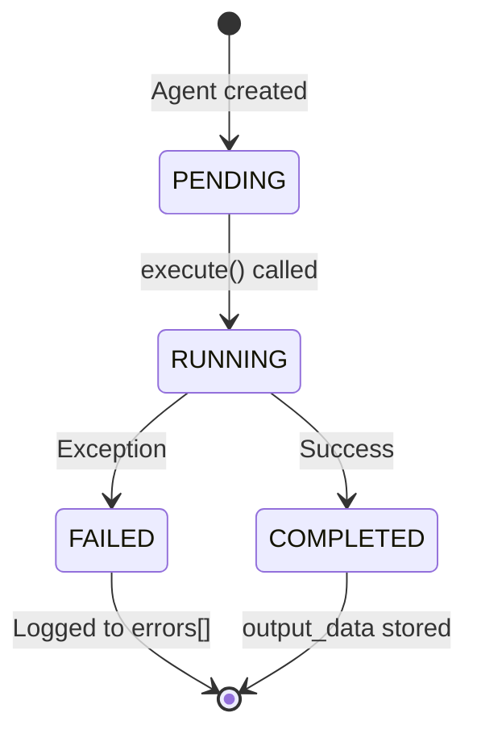

### Message History

Messages accumulate across agents using LangGraph's `operator.add` annotation. Each agent appends messages with its agent type, creating a full audit trail:

```python
# Message accumulation pattern
messages: Annotated[List[Message], operator.add]

# Each agent adds messages like:
message = Message(
    role="assistant",
    content="Research findings: ...",
    timestamp=datetime.utcnow().isoformat(),
    agent_type="researcher",
    metadata={"tools_used": ["search_knowledge", "fetch_url"]}
)
```

---

## MCP Server Architecture

### Protocol Overview

The MCP server implements the [Model Context Protocol](https://modelcontextprotocol.io) — an open standard that provides a uniform interface for AI applications to discover and invoke tools, read resources, and use prompt templates.

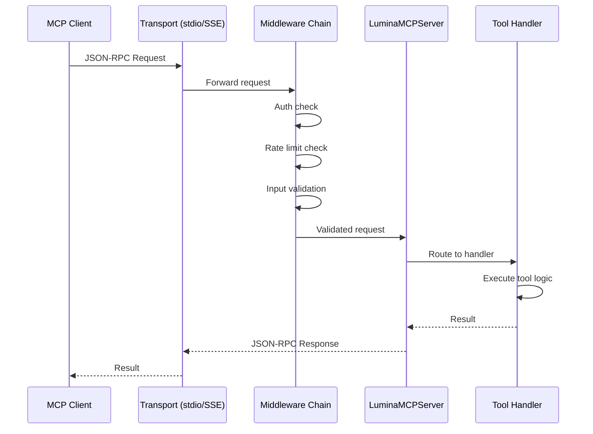

### Server Components

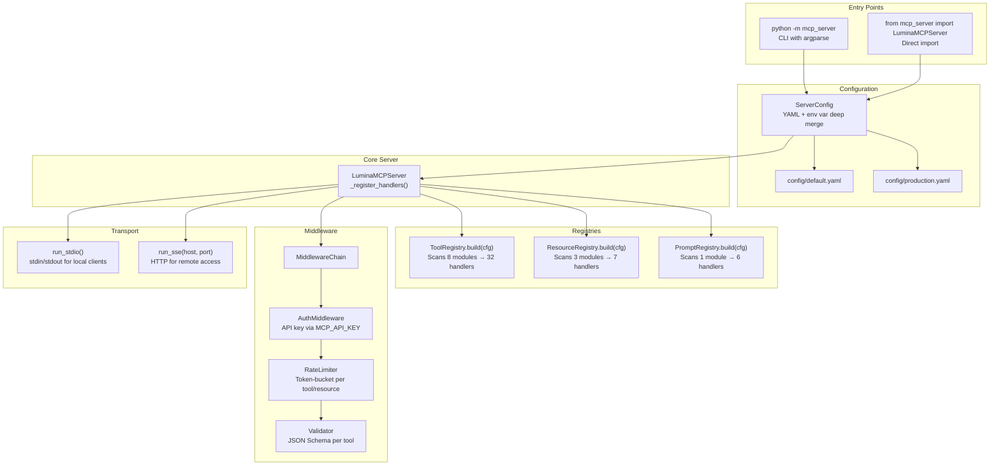

### Tool Registry

The `_ToolRegistry` dynamically discovers tools from 8 category modules:

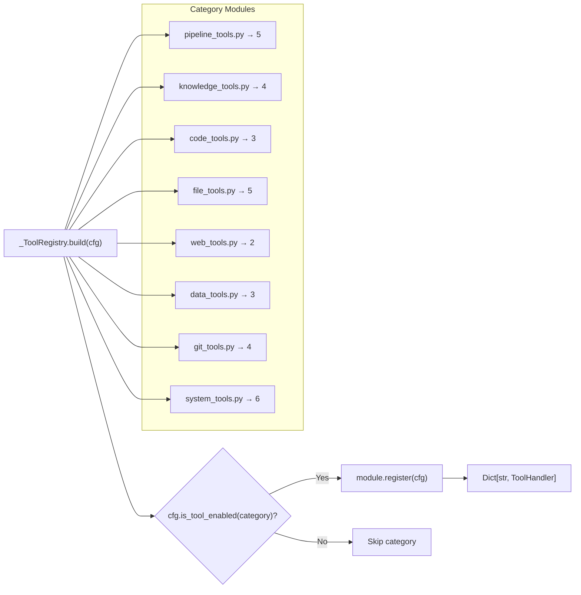

Each tool is a subclass of `ToolHandler(ABC)`:

```python
class ToolHandler(ABC):
    name: str                    # Unique tool identifier
    description: str             # Human-readable description
    input_schema: dict           # JSON Schema for arguments

    @abstractmethod
    async def handle(self, arguments: dict) -> str:
        """Execute the tool and return a result string."""
```

### Resource System

Resources provide read-only data access via `lumina://` URIs:

| URI | Module | Description |
|-----|--------|-------------|
| `lumina://pipeline/config` | `pipeline_resources.py` | Current pipeline configuration |
| `lumina://pipeline/metrics` | `pipeline_resources.py` | Execution metrics and statistics |
| `lumina://pipeline/agents` | `pipeline_resources.py` | Agent roster with roles and status |
| `lumina://knowledge/manifest` | `knowledge_resources.py` | All ingested knowledge sources |
| `lumina://knowledge/stats` | `knowledge_resources.py` | Knowledge base size and dimension info |
| `lumina://system/info` | `system_resources.py` | OS, Python, memory, CPU details |
| `lumina://system/capabilities` | `system_resources.py` | Full server capability manifest |

### Prompt Library

Pre-built prompt templates for common workflows:

| Prompt | Arguments | Purpose |
|--------|-----------|---------|
| `analyze_task` | `task_description` (required) | Break a task into an execution plan with tool recommendations |
| `research_topic` | `topic` (required), `depth` (optional) | Multi-source research using MCP tools |
| `code_review` | `file_path` (required), `focus_areas` (optional) | Quality, security, and best-practice review |
| `debug_issue` | `issue_description` (required), `error_logs` (optional) | Systematic debugging with log analysis |
| `summarize_project` | `project_path` (optional) | Comprehensive project summary |
| `analyze_data` | `data_source` (required), `analysis_type` (optional) | Statistical and exploratory data analysis |

### Middleware Chain

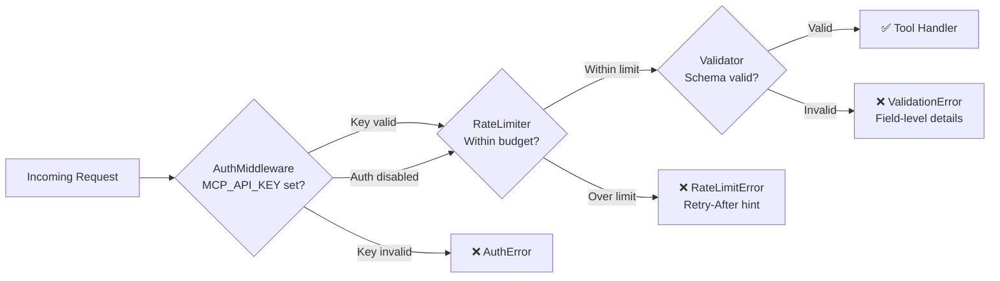

**Error Hierarchy:**

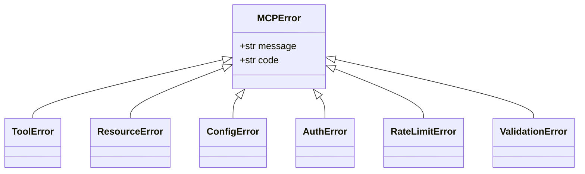

### Transport Layer

| Transport | Command | Use Case |
|-----------|---------|----------|
| **stdio** | `python -m mcp_server` | Claude Desktop, Cursor, VS Code — local subprocess |
| **SSE** | `python -m mcp_server --transport sse --port 8080` | Remote access, containerized deployments |

**SSE Endpoints:**

| Endpoint | Method | Description |
|----------|--------|-------------|
| `/sse` | `GET` | Server-Sent Events stream (server → client) |
| `/messages` | `POST` | JSON-RPC messages (client → server) |

---

## MCP Client Integration

### Connection Modes

The `MCPClient` in `agentic_ai/mcp_client/client.py` supports two modes:

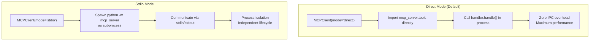

### Per-Agent Tool Mapping

Each pipeline agent receives a curated subset of MCP tools via `_AGENT_TOOL_MAP`:

```mermaid
graph LR
    subgraph "Agent → Tool Mapping"
        P["Planner"] -->|5 tools| PT["get_project_structure, search_code,<br/>read_file, list_available_tools, health_check"]
        R["Researcher"] -->|9 tools| RT["search_knowledge, search_code, read_file,<br/>fetch_url, extract_content, list_directory,<br/>search_files, get_project_structure, git_log"]
        A["Analyzer"] -->|6 tools| AT["analyze_file, search_code, read_file,<br/>parse_csv, parse_json, transform_data"]
        S["Synthesizer"] -->|3 tools| ST["search_knowledge, read_file, fetch_url"]
        V["Validator"] -->|4 tools| VT["search_code, read_file,<br/>analyze_file, environment_check"]
        E["Executor"] -->|10 tools| ET["read_file, write_file, list_directory,<br/>search_files, fetch_url, git_status,<br/>git_diff, search_code, run_pipeline"]
        Rev["Reviewer"] -->|6 tools| RevT["read_file, git_diff, git_log,<br/>search_code, analyze_file, get_server_metrics"]
    end
```

### Tool Adapter Pattern

`MCPToolAdapter` wraps MCP tool handlers as LangChain-compatible callables:

```mermaid
sequenceDiagram
    participant Agent as Pipeline Agent
    participant Adapter as MCPToolAdapter
    participant Handler as ToolHandler
    participant System as External System

    Agent->>Adapter: ainvoke({"query": "..."})
    Adapter->>Adapter: Validate arguments
    Adapter->>Handler: handler.handle(arguments)
    Handler->>System: File I/O, HTTP, Git, etc.
    System-->>Handler: Raw result
    Handler-->>Adapter: Serialized string
    Adapter-->>Agent: Tool output
```

```python
class MCPToolAdapter:
    """Wraps an MCP ToolHandler as a LangChain-compatible callable."""
    name: str
    description: str
    handler: ToolHandler

    async def ainvoke(self, arguments: dict) -> str:
        return await self.handler.handle(arguments)

    def invoke(self, arguments: dict) -> str:
        return asyncio.get_event_loop().run_until_complete(
            self.handler.handle(arguments)
        )
```

### Intelligent Tool Routing

The **Executor Agent** uses keyword-based routing to match natural-language action descriptions to specific MCP tools:

```mermaid
flowchart TD
    Action["Action description from Synthesizer/Validator"]
    Action --> Lower["Lowercase the description"]
    Lower --> KW1{"Contains read/open/view<br/>AND file/document?"}
    KW1 -->|Yes| RF["→ read_file"]
    KW1 -->|No| KW2{"Contains write/save/create<br/>AND file?"}
    KW2 -->|Yes| WF["→ write_file"]
    KW2 -->|No| KW3{"Contains search/find/grep<br/>AND code?"}
    KW3 -->|Yes| SC["→ search_code"]
    KW3 -->|No| KW4{"Contains fetch/http/url/web?"}
    KW4 -->|Yes| FU["→ fetch_url"]
    KW4 -->|No| KW5{"Contains git/commit/diff?"}
    KW5 -->|Yes| GS["→ git_status"]
    KW5 -->|No| KW6{"Contains knowledge/rag?"}
    KW6 -->|Yes| SK["→ search_knowledge"]
    KW6 -->|No| KW7{"Contains analyze + file?"}
    KW7 -->|Yes| AF["→ analyze_file"]
    KW7 -->|No| KW8{"Contains csv/data/parse?"}
    KW8 -->|Yes| PC["→ parse_csv"]
    KW8 -->|No| LLM["→ LLM-based reasoning<br/>(no tool match)"]

    RF & WF & SC & FU & GS & SK & AF & PC --> Build["_build_tool_arguments()"]
    Build --> Exec["tool.ainvoke(args)"]
```

---

## Complete Tool Catalog

### Pipeline Tools (5)

| Tool | Parameters | Description |
|------|-----------|-------------|
| `run_pipeline` | `task` (str, req), `context` (obj), `config_overrides` (obj) | Execute the agentic AI pipeline |
| `get_pipeline_status` | `pipeline_id` (str, req) | Check pipeline run status |
| `list_pipelines` | `status_filter` (str), `limit` (int, 10) | List tracked pipeline runs |
| `cancel_pipeline` | `pipeline_id` (str, req), `reason` (str) | Cancel a running pipeline |
| `get_pipeline_graph` | `format` (str, "mermaid") | Get pipeline graph visualization |

### Knowledge Tools (4)

| Tool | Parameters | Description |
|------|-----------|-------------|
| `search_knowledge` | `query` (str, req), `top_k` (int, 5), `filter_type` (str) | Semantic search against RAG knowledge base |
| `list_knowledge_sources` | `source_type` (str), `limit` (int, 20) | List all ingested knowledge sources |
| `get_knowledge_document` | `document_id` (str, req), `include_vectors` (bool, false) | Retrieve a specific document |
| `similarity_search` | `query` (str, req), `top_k` (int, 10), `threshold` (float, 0.7), `namespace` (str) | Vector similarity search |

### Code Tools (3)

| Tool | Parameters | Description |
|------|-----------|-------------|
| `search_code` | `pattern` (str, req), `path` (str, "."), `file_glob` (str), `max_results` (int, 50) | Regex code search with glob filtering |
| `analyze_file` | `file_path` (str, req), `include_metrics` (bool, true) | Analyze file structure and complexity |
| `get_project_structure` | `root_path` (str, "."), `max_depth` (int, 3), `exclude_patterns` (str[]) | Generate directory tree |

### File Tools (5)

| Tool | Parameters | Description |
|------|-----------|-------------|
| `read_file` | `path` (str, req), `encoding` (str, "utf-8"), `line_range` ([start, end]) | Read file contents |
| `write_file` | `path` (str, req), `content` (str, req), `create_dirs` (bool, false), `mode` (str, "overwrite") | Write content to file |
| `list_directory` | `path` (str, "."), `recursive` (bool, false), `include_hidden` (bool, false) | List directory contents |
| `file_info` | `path` (str, req) | Get file metadata |
| `search_files` | `pattern` (str, req), `path` (str, "."), `max_results` (int, 100) | Search files by name pattern |

### Web Tools (2)

| Tool | Parameters | Description |
|------|-----------|-------------|
| `fetch_url` | `url` (str, req), `method` (str, "GET"), `headers` (obj), `timeout` (int, 30) | Fetch content from URL |
| `extract_content` | `url` (str, req), `selector` (str), `format` (str, "text") | Extract structured content from HTML |

### Data Tools (3)

| Tool | Parameters | Description |
|------|-----------|-------------|
| `parse_csv` | `file_path` (str, req), `delimiter` (str, ","), `has_header` (bool, true), `max_rows` (int) | Parse CSV data |
| `parse_json` | `file_path` (str, req), `json_path` (str) | Parse and query JSON with JSONPath |
| `transform_data` | `data` (arr, req), `operations` (arr, req) | Apply filter/sort/group/map transforms |

### Git Tools (4)

| Tool | Parameters | Description |
|------|-----------|-------------|
| `git_status` | `repo_path` (str, ".") | Get working tree status |
| `git_log` | `repo_path` (str, "."), `max_count` (int, 10), `branch` (str), `author` (str) | Get commit history |
| `git_diff` | `repo_path` (str, "."), `ref1` (str, "HEAD"), `ref2` (str), `file_path` (str) | Get diff between refs |
| `git_blame` | `file_path` (str, req), `repo_path` (str, ".") | Get blame information |

### System Tools (6)

| Tool | Parameters | Description |
|------|-----------|-------------|
| `health_check` | *(none)* | Verify server is running |
| `system_info` | `include_env` (bool, false) | OS, Python, memory, CPU info |
| `get_server_config` | `section` (str) | Current server configuration |
| `get_server_metrics` | `period` (str, "1h") | Server performance metrics |
| `list_available_tools` | `category` (str) | List all registered tools |
| `environment_check` | *(none)* | Verify environment and dependencies |

---

## Configuration Reference

### Pipeline Configuration

**File:** `agentic_ai/config/default_config.yaml`

```yaml
llm:
  provider: "openai"          # openai, anthropic, azure
  model: "gpt-4"
  temperature: 0.7
  max_tokens: 4096

agents:
  planner:
    enabled: true
    timeout: 60
  researcher:
    enabled: true
    timeout: 120
  # ... all 7 agents configurable

pipeline:
  max_retries: 3
  timeout_seconds: 600
  enable_parallel: false

mcp:
  config_path: "mcp_server/config/default.yaml"
  mode: "direct"              # direct (in-process) or stdio (subprocess)

monitoring:
  enabled: true
  log_level: "INFO"
  export_path: "logs/metrics"
```

### MCP Server Configuration

**File:** `mcp_server/config/default.yaml`

```yaml
server:
  name: "lumina-mcp-server"
  version: "1.0.0"

tools:
  pipeline: true              # Enable/disable entire categories
  knowledge: true
  code: true
  file: true
  web: true
  data: true
  git: true
  system: true

middleware:
  auth:
    enabled: false
  rate_limit:
    enabled: true
    requests_per_minute: 60
  validator:
    enabled: true

logging:
  level: "INFO"
  format: "json"
```

### Environment Variables

| Variable | Scope | Description |
|----------|-------|-------------|
| `OPENAI_API_KEY` | Pipeline | LLM provider API key |
| `ANTHROPIC_API_KEY` | Pipeline | Alternative LLM provider |
| `MCP_SERVER_NAME` | MCP Server | Override server name |
| `MCP_LOG_LEVEL` | MCP Server | Override log level |
| `MCP_RATE_LIMIT` | MCP Server | Override rate limit (rpm) |
| `MCP_API_KEY` | MCP Server | API key for authentication middleware |
| `LANGCHAIN_API_KEY` | Pipeline | LangSmith tracing (optional) |
| `LANGCHAIN_TRACING_V2` | Pipeline | Enable LangSmith tracing |

---

## Monitoring & Observability

```mermaid
graph TB
    subgraph "Pipeline Monitoring"
        Monitor["PipelineMonitor<br/>utils/monitoring.py"]
        Monitor --> AgentStart["record_agent_start()"]
        Monitor --> AgentEnd["record_agent_completion()"]
        Monitor --> AgentErr["record_agent_error()"]
        Monitor --> Summary["get_summary()"]
        Monitor --> Export["export_metrics()"]
    end

    subgraph "Metrics Collected"
        M1["Pipeline execution count"]
        M2["Success / failure rates"]
        M3["Per-agent execution time"]
        M4["Error rates by agent"]
        M5["Retry count distribution"]
        M6["Tool usage frequency"]
    end

    subgraph "MCP Server Metrics"
        SM["get_server_metrics tool"]
        SM --> SM1["Request count"]
        SM --> SM2["Rate limit hits"]
        SM --> SM3["Error distribution"]
        SM --> SM4["Tool call frequency"]
    end

    Monitor --> M1 & M2 & M3 & M4 & M5 & M6
```

---

## Deployment

### Local Development

```bash
# Install dependencies
pip install -r agentic_ai/requirements.txt
pip install -r mcp_server/requirements.txt

# Run the pipeline
python -m agentic_ai run --task "Analyze the impact of AI on healthcare"

# Run the MCP server (stdio — for Claude Desktop)
python -m mcp_server

# Run the MCP server (SSE — for remote access)
python -m mcp_server --transport sse --port 8080

# Visualize the pipeline graph
python -m agentic_ai visualize
```

### Docker Deployment

```bash
docker build -t lumina-agentic:latest -f agentic_ai/deployments/aws/Dockerfile .
docker run -d \
  -p 8080:8080 \
  -e OPENAI_API_KEY=your-key \
  -e MCP_API_KEY=your-mcp-key \
  lumina-agentic:latest
```

### Cloud Deployment

**AWS (ECS/Fargate):**

```bash
cd agentic_ai/deployments/aws
export ENVIRONMENT=production
export AWS_REGION=us-east-1
./deploy.sh
```

**Azure (Container Apps):**

```bash
cd agentic_ai/deployments/azure
export ENVIRONMENT=production
export AZURE_LOCATION=eastus
az login && ./deploy.sh
```

---

## Extension Guide

### Adding a New Agent

1. Create `agentic_ai/agents/my_agent.py` extending `BaseAgent`:

```python
from .base import BaseAgent
from ..core.state import PipelineState

class MyAgent(BaseAgent):
    async def execute(self, state: PipelineState) -> PipelineState:
        # Build prompt from state
        prompt = self._build_prompt(state)
        # Call LLM
        response = await self.llm.ainvoke(prompt)
        # Update state
        state["intermediate_results"]["my_agent"] = self._parse(response)
        return state
```

2. Register in `orchestrator.py`:
   - Add to `_initialize_agents()`
   - Add node: `graph.add_node("my_agent", self._create_agent_node("my_agent"))`
   - Add edges to connect it in the assembly line

3. Add tool mapping in `mcp_client/tool_adapter.py`:
   ```python
   _AGENT_TOOL_MAP["my_agent"] = ["read_file", "search_code"]
   ```

### Adding a New MCP Tool

1. Create a handler in the appropriate `mcp_server/tools/` module:

```python
from mcp_server.tools.base import ToolHandler

class MyTool(ToolHandler):
    name = "my_tool"
    description = "Does something useful"
    input_schema = {
        "type": "object",
        "properties": {
            "param": {"type": "string", "description": "Required input"}
        },
        "required": ["param"]
    }

    async def handle(self, arguments: dict) -> str:
        return f"Result for {arguments['param']}"
```

2. Add to the `register(cfg)` function in the module so `_ToolRegistry` discovers it.

3. Optionally add to `_AGENT_TOOL_MAP` in `tool_adapter.py` to make it available to pipeline agents.

### Custom Tool Routing Rules

Extend `_parse_action()` in `executor.py` to add new keyword-to-tool mappings:

```python
elif any(kw in lower for kw in ["my_keyword"]):
    return {"type": "mcp_tool", "tool": "my_tool", ...}
```

---

## Security Model

| Layer | Protection |
|-------|-----------|
| **Transport** | stdio is local-only; SSE supports TLS termination via reverse proxy |
| **Authentication** | API key middleware via `MCP_API_KEY` environment variable |
| **Rate Limiting** | Token-bucket per tool and per resource, prevents abuse |
| **Input Validation** | JSON Schema validation on every tool call |
| **File Access** | Tools operate within the working directory; no arbitrary path traversal |
| **Secrets** | API keys stored in environment variables or cloud secrets manager |
| **Network** | VPC isolation and private subnets in cloud deployments |

---

## Error Handling & Recovery

```mermaid
flowchart TD
    Err["Error occurs in agent"] --> Log["Log to state.errors[]"]
    Log --> Type{Error type?}

    Type -->|Agent failure| Status["Set agent status = FAILED"]
    Status --> Continue["Pipeline continues<br/>with partial data"]

    Type -->|Validation failure| Retry{retry_count < max?}
    Retry -->|Yes| Loop["Retry from Researcher"]
    Retry -->|No| Degrade["Graceful degradation<br/>Return best-effort result"]

    Type -->|MCP tool failure| Fallback["Fall back to<br/>LLM-based reasoning"]

    Type -->|Fatal error| Halt["Pipeline status = FAILED<br/>Return error report"]
```

**Recovery strategies:**
- **Agent failure:** Logged and pipeline continues with partial data
- **Validation failure:** Automatic retry loop (configurable `max_retries`)
- **MCP tool failure:** Executor falls back to LLM-based reasoning
- **Fatal error:** Pipeline terminates with a structured error report

---

## Performance Characteristics

| Metric | Typical Range | Notes |
|--------|--------------|-------|
| Simple task (3–4 agents active) | 10–30 seconds | Depends on LLM provider latency |
| Medium complexity (all agents) | 30–90 seconds | Includes retry loops |
| Complex task with retries | 90–180 seconds | Multiple research-analysis cycles |
| MCP tool call (direct mode) | < 50ms | In-process, no IPC |
| MCP tool call (stdio mode) | 100–500ms | Subprocess communication overhead |
| MCP tool call (SSE mode) | 50–200ms | Network latency dependent |

**Optimization levers:**
- Enable `direct` MCP mode (default) for zero-overhead tool calls
- Adjust `max_retries` to limit retry loops
- Disable unused tool categories in MCP server config
- Use `enable_parallel: true` for independent agent execution (experimental)
- Tune per-agent `timeout` values to prevent runaway execution

---

**Document Version:** 1.0
**Last Updated:** 2026-03-18
**Packages:** `agentic_ai/` v1.1.0 · `mcp_server/` v1.0.0
