# Lumina AI Assistant - Architecture Documentation

## Table of Contents

- [Overview](#overview)
- [System Architecture](#system-architecture)
  - [High-Level Architecture Diagram](#high-level-architecture-diagram)
  - [Component Architecture](#component-architecture)
- [Technology Stack](#technology-stack)
- [Frontend Architecture](#frontend-architecture)
  - [Component Hierarchy](#component-hierarchy)
  - [State Management](#state-management)
  - [Routing Structure](#routing-structure)
- [Backend Architecture](#backend-architecture)
  - [API Layer](#api-layer)
  - [Service Layer](#service-layer)
  - [Data Layer](#data-layer)
  - [Authentication Flow](#authentication-flow)
- [AI/ML Architecture](#aiml-architecture)
  - [RAG Implementation](#rag-implementation)
  - [Vector Search Pipeline](#vector-search-pipeline)
  - [Knowledge Storage](#knowledge-storage)
- [Data Flow](#data-flow)
  - [Chat Message Flow](#chat-message-flow)
  - [Conversation Management Flow](#conversation-management-flow)
  - [Guest vs Authenticated User Flow](#guest-vs-authenticated-user-flow)
- [Database Schema](#database-schema)
- [Security Architecture](#security-architecture)
- [Deployment Architecture](#deployment-architecture)
- [Performance Considerations](#performance-considerations)
- [Scalability Strategy](#scalability-strategy)

---

## Overview

Lumina is a full-stack AI-powered chatbot application that leverages Retrieval-Augmented Generation (RAG) to provide personalized, context-aware responses. The system is built with a modern microservices-oriented architecture, featuring a React frontend, Express.js backend, MongoDB for data persistence, Pinecone for vector storage, and Google's Gemini AI for natural language processing.

### Key Architectural Principles

1. **Separation of Concerns**: Clear boundaries between frontend, backend, and AI/ML components
2. **Stateless API Design**: RESTful APIs with JWT-based authentication
3. **Scalable Data Layer**: Distributed databases (MongoDB + Pinecone)
4. **Event-Driven Communication**: Real-time updates and async processing
5. **Security First**: JWT authentication, encrypted passwords, CORS protection

---

## System Architecture

### High-Level Architecture Diagram

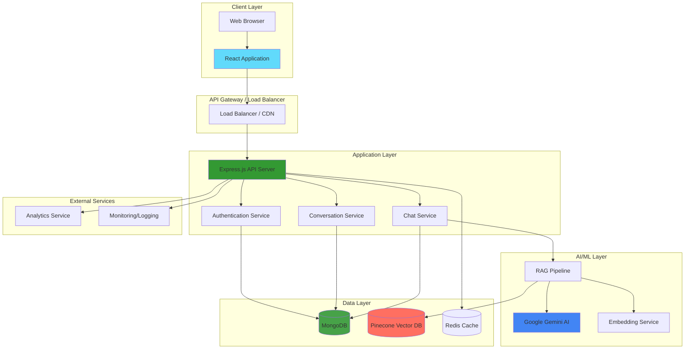
```mermaid
graph TB
    subgraph "Client Layer"
        Browser[Web Browser]
        React[React Application]
    end

    subgraph "API Gateway / Load Balancer"
        LB[Load Balancer / CDN]
    end

    subgraph "Application Layer"
        API[Express.js API Server]
        Auth[Authentication Service]
        Chat[Chat Service]
        Conv[Conversation Service]
    end

    subgraph "AI/ML Layer"
        RAG[RAG Pipeline]
        Gemini[Google Gemini AI]
        Embed[Embedding Service]
    end

    subgraph "Data Layer"
        MongoDB[(MongoDB)]
        Pinecone[(Pinecone Vector DB)]
        Cache[(Redis Cache)]
    end

    subgraph "External Services"
        Analytics[Analytics Service]
        Monitoring[Monitoring/Logging]
    end

    Browser --> React
    React --> LB
    LB --> API

    API --> Auth
    API --> Chat
    API --> Conv

    Chat --> RAG
    RAG --> Embed
    RAG --> Gemini
    RAG --> Pinecone

    Auth --> MongoDB
    Conv --> MongoDB
    Chat --> MongoDB

    API --> Cache

    API --> Analytics
    API --> Monitoring

    style React fill:#61DAFB
    style API fill:#339933
    style MongoDB fill:#47A248
    style Pinecone fill:#FF6F61
    style Gemini fill:#4285F4
```

### Component Architecture

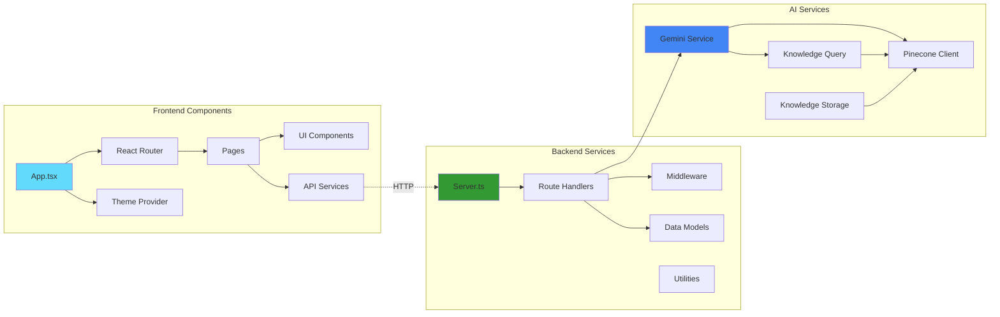
```mermaid
graph LR
    subgraph "Frontend Components"
        App[App.tsx]
        Router[React Router]
        Pages[Pages]
        Components[UI Components]
        Services[API Services]
        Theme[Theme Provider]
    end

    subgraph "Backend Services"
        Server[Server.ts]
        Routes[Route Handlers]
        Middleware[Middleware]
        Models[Data Models]
        Utils[Utilities]
    end

    subgraph "AI Services"
        GeminiSvc[Gemini Service]
        PineconeSvc[Pinecone Client]
        QueryKnowledge[Knowledge Query]
        StoreKnowledge[Knowledge Storage]
    end

    App --> Router
    Router --> Pages
    Pages --> Components
    Pages --> Services
    App --> Theme

    Services -.HTTP.-> Server
    Server --> Routes
    Routes --> Middleware
    Routes --> Models
    Routes --> GeminiSvc

    GeminiSvc --> PineconeSvc
    GeminiSvc --> QueryKnowledge
    QueryKnowledge --> PineconeSvc
    StoreKnowledge --> PineconeSvc

    style App fill:#61DAFB
    style Server fill:#339933
    style GeminiSvc fill:#4285F4
```

---

## Technology Stack

### Frontend Stack

| Technology | Purpose | Version |
|------------|---------|---------|
| **React** | UI Framework | 18.2.0 |
| **TypeScript** | Type Safety | 4.9.5 |
| **Material-UI (MUI)** | UI Component Library | 5.16.14 |
| **React Router** | Client-side Routing | 6.29.0 |
| **Axios** | HTTP Client | 1.7.9 |
| **Framer Motion** | Animations | 12.4.2 |
| **React Markdown** | Markdown Rendering | 9.0.1 |
| **KaTeX** | Math Rendering | 0.16.22 |

### Backend Stack

| Technology | Purpose | Version |
|------------|---------|---------|
| **Node.js** | Runtime Environment | LTS |
| **Express.js** | Web Framework | 4.17.1 |
| **TypeScript** | Type Safety | 4.5.5 |
| **MongoDB** | Primary Database | 6.0.0 |
| **Mongoose** | ODM | 6.0.0 |
| **JWT** | Authentication | 9.0.0 |
| **bcrypt** | Password Hashing | 5.0.1 |
| **Swagger** | API Documentation | 6.2.8 |

### AI/ML Stack

| Technology | Purpose | Version |
|------------|---------|---------|
| **Google Gemini AI** | LLM | 2.0-flash-lite |
| **Pinecone** | Vector Database | 4.1.0 |
| **LangChain** | RAG Framework | Latest |
| **Text Embeddings** | Vector Embeddings | 004 |

### DevOps & Deployment

| Technology | Purpose |
|------------|---------|
| **Docker** | Containerization |
| **Docker Compose** | Multi-container orchestration |
| **GitHub Actions** | CI/CD Pipeline |
| **Vercel** | Frontend Hosting |
| **AWS (Future)** | Production Infrastructure |
| **Terraform** | Infrastructure as Code |

---

## Frontend Architecture

### Component Hierarchy

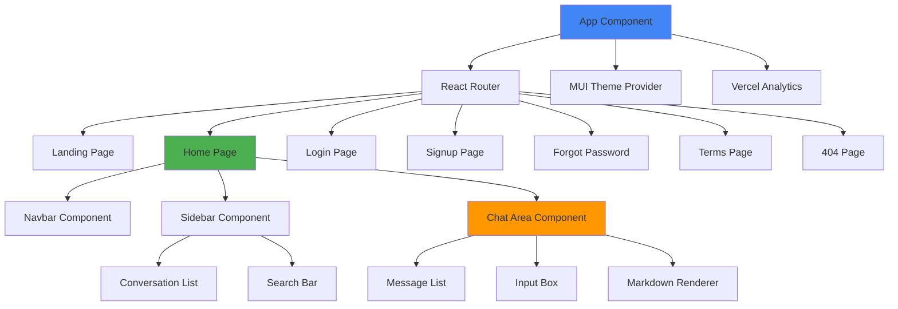
```mermaid
graph TD
    App[App Component]
    App --> Router[React Router]

    Router --> Landing[Landing Page]
    Router --> Home[Home Page]
    Router --> Login[Login Page]
    Router --> Signup[Signup Page]
    Router --> Forgot[Forgot Password]
    Router --> Terms[Terms Page]
    Router --> NotFound[404 Page]

    Home --> Navbar[Navbar Component]
    Home --> Sidebar[Sidebar Component]
    Home --> ChatArea[Chat Area Component]

    Sidebar --> ConvList[Conversation List]
    Sidebar --> Search[Search Bar]

    ChatArea --> MessageList[Message List]
    ChatArea --> InputBox[Input Box]
    ChatArea --> MarkdownRender[Markdown Renderer]

    App --> ThemeProvider[MUI Theme Provider]
    App --> Analytics[Vercel Analytics]

    style App fill:#4285F4
    style Home fill:#4CAF50
    style ChatArea fill:#FF9800
```

### State Management

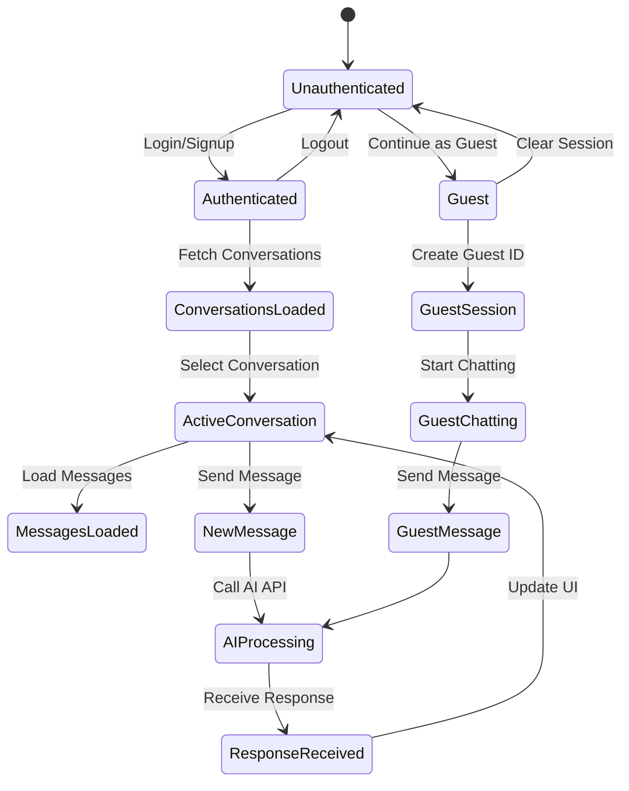
```mermaid
stateDiagram-v2
    [*] --> Unauthenticated

    Unauthenticated --> Authenticated: Login/Signup
    Unauthenticated --> Guest: Continue as Guest

    Authenticated --> ConversationsLoaded: Fetch Conversations
    ConversationsLoaded --> ActiveConversation: Select Conversation
    ActiveConversation --> MessagesLoaded: Load Messages

    Guest --> GuestSession: Create Guest ID
    GuestSession --> GuestChatting: Start Chatting

    ActiveConversation --> NewMessage: Send Message
    NewMessage --> AIProcessing: Call AI API
    AIProcessing --> ResponseReceived: Receive Response
    ResponseReceived --> ActiveConversation: Update UI

    GuestChatting --> GuestMessage: Send Message
    GuestMessage --> AIProcessing

    Authenticated --> Unauthenticated: Logout
    Guest --> Unauthenticated: Clear Session
```

### Routing Structure

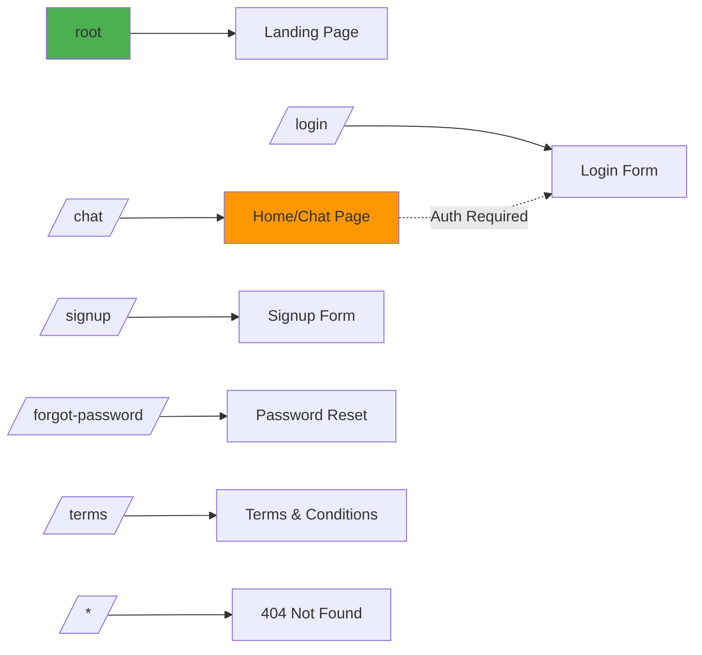
```mermaid
graph LR
    Root[root] --> LandingPage[Landing Page]

    Chat[/chat/] --> HomePage[Home/Chat Page]
    Login[/login/] --> LoginPage[Login Form]
    Signup[/signup/] --> SignupPage[Signup Form]
    Forgot[/forgot-password/] --> ForgotPage[Password Reset]
    Terms[/terms/] --> TermsPage[Terms & Conditions]
    NotFound[/*/] --> 404Page[404 Not Found]

    HomePage -.Auth Required.-> LoginPage

    style Root fill:#4CAF50
    style HomePage fill:#FF9800
```

---

## Backend Architecture

### API Layer

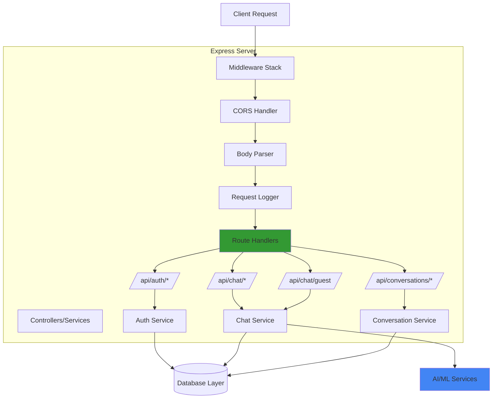
```mermaid
graph TB
    Client[Client Request]

    subgraph "Express Server"
        Middleware[Middleware Stack]
        CORS[CORS Handler]
        BodyParser[Body Parser]
        Logger[Request Logger]

        Routes[Route Handlers]
        AuthRoutes[/api/auth/*/]
        ChatRoutes[/api/chat/*/]
        ConvRoutes[/api/conversations/*/]
        GuestRoutes[/api/chat/guest/]

        Controllers[Controllers/Services]
        AuthService[Auth Service]
        ChatService[Chat Service]
        ConvService[Conversation Service]
    end

    Database[(Database Layer)]
    AI[AI/ML Services]

    Client --> Middleware
    Middleware --> CORS
    CORS --> BodyParser
    BodyParser --> Logger
    Logger --> Routes

    Routes --> AuthRoutes
    Routes --> ChatRoutes
    Routes --> ConvRoutes
    Routes --> GuestRoutes

    AuthRoutes --> AuthService
    ChatRoutes --> ChatService
    ConvRoutes --> ConvService
    GuestRoutes --> ChatService

    AuthService --> Database
    ChatService --> Database
    ChatService --> AI
    ConvService --> Database

    style Routes fill:#339933
    style AI fill:#4285F4
```

### API Endpoints Overview

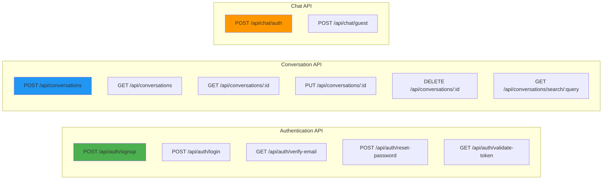
```mermaid
graph LR
    subgraph "Authentication API"
        POST_Signup[POST /api/auth/signup]
        POST_Login[POST /api/auth/login]
        GET_Verify[GET /api/auth/verify-email]
        POST_Reset[POST /api/auth/reset-password]
        GET_Validate[GET /api/auth/validate-token]
    end

    subgraph "Conversation API"
        POST_Conv[POST /api/conversations]
        GET_Convs[GET /api/conversations]
        GET_Conv[GET /api/conversations/:id]
        PUT_Conv[PUT /api/conversations/:id]
        DELETE_Conv[DELETE /api/conversations/:id]
        GET_Search[GET /api/conversations/search/:query]
    end

    subgraph "Chat API"
        POST_AuthChat[POST /api/chat/auth]
        POST_GuestChat[POST /api/chat/guest]
    end

    style POST_Signup fill:#4CAF50
    style POST_AuthChat fill:#FF9800
    style POST_Conv fill:#2196F3
```

### Service Layer

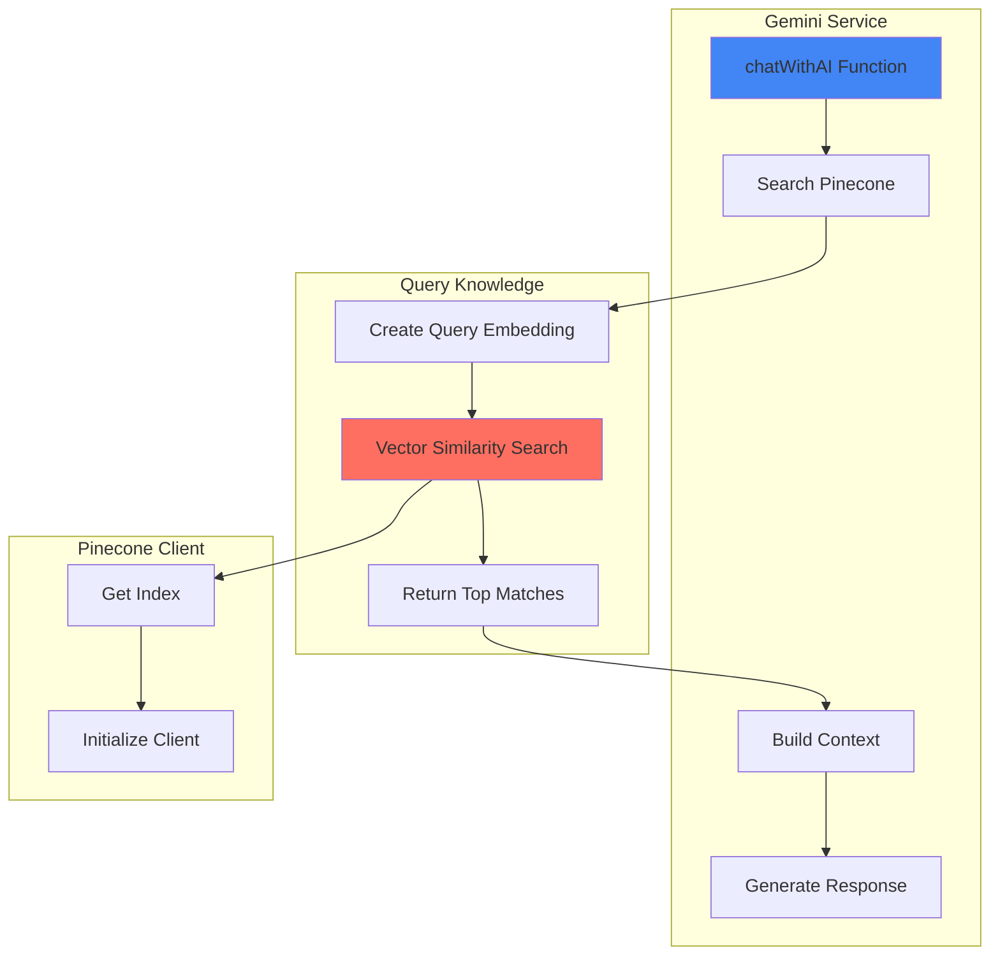
```mermaid
graph TD
    subgraph "Gemini Service"
        ChatWithAI[chatWithAI Function]
        SearchKnowledge[Search Pinecone]
        BuildContext[Build Context]
        GenerateResponse[Generate Response]
    end

    subgraph "Pinecone Client"
        InitPinecone[Initialize Client]
        GetIndex[Get Index]
    end

    subgraph "Query Knowledge"
        CreateEmbedding[Create Query Embedding]
        VectorSearch[Vector Similarity Search]
        ReturnMatches[Return Top Matches]
    end

    ChatWithAI --> SearchKnowledge
    SearchKnowledge --> CreateEmbedding
    CreateEmbedding --> VectorSearch
    VectorSearch --> ReturnMatches
    ReturnMatches --> BuildContext
    BuildContext --> GenerateResponse

    VectorSearch --> GetIndex
    GetIndex --> InitPinecone

    style ChatWithAI fill:#4285F4
    style VectorSearch fill:#FF6F61
```

### Data Layer

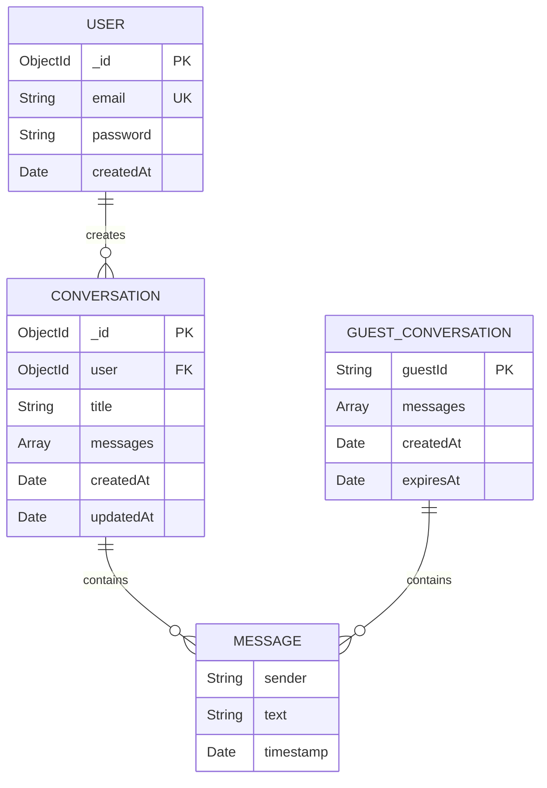
```mermaid
erDiagram
    USER ||--o{ CONVERSATION : creates
    CONVERSATION ||--o{ MESSAGE : contains
    GUEST_CONVERSATION ||--o{ MESSAGE : contains

    USER {
        ObjectId _id PK
        String email UK
        String password
        Date createdAt
    }

    CONVERSATION {
        ObjectId _id PK
        ObjectId user FK
        String title
        Array messages
        Date createdAt
        Date updatedAt
    }

    MESSAGE {
        String sender
        String text
        Date timestamp
    }

    GUEST_CONVERSATION {
        String guestId PK
        Array messages
        Date createdAt
        Date expiresAt
    }
```

### Authentication Flow

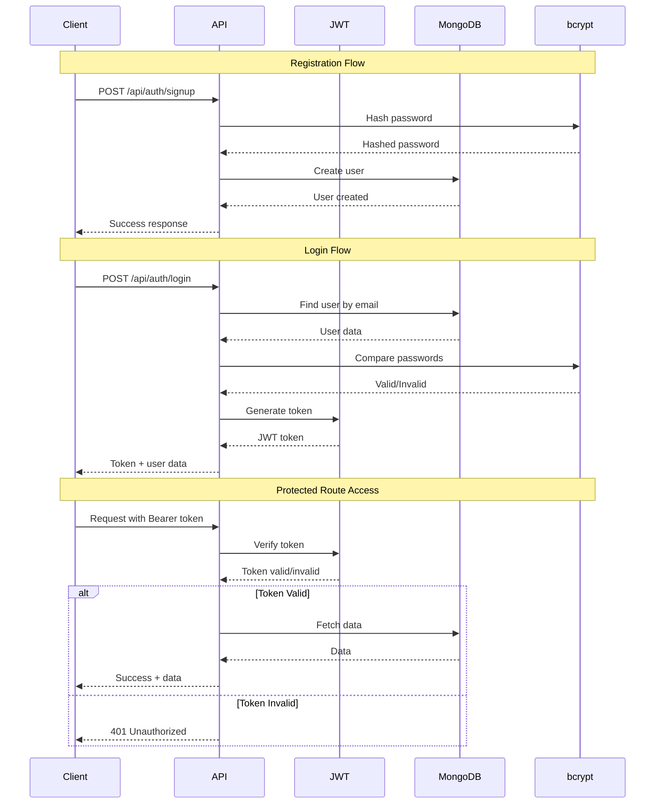
```mermaid
sequenceDiagram
    participant Client
    participant API
    participant JWT
    participant MongoDB
    participant bcrypt

    Note over Client,bcrypt: Registration Flow
    Client->>API: POST /api/auth/signup
    API->>bcrypt: Hash password
    bcrypt-->>API: Hashed password
    API->>MongoDB: Create user
    MongoDB-->>API: User created
    API-->>Client: Success response

    Note over Client,bcrypt: Login Flow
    Client->>API: POST /api/auth/login
    API->>MongoDB: Find user by email
    MongoDB-->>API: User data
    API->>bcrypt: Compare passwords
    bcrypt-->>API: Valid/Invalid
    API->>JWT: Generate token
    JWT-->>API: JWT token
    API-->>Client: Token + user data

    Note over Client,bcrypt: Protected Route Access
    Client->>API: Request with Bearer token
    API->>JWT: Verify token
    JWT-->>API: Token valid/invalid
    alt Token Valid
        API->>MongoDB: Fetch data
        MongoDB-->>API: Data
        API-->>Client: Success + data
    else Token Invalid
        API-->>Client: 401 Unauthorized
    end
```

---

## AI/ML Architecture

### RAG Implementation

The RAG (Retrieval-Augmented Generation) system enhances the AI's responses by combining retrieved knowledge with generative AI capabilities.

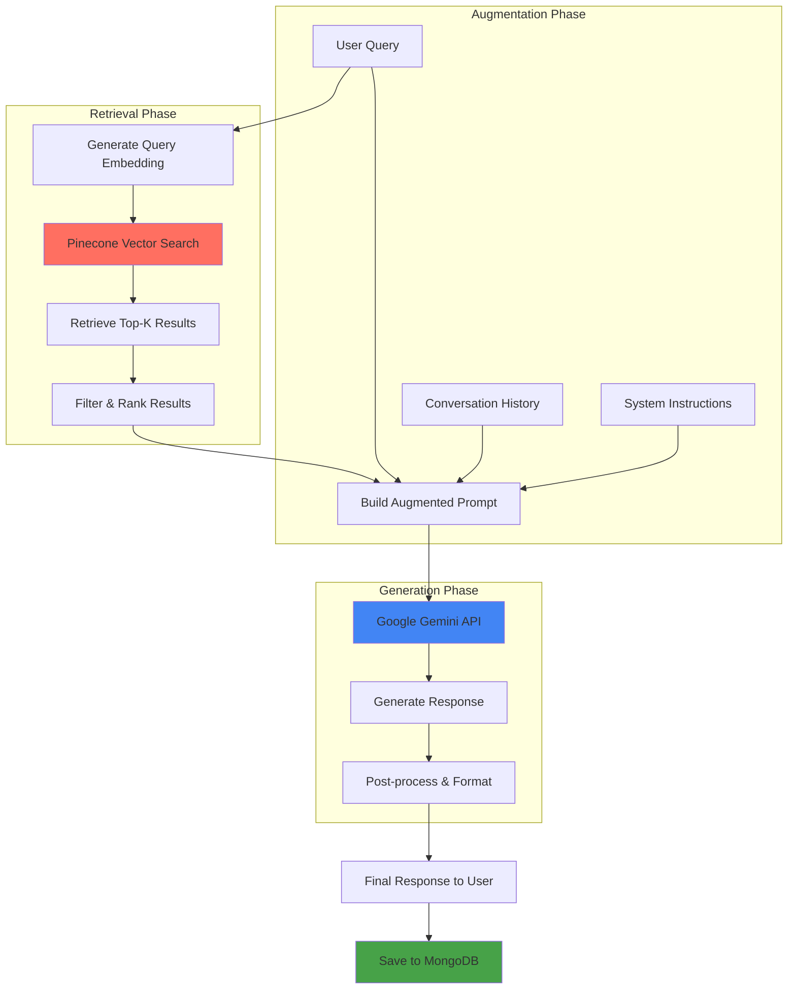
```mermaid
graph TB
    UserQuery[User Query] --> EmbedQuery[Generate Query Embedding]

    subgraph "Retrieval Phase"
        EmbedQuery --> VectorSearch[Pinecone Vector Search]
        VectorSearch --> TopK[Retrieve Top-K Results]
        TopK --> FilterResults[Filter & Rank Results]
    end

    subgraph "Augmentation Phase"
        FilterResults --> BuildPrompt[Build Augmented Prompt]
        UserQuery --> BuildPrompt
        ConversationHistory[Conversation History] --> BuildPrompt
        SystemInstructions[System Instructions] --> BuildPrompt
    end

    subgraph "Generation Phase"
        BuildPrompt --> GeminiAPI[Google Gemini API]
        GeminiAPI --> GenerateResponse[Generate Response]
        GenerateResponse --> PostProcess[Post-process & Format]
    end

    PostProcess --> FinalResponse[Final Response to User]

    FinalResponse --> SaveToMongo[Save to MongoDB]

    style VectorSearch fill:#FF6F61
    style GeminiAPI fill:#4285F4
    style SaveToMongo fill:#47A248
```

### Vector Search Pipeline

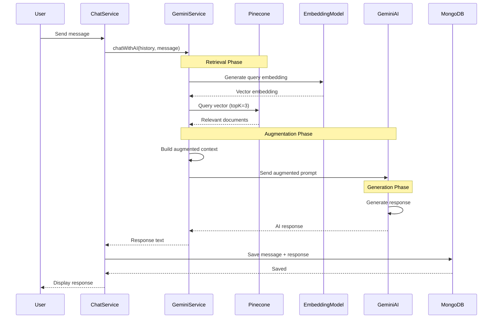
```mermaid
sequenceDiagram
    participant User
    participant ChatService
    participant GeminiService
    participant Pinecone
    participant EmbeddingModel
    participant GeminiAI
    participant MongoDB

    User->>ChatService: Send message
    ChatService->>GeminiService: chatWithAI(history, message)

    Note over GeminiService,Pinecone: Retrieval Phase
    GeminiService->>EmbeddingModel: Generate query embedding
    EmbeddingModel-->>GeminiService: Vector embedding
    GeminiService->>Pinecone: Query vector (topK=3)
    Pinecone-->>GeminiService: Relevant documents

    Note over GeminiService,GeminiAI: Augmentation Phase
    GeminiService->>GeminiService: Build augmented context
    GeminiService->>GeminiAI: Send augmented prompt

    Note over GeminiAI: Generation Phase
    GeminiAI->>GeminiAI: Generate response
    GeminiAI-->>GeminiService: AI response

    GeminiService-->>ChatService: Response text
    ChatService->>MongoDB: Save message + response
    MongoDB-->>ChatService: Saved
    ChatService-->>User: Display response
```

### Knowledge Storage

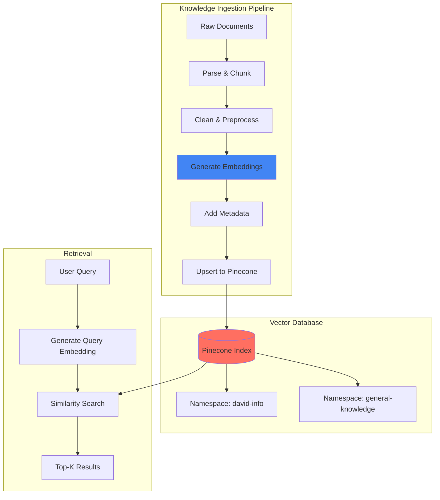
```mermaid
graph TD
    subgraph "Knowledge Ingestion Pipeline"
        RawDocs[Raw Documents] --> Parse[Parse & Chunk]
        Parse --> Clean[Clean & Preprocess]
        Clean --> Embed[Generate Embeddings]
        Embed --> Metadata[Add Metadata]
        Metadata --> Upsert[Upsert to Pinecone]
    end

    subgraph "Vector Database"
        Upsert --> PineconeIndex[(Pinecone Index)]
        PineconeIndex --> Namespace1[Namespace: david-info]
        PineconeIndex --> Namespace2[Namespace: general-knowledge]
    end

    subgraph "Retrieval"
        Query[User Query] --> QueryEmbed[Generate Query Embedding]
        QueryEmbed --> Search[Similarity Search]
        PineconeIndex --> Search
        Search --> Results[Top-K Results]
    end

    style PineconeIndex fill:#FF6F61
    style Embed fill:#4285F4
```

#### Knowledge Storage Script Flow

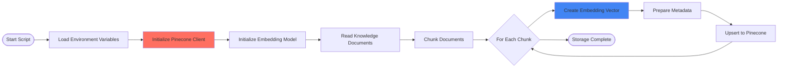
```mermaid
flowchart LR
    Start([Start Script]) --> LoadEnv[Load Environment Variables]
    LoadEnv --> InitPinecone[Initialize Pinecone Client]
    InitPinecone --> InitEmbeddings[Initialize Embedding Model]

    InitEmbeddings --> ReadDocs[Read Knowledge Documents]
    ReadDocs --> ChunkDocs[Chunk Documents]

    ChunkDocs --> Loop{For Each Chunk}
    Loop --> CreateEmbed[Create Embedding Vector]
    CreateEmbed --> PrepareMetadata[Prepare Metadata]
    PrepareMetadata --> UpsertVector[Upsert to Pinecone]
    UpsertVector --> Loop

    Loop --> Complete([Storage Complete])

    style InitPinecone fill:#FF6F61
    style CreateEmbed fill:#4285F4
```

---

## Data Flow

### Chat Message Flow (Authenticated User)

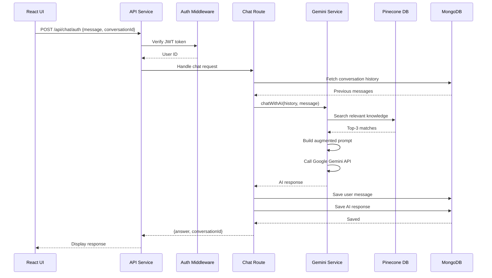
```mermaid
sequenceDiagram
    participant UI as React UI
    participant API as API Service
    participant Auth as Auth Middleware
    participant Chat as Chat Route
    participant Gemini as Gemini Service
    participant Pinecone as Pinecone DB
    participant Mongo as MongoDB

    UI->>API: POST /api/chat/auth {message, conversationId}
    API->>Auth: Verify JWT token
    Auth-->>API: User ID

    API->>Chat: Handle chat request
    Chat->>Mongo: Fetch conversation history
    Mongo-->>Chat: Previous messages

    Chat->>Gemini: chatWithAI(history, message)
    Gemini->>Pinecone: Search relevant knowledge
    Pinecone-->>Gemini: Top-3 matches
    Gemini->>Gemini: Build augmented prompt
    Gemini->>Gemini: Call Google Gemini API
    Gemini-->>Chat: AI response

    Chat->>Mongo: Save user message
    Chat->>Mongo: Save AI response
    Mongo-->>Chat: Saved

    Chat-->>API: {answer, conversationId}
    API-->>UI: Display response
```

### Conversation Management Flow

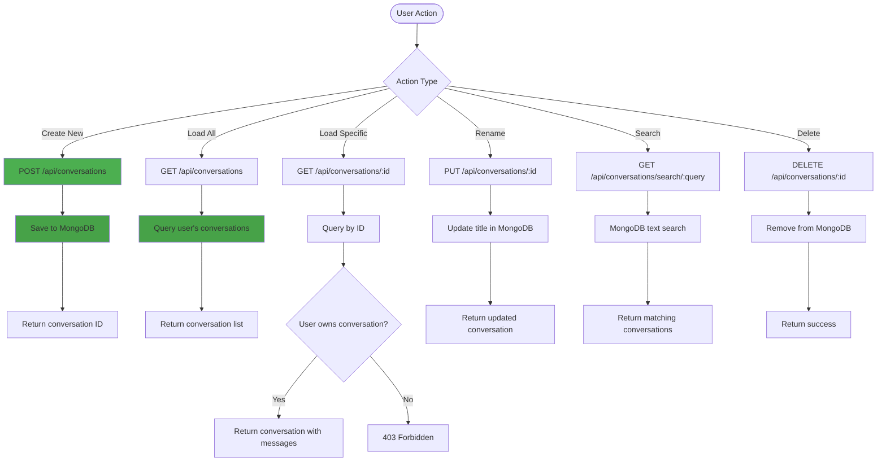
```mermaid
flowchart TD
    Start([User Action]) --> Action{Action Type}

    Action -->|Create New| CreateConv[POST /api/conversations]
    CreateConv --> SaveMongo1[Save to MongoDB]
    SaveMongo1 --> Return1[Return conversation ID]

    Action -->|Load All| GetConvs[GET /api/conversations]
    GetConvs --> QueryMongo1[Query user's conversations]
    QueryMongo1 --> Return2[Return conversation list]

    Action -->|Load Specific| GetConv[GET /api/conversations/:id]
    GetConv --> QueryMongo2[Query by ID]
    QueryMongo2 --> Verify{User owns conversation?}
    Verify -->|Yes| Return3[Return conversation with messages]
    Verify -->|No| Error1[403 Forbidden]

    Action -->|Rename| PutConv[PUT /api/conversations/:id]
    PutConv --> UpdateMongo[Update title in MongoDB]
    UpdateMongo --> Return4[Return updated conversation]

    Action -->|Search| SearchConv[GET /api/conversations/search/:query]
    SearchConv --> TextSearch[MongoDB text search]
    TextSearch --> Return5[Return matching conversations]

    Action -->|Delete| DeleteConv[DELETE /api/conversations/:id]
    DeleteConv --> RemoveMongo[Remove from MongoDB]
    RemoveMongo --> Return6[Return success]

    style CreateConv fill:#4CAF50
    style QueryMongo1 fill:#47A248
    style SaveMongo1 fill:#47A248
```

### Guest vs Authenticated User Flow

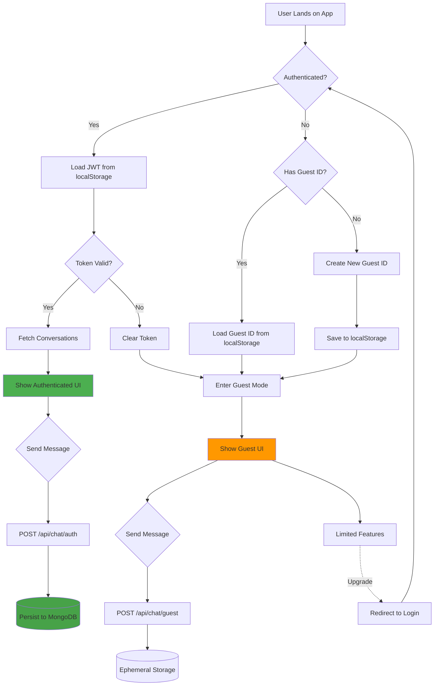
```mermaid
flowchart TD
    UserLands[User Lands on App] --> AuthCheck{Authenticated?}

    AuthCheck -->|Yes| LoadToken[Load JWT from localStorage]
    LoadToken --> ValidateToken{Token Valid?}
    ValidateToken -->|Yes| FetchConvs[Fetch Conversations]
    FetchConvs --> AuthUI[Show Authenticated UI]
    ValidateToken -->|No| ClearToken[Clear Token]
    ClearToken --> GuestMode

    AuthCheck -->|No| GuestCheck{Has Guest ID?}
    GuestCheck -->|Yes| LoadGuestID[Load Guest ID from localStorage]
    LoadGuestID --> GuestMode[Enter Guest Mode]
    GuestCheck -->|No| CreateGuestID[Create New Guest ID]
    CreateGuestID --> SaveGuestID[Save to localStorage]
    SaveGuestID --> GuestMode

    GuestMode --> GuestUI[Show Guest UI]
    GuestUI --> LimitedFeatures[Limited Features]

    AuthUI --> SendMessage{Send Message}
    SendMessage --> AuthAPI[POST /api/chat/auth]
    AuthAPI --> PersistMongo[(Persist to MongoDB)]

    GuestUI --> SendGuestMessage{Send Message}
    SendGuestMessage --> GuestAPI[POST /api/chat/guest]
    GuestAPI --> EphemeralStorage[(Ephemeral Storage)]

    LimitedFeatures -.Upgrade.-> Login[Redirect to Login]
    Login --> AuthCheck

    style AuthUI fill:#4CAF50
    style GuestUI fill:#FF9800
    style PersistMongo fill:#47A248
```

---

## Database Schema

### MongoDB Collections

#### Users Collection

```javascript
{
  _id: ObjectId,
  email: String (unique, indexed),
  password: String (bcrypt hashed),
  createdAt: Date,
  __v: Number
}
```

#### Conversations Collection

```javascript
{
  _id: ObjectId,
  user: ObjectId (ref: 'User', indexed),
  title: String (default: "New Conversation"),
  messages: [
    {
      sender: String ("user" | "model"),
      text: String,
      timestamp: Date,
      _id: ObjectId
    }
  ],
  createdAt: Date,
  updatedAt: Date,
  __v: Number
}
```

#### Guest Conversations Collection

```javascript
{
  guestId: String (unique, indexed),
  messages: [
    {
      sender: String ("user" | "model"),
      text: String,
      timestamp: Date,
      _id: ObjectId
    }
  ],
  createdAt: Date,
  expiresAt: Date (TTL index: 24 hours),
  __v: Number
}
```

### Pinecone Vector Database Schema

```javascript
{
  id: String (unique),
  values: Array<Number> (embedding vector, dimension: 768),
  metadata: {
    text: String,
    source: String,
    category: String,
    timestamp: String
  }
}
```

### Database Indexing Strategy

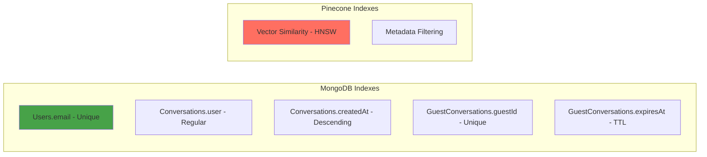
```mermaid
graph LR
    subgraph "MongoDB Indexes"
        UserEmail[Users.email - Unique]
        ConvUser[Conversations.user - Regular]
        ConvCreated[Conversations.createdAt - Descending]
        GuestID[GuestConversations.guestId - Unique]
        GuestExpire[GuestConversations.expiresAt - TTL]
    end

    subgraph "Pinecone Indexes"
        VectorIndex[Vector Similarity - HNSW]
        MetadataFilter[Metadata Filtering]
    end

    style UserEmail fill:#47A248
    style VectorIndex fill:#FF6F61
```

---

## Security Architecture

### Security Layers

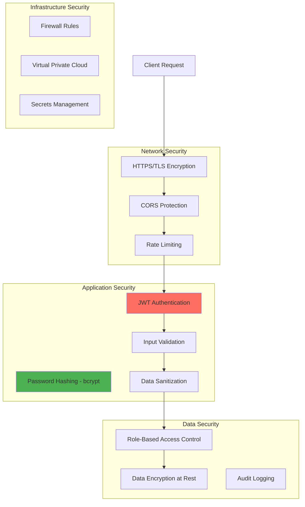
```mermaid
graph TB
    subgraph "Network Security"
        HTTPS[HTTPS/TLS Encryption]
        CORS[CORS Protection]
        RateLimit[Rate Limiting]
    end

    subgraph "Application Security"
        JWT[JWT Authentication]
        Bcrypt[Password Hashing - bcrypt]
        Validation[Input Validation]
        Sanitization[Data Sanitization]
    end

    subgraph "Data Security"
        Encryption[Data Encryption at Rest]
        Access[Role-Based Access Control]
        Audit[Audit Logging]
    end

    subgraph "Infrastructure Security"
        Firewall[Firewall Rules]
        VPC[Virtual Private Cloud]
        Secrets[Secrets Management]
    end

    Client[Client Request] --> HTTPS
    HTTPS --> CORS
    CORS --> RateLimit
    RateLimit --> JWT
    JWT --> Validation
    Validation --> Sanitization
    Sanitization --> Access
    Access --> Encryption

    style JWT fill:#FF6F61
    style Bcrypt fill:#4CAF50
```

### JWT Authentication Flow

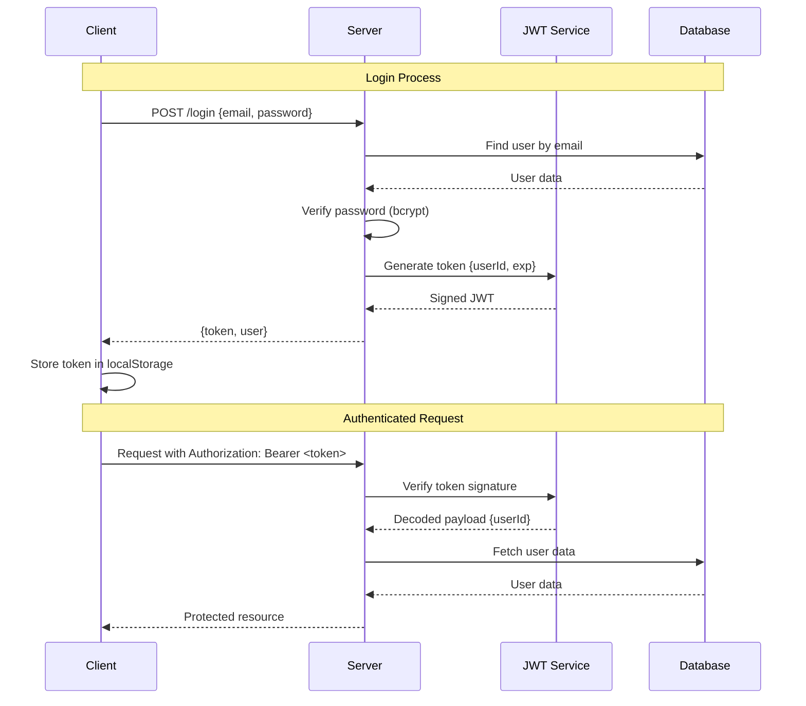
```mermaid
sequenceDiagram
    participant Client
    participant Server
    participant JWT as JWT Service
    participant DB as Database

    Note over Client,DB: Login Process
    Client->>Server: POST /login {email, password}
    Server->>DB: Find user by email
    DB-->>Server: User data
    Server->>Server: Verify password (bcrypt)
    Server->>JWT: Generate token {userId, exp}
    JWT-->>Server: Signed JWT
    Server-->>Client: {token, user}

    Client->>Client: Store token in localStorage

    Note over Client,DB: Authenticated Request
    Client->>Server: Request with Authorization: Bearer <token>
    Server->>JWT: Verify token signature
    JWT-->>Server: Decoded payload {userId}
    Server->>DB: Fetch user data
    DB-->>Server: User data
    Server-->>Client: Protected resource
```

### Data Security Measures

| Layer | Security Measure | Implementation |
|-------|------------------|----------------|
| **Transport** | HTTPS/TLS 1.3 | All API communications encrypted |
| **Authentication** | JWT Tokens | Signed with secret, 24h expiration |
| **Passwords** | bcrypt Hashing | Salt rounds: 10, one-way encryption |
| **Input Validation** | Schema Validation | Mongoose schemas, Express validators |
| **CORS** | Whitelisted Origins | Configurable allowed domains |
| **Rate Limiting** | Request Throttling | Per-IP rate limits (future) |
| **SQL Injection** | Parameterized Queries | Mongoose ORM protection |
| **XSS Prevention** | Content Sanitization | React's built-in XSS protection |
| **API Keys** | Environment Variables | Never committed to version control |

---

## Deployment Architecture

### Current Deployment (Vercel)

```mermaid
graph TB
    subgraph "Edge Network"
        CDN[Vercel Edge Network]
    end

    subgraph "Frontend Deployment"
        ReactBuild[React Build Artifacts]
        VercelFrontend[Vercel Frontend]
    end

    subgraph "Backend Deployment"
        ServerlessFunctions[Vercel Serverless Functions]
        VercelBackend[Vercel Backend]
    end

    subgraph "External Services"
        MongoDB[MongoDB Atlas]
        Pinecone[Pinecone Cloud]
        Gemini[Google Gemini API]
    end

    Users[Users] --> CDN
    CDN --> VercelFrontend
    VercelFrontend --> ReactBuild

    VercelFrontend -.API Calls.-> VercelBackend
    VercelBackend --> ServerlessFunctions

    ServerlessFunctions --> MongoDB
    ServerlessFunctions --> Pinecone
    ServerlessFunctions --> Gemini

    style VercelFrontend fill:#000000
    style MongoDB fill:#47A248
    style Pinecone fill:#FF6F61
    style Gemini fill:#4285F4
```

### Docker Containerization

```mermaid
graph LR
    subgraph "Docker Compose Setup"
        FrontendContainer[Frontend Container<br/>Node.js + React<br/>Port 3000]
        BackendContainer[Backend Container<br/>Node.js + Express<br/>Port 5000]
        MongoContainer[MongoDB Container<br/>Port 27017]
    end

    subgraph "External Services"
        PineconeCloud[Pinecone Cloud]
        GeminiAPI[Gemini API]
    end

    FrontendContainer -.HTTP.-> BackendContainer
    BackendContainer -.MongoDB Protocol.-> MongoContainer
    BackendContainer -.HTTPS.-> PineconeCloud
    BackendContainer -.HTTPS.-> GeminiAPI

    style FrontendContainer fill:#61DAFB
    style BackendContainer fill:#339933
    style MongoContainer fill:#47A248
```

### CI/CD Pipeline

```mermaid
flowchart TD
    Start([Git Push]) --> GitHubActions[GitHub Actions Triggered]

    GitHubActions --> Checkout[Checkout Code]
    Checkout --> InstallDeps[Install Dependencies]

    InstallDeps --> LintFrontend[Lint Frontend]
    InstallDeps --> LintBackend[Lint Backend]

    LintFrontend --> TestFrontend[Run Frontend Tests]
    LintBackend --> TestBackend[Run Backend Tests]

    TestFrontend --> BuildFrontend[Build React App]
    TestBackend --> BuildBackend[Build Express Server]

    BuildFrontend --> DeployCheck{Tests Passed?}
    BuildBackend --> DeployCheck

    DeployCheck -->|Yes| DeployFrontend[Deploy to Vercel Frontend]
    DeployCheck -->|Yes| DeployBackend[Deploy to Vercel Backend]
    DeployCheck -->|No| NotifyFailure[Notify Team]

    DeployFrontend --> VerifyDeploy[Verify Deployment]
    DeployBackend --> VerifyDeploy

    VerifyDeploy --> NotifySuccess[Notify Success]

    NotifyFailure --> End([End])
    NotifySuccess --> End

    style DeployCheck fill:#FF9800
    style NotifySuccess fill:#4CAF50
    style NotifyFailure fill:#F44336
```

### Future AWS Deployment Architecture

```mermaid
graph TB
    subgraph "User Access"
        Users[Users]
        Route53[Amazon Route 53<br/>DNS]
    end

    subgraph "Edge Layer"
        CloudFront[Amazon CloudFront<br/>CDN]
        WAF[AWS WAF<br/>Web Application Firewall]
    end

    subgraph "Application Layer - Availability Zone 1"
        ALB1[Application Load Balancer]
        ECS1[ECS/Fargate<br/>Frontend Container]
        ECS2[ECS/Fargate<br/>Backend Container]
    end

    subgraph "Application Layer - Availability Zone 2"
        ECS3[ECS/Fargate<br/>Frontend Container]
        ECS4[ECS/Fargate<br/>Backend Container]
    end

    subgraph "Caching Layer"
        ElastiCache[Amazon ElastiCache<br/>Redis]
    end

    subgraph "Data Layer"
        DocumentDB[Amazon DocumentDB<br/>MongoDB Compatible]
        S3[Amazon S3<br/>Static Assets]
    end

    subgraph "AI/ML Services"
        Pinecone[Pinecone Cloud<br/>Vector DB]
        Gemini[Google Gemini API]
    end

    subgraph "Monitoring & Security"
        CloudWatch[Amazon CloudWatch]
        Secrets[AWS Secrets Manager]
        IAM[AWS IAM]
    end

    Users --> Route53
    Route53 --> CloudFront
    CloudFront --> WAF
    WAF --> ALB1

    ALB1 --> ECS1
    ALB1 --> ECS2
    ALB1 --> ECS3
    ALB1 --> ECS4

    ECS2 --> ElastiCache
    ECS4 --> ElastiCache

    ECS2 --> DocumentDB
    ECS4 --> DocumentDB

    ECS1 --> S3
    ECS3 --> S3

    ECS2 --> Pinecone
    ECS4 --> Pinecone
    ECS2 --> Gemini
    ECS4 --> Gemini

    ECS1 --> CloudWatch
    ECS2 --> CloudWatch
    ECS3 --> CloudWatch
    ECS4 --> CloudWatch

    ECS2 --> Secrets
    ECS4 --> Secrets

    style CloudFront fill:#FF9900
    style ECS1 fill:#61DAFB
    style ECS2 fill:#339933
    style DocumentDB fill:#47A248
    style Pinecone fill:#FF6F61
```

---

## Performance Considerations

### Performance Optimization Strategies

```mermaid
graph TD
    subgraph "Frontend Optimizations"
        LazyLoad[Lazy Loading Components]
        CodeSplit[Code Splitting]
        Memoization[React Memoization]
        ImageOpt[Image Optimization]
    end

    subgraph "Backend Optimizations"
        Caching[Response Caching]
        DBIndexing[Database Indexing]
        ConnectionPool[Connection Pooling]
        Compression[Response Compression]
    end

    subgraph "Network Optimizations"
        CDN[CDN Distribution]
        HTTP2[HTTP/2 Protocol]
        Minification[Asset Minification]
        Bundling[Asset Bundling]
    end

    subgraph "AI/ML Optimizations"
        VectorCache[Vector Search Caching]
        BatchEmbedding[Batch Embedding Generation]
        ModelOptimization[Model Parameter Tuning]
    end

    style Caching fill:#4CAF50
    style CDN fill:#FF9900
    style VectorCache fill:#FF6F61
```

### Caching Strategy

```mermaid
graph LR
    Request[User Request] --> CheckCache{Cache Hit?}

    CheckCache -->|Yes| ReturnCached[Return Cached Data]
    CheckCache -->|No| FetchDB[Fetch from Database]

    FetchDB --> ProcessData[Process Data]
    ProcessData --> StoreCache[Store in Cache]
    StoreCache --> ReturnData[Return Data]

    ReturnCached --> CheckExpiry{Expired?}
    CheckExpiry -->|Yes| FetchDB
    CheckExpiry -->|No| End[Return to User]

    ReturnData --> End

    style CheckCache fill:#FF9800
    style ReturnCached fill:#4CAF50
```

### Response Time Targets

| Operation | Target Time | Current Performance |
|-----------|-------------|---------------------|
| Page Load (First Contentful Paint) | < 1.5s | ~1.2s |
| API Authentication | < 200ms | ~150ms |
| Chat Message (without AI) | < 300ms | ~250ms |
| AI Response Generation | < 3s | ~2.5s |
| Conversation Load | < 500ms | ~400ms |
| Vector Search | < 100ms | ~80ms |

---

## Scalability Strategy

### Horizontal Scaling Architecture

```mermaid
graph TB
    subgraph "Load Distribution"
        LB[Load Balancer]
    end

    subgraph "Application Tier - Auto Scaling Group"
        App1[App Instance 1]
        App2[App Instance 2]
        App3[App Instance 3]
        AppN[App Instance N...]
    end

    subgraph "Data Tier"
        Primary[(Primary DB)]
        Replica1[(Read Replica 1)]
        Replica2[(Read Replica 2)]
    end

    subgraph "Cache Tier"
        Redis1[(Redis Primary)]
        Redis2[(Redis Replica)]
    end

    Users[Increasing Users] --> LB
    LB --> App1
    LB --> App2
    LB --> App3
    LB --> AppN

    App1 --> Redis1
    App2 --> Redis1
    App3 --> Redis1
    AppN --> Redis1

    Redis1 -.Replication.-> Redis2

    App1 --> Primary
    App2 --> Replica1
    App3 --> Replica2
    AppN --> Replica1

    Primary -.Replication.-> Replica1
    Primary -.Replication.-> Replica2

    style LB fill:#FF9800
    style App1 fill:#339933
    style Primary fill:#47A248
```

### Scalability Metrics & Thresholds

```mermaid
graph TD
    Monitor[Monitoring System] --> CheckCPU{CPU > 70%}
    Monitor --> CheckMemory{Memory > 80%}
    Monitor --> CheckLatency{Latency > 500ms}
    Monitor --> CheckRequests{Requests/s > Threshold}

    CheckCPU -->|Yes| ScaleOut[Trigger Scale Out]
    CheckMemory -->|Yes| ScaleOut
    CheckLatency -->|Yes| ScaleOut
    CheckRequests -->|Yes| ScaleOut

    ScaleOut --> AddInstance[Add New Instance]
    AddInstance --> RegisterLB[Register with Load Balancer]
    RegisterLB --> HealthCheck[Perform Health Check]
    HealthCheck --> Active[Instance Active]

    CheckCPU -->|No| Continue[Continue Monitoring]
    CheckMemory -->|No| Continue
    CheckLatency -->|No| Continue
    CheckRequests -->|No| Continue

    style ScaleOut fill:#FF9800
    style Active fill:#4CAF50
```

### Database Scaling Strategy

| Strategy | Implementation | Use Case |
|----------|----------------|----------|
| **Vertical Scaling** | Increase instance size | Initial growth phase |
| **Read Replicas** | Add read-only copies | Distribute read load |
| **Sharding** | Partition by user ID | Massive dataset growth |
| **Caching** | Redis/ElastiCache | Reduce DB queries |
| **Connection Pooling** | Reuse connections | Handle concurrent users |

---

## Monitoring and Observability

### Monitoring Architecture

```mermaid
graph TB
    subgraph "Application Instrumentation"
        Frontend[Frontend Metrics]
        Backend[Backend Metrics]
        Database[Database Metrics]
    end

    subgraph "Monitoring Services"
        CloudWatch[AWS CloudWatch]
        Prometheus[Prometheus]
        Grafana[Grafana Dashboards]
    end

    subgraph "Alerting"
        SNS[AWS SNS]
        Email[Email Alerts]
        Slack[Slack Notifications]
        PagerDuty[PagerDuty]
    end

    subgraph "Logging"
        CloudWatchLogs[CloudWatch Logs]
        ElasticSearch[Elasticsearch]
        Kibana[Kibana]
    end

    Frontend --> CloudWatch
    Backend --> CloudWatch
    Database --> CloudWatch

    CloudWatch --> Prometheus
    Prometheus --> Grafana

    CloudWatch --> SNS
    SNS --> Email
    SNS --> Slack
    SNS --> PagerDuty

    Backend --> CloudWatchLogs
    CloudWatchLogs --> ElasticSearch
    ElasticSearch --> Kibana

    style Grafana fill:#FF9800
    style Prometheus fill:#E6522C
```

### Key Metrics to Monitor

1. **Application Metrics**
   - Request throughput (requests/second)
   - Response time (p50, p95, p99)
   - Error rate (4xx, 5xx)
   - Active users (concurrent connections)

2. **Infrastructure Metrics**
   - CPU utilization
   - Memory usage
   - Disk I/O
   - Network throughput

3. **Database Metrics**
   - Query execution time
   - Connection pool usage
   - Replication lag
   - Cache hit ratio

4. **AI/ML Metrics**
   - AI response time
   - Vector search latency
   - Pinecone query performance
   - Token usage/costs

---

## Disaster Recovery

### Backup Strategy

```mermaid
graph LR
    subgraph "Data Sources"
        MongoDB[MongoDB]
        Pinecone[Pinecone Vectors]
        S3Assets[S3 Assets]
    end

    subgraph "Backup Storage"
        S3Backup[S3 Backup Bucket]
        Glacier[S3 Glacier]
    end

    subgraph "Backup Schedule"
        Continuous[Continuous: Binlog]
        Daily[Daily: Full Backup]
        Weekly[Weekly: Archive]
    end

    MongoDB -->|Real-time| Continuous
    MongoDB -->|24h| Daily
    MongoDB -->|7d| Weekly

    Continuous --> S3Backup
    Daily --> S3Backup
    Weekly --> Glacier

    Pinecone -->|Snapshot| Daily
    S3Assets -->|Versioning| S3Backup

    style S3Backup fill:#FF9900
    style Glacier fill:#4CAF50
```

### Recovery Time Objectives (RTO) and Recovery Point Objectives (RPO)

| Component | RPO | RTO | Strategy |
|-----------|-----|-----|----------|
| **MongoDB** | < 5 minutes | < 30 minutes | Point-in-time restore |
| **Pinecone** | < 1 hour | < 2 hours | Daily snapshots |
| **Frontend** | 0 (immutable) | < 5 minutes | Redeployment |
| **Backend** | 0 (stateless) | < 5 minutes | Redeployment |

---

## Future Enhancements

### Planned Architectural Improvements

1. **Microservices Decomposition**
   - Separate authentication service
   - Dedicated chat service
   - Independent AI/ML service

2. **Event-Driven Architecture**
   - AWS EventBridge or SNS/SQS
   - Asynchronous processing
   - Event sourcing for audit trails

3. **Advanced Caching**
   - Multi-level caching (L1: in-memory, L2: Redis)
   - Conversation caching
   - AI response caching for common queries

4. **Real-Time Features**
   - WebSocket support for live chat
   - Server-sent events for streaming responses
   - Collaborative features

5. **Enhanced Security**
   - OAuth2/OIDC integration
   - Multi-factor authentication
   - API rate limiting with Redis
   - DDoS protection

6. **Observability**
   - Distributed tracing (OpenTelemetry)
   - Advanced metrics (Prometheus + Grafana)
   - Log aggregation (ELK stack)

7. **AI/ML Improvements**
   - Fine-tuned custom models
   - Multi-model support
   - Response quality feedback loop
   - A/B testing for AI parameters

---

## Conclusion

This architecture document provides a comprehensive overview of the Lumina AI Assistant application's design, from high-level system architecture to detailed component interactions. The system is designed with scalability, security, and maintainability in mind, leveraging modern cloud-native technologies and best practices.

### Key Architectural Strengths

- **Modular Design**: Clear separation between frontend, backend, and AI/ML components
- **Scalable Infrastructure**: Ready for horizontal scaling with cloud-native patterns
- **Secure by Design**: Multiple layers of security from network to data
- **Observable**: Comprehensive monitoring and logging capabilities
- **Flexible Deployment**: Support for multiple deployment strategies (Vercel, Docker, AWS)

### Next Steps

1. Implement AWS/Terraform infrastructure (see `aws/` and `terraform/` directories)
2. Set up production monitoring and alerting
3. Establish automated backup and disaster recovery procedures
4. Conduct load testing and performance optimization
5. Implement advanced features (real-time chat, enhanced AI capabilities)

---

**Document Version**: 1.0
**Last Updated**: 2025-01-08
**Maintained By**: David Nguyen
**Contact**: hoangson091104@gmail.com
