# Lumina AI Assistant - Architecture Documentation

## Table of Contents

- [Overview](#overview)
- [System Architecture](#system-architecture)
  - [High-Level Architecture Diagram](#high-level-architecture-diagram)
  - [Component Architecture](#component-architecture)
- [Technology Stack](#technology-stack)
- [Frontend Architecture](#frontend-architecture)
  - [Component Hierarchy](#component-hierarchy)
  - [State Management](#state-management)
  - [Routing Structure](#routing-structure)
- [Backend Architecture](#backend-architecture)
  - [API Layer](#api-layer)
  - [Service Layer](#service-layer)
  - [Data Layer](#data-layer)
  - [Authentication Flow](#authentication-flow)
- [AI/ML Architecture](#aiml-architecture)
  - [RAG Implementation](#rag-implementation)
  - [Hybrid Retrieval Pipeline](#hybrid-retrieval-pipeline)
  - [Vector Search Pipeline](#vector-search-pipeline)
  - [Graph Retrieval Pipeline](#graph-retrieval-pipeline)
  - [Knowledge Storage](#knowledge-storage)
- [MCP Server Architecture](#mcp-server-architecture)
  - [MCP Protocol Overview](#mcp-protocol-overview)
  - [Server Components](#server-components)
  - [Tool Architecture](#tool-architecture)
  - [MCP Client Integration](#mcp-client-integration)
- [Agentic AI Pipeline](#agentic-ai-pipeline-architecture)
  - [Pipeline Architecture](#pipeline-architecture)
  - [Agent System](#agent-system)
  - [MCP Tool Routing](#mcp-tool-routing)
- [Data Flow](#data-flow)
  - [Chat Message Flow](#chat-message-flow)
  - [Knowledge Ingestion Data Flow (Vector + Graph)](#knowledge-ingestion-data-flow-vector--graph)
  - [Hybrid Retrieval Data Flow](#hybrid-retrieval-data-flow)
  - [Exhaustive List Retrieval](#exhaustive-list-retrieval)
  - [Conversation Management Flow](#conversation-management-flow)
  - [Guest vs Authenticated User Flow](#guest-vs-authenticated-user-flow)
  - [Message Editing & Conversation Branching](#message-editing--conversation-branching)
- [Database Schema](#database-schema)
  - [MongoDB Collections](#mongodb-collections)
  - [Pinecone Vector Database Schema](#pinecone-vector-database-schema)
  - [Neo4j Knowledge Graph Schema](#neo4j-knowledge-graph-schema)
- [Graceful Degradation](#graceful-degradation)
- [Security Architecture](#security-architecture)
- [Deployment Architecture](#deployment-architecture)
- [Performance Considerations](#performance-considerations)
- [Scalability Strategy](#scalability-strategy)

---

## Overview

Lumina is a full-stack AI-powered chatbot application that leverages Retrieval-Augmented Generation (RAG) to provide personalized, context-aware responses. The system is built with a modern microservices-oriented architecture, featuring a React frontend, Express.js backend, MongoDB for data persistence, Pinecone for vector storage, Neo4j AuraDB for knowledge graph traversal, and Google's Gemini AI for natural language processing. The hybrid retrieval pipeline combines vector similarity search with graph-based entity traversal, merging results for higher relevance and richer citations.

### Key Architectural Principles

1. **Separation of Concerns**: Clear boundaries between frontend, backend, and AI/ML components
2. **Stateless API Design**: RESTful APIs with JWT-based authentication
3. **Scalable Data Layer**: Distributed databases (MongoDB + Pinecone + Neo4j)
4. **Hybrid Retrieval**: Parallel vector similarity and graph traversal with merged scoring
5. **Graceful Degradation**: System operates in vector-only mode when graph DB is unavailable and can use static resume fallback context when live retrieval backends fail
6. **Event-Driven Communication**: Real-time updates and async processing
7. **Security First**: JWT authentication, encrypted passwords, CORS protection

---

## System Architecture

### High-Level Architecture Diagram

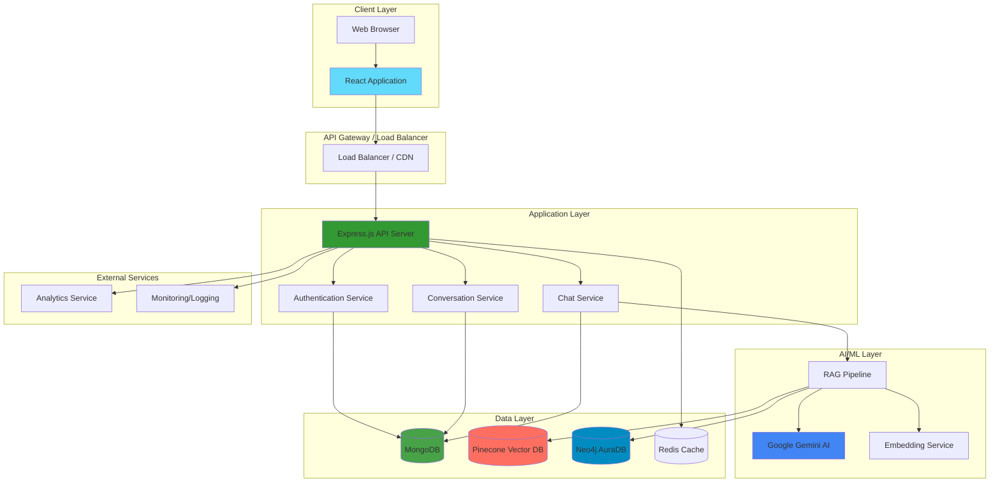
```mermaid
graph TB
    subgraph "Client Layer"
        Browser[Web Browser]
        React[React Application]
    end

    subgraph "API Gateway / Load Balancer"
        LB[Load Balancer / CDN]
    end

    subgraph "Application Layer"
        API[Express.js API Server]
        Auth[Authentication Service]
        Chat[Chat Service]
        Conv[Conversation Service]
    end

    subgraph "AI/ML Layer"
        RAG[RAG Pipeline]
        Gemini[Google Gemini AI]
        Embed[Embedding Service]
    end

    subgraph "Data Layer"
        MongoDB[(MongoDB)]
        Pinecone[(Pinecone Vector DB)]
        Neo4j[(Neo4j AuraDB)]
        Cache[(Redis Cache)]
    end

    subgraph "External Services"
        Analytics[Analytics Service]
        Monitoring[Monitoring/Logging]
    end

    Browser --> React
    React --> LB
    LB --> API

    API --> Auth
    API --> Chat
    API --> Conv

    Chat --> RAG
    RAG --> Embed
    RAG --> Gemini
    RAG --> Pinecone
    RAG --> Neo4j

    Auth --> MongoDB
    Conv --> MongoDB
    Chat --> MongoDB

    API --> Cache

    API --> Analytics
    API --> Monitoring

    style React fill:#61DAFB
    style API fill:#339933
    style MongoDB fill:#47A248
    style Pinecone fill:#FF6F61
    style Neo4j fill:#008CC1
    style Gemini fill:#4285F4
```

### Component Architecture

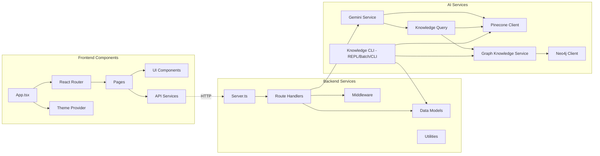
```mermaid
graph LR
    subgraph "Frontend Components"
        App[App.tsx]
        Router[React Router]
        Pages[Pages]
        Components[UI Components]
        Services[API Services]
        Theme[Theme Provider]
    end

    subgraph "Backend Services"
        Server[Server.ts]
        Routes[Route Handlers]
        Middleware[Middleware]
        Models[Data Models]
        Utils[Utilities]
    end

    subgraph "AI Services"
        GeminiSvc[Gemini Service]
        PineconeSvc[Pinecone Client]
        Neo4jClient[Neo4j Client]
        GraphKnowledge[Graph Knowledge Service]
        QueryKnowledge[Knowledge Query]
        KnowledgeCLI[Knowledge CLI - REPL/Batch/CLI]
    end

    App --> Router
    Router --> Pages
    Pages --> Components
    Pages --> Services
    App --> Theme

    Services -.HTTP.-> Server
    Server --> Routes
    Routes --> Middleware
    Routes --> Models
    Routes --> GeminiSvc

    GeminiSvc --> PineconeSvc
    GeminiSvc --> QueryKnowledge
    QueryKnowledge --> PineconeSvc
    QueryKnowledge --> GraphKnowledge
    GraphKnowledge --> Neo4jClient
    KnowledgeCLI --> PineconeSvc
    KnowledgeCLI --> GraphKnowledge
    KnowledgeCLI --> Models
```

---

## Technology Stack

### Frontend Stack

| Technology | Purpose | Version |
|------------|---------|---------|
| **Vite** | Build Tool & Dev Server | 7.2.2 |
| **React** | UI Framework | 18.2.0 |
| **TypeScript** | Type Safety | 4.9.5 |
| **Material-UI (MUI)** | UI Component Library | 5.16.14 |
| **React Router** | Client-side Routing | 6.29.0 |
| **Axios** | HTTP Client | 1.7.9 |
| **Framer Motion** | Animations | 12.4.2 |
| **React Markdown** | Markdown Rendering | 9.0.1 |
| **KaTeX** | Math Rendering | 0.16.22 |

### Backend Stack

| Technology | Purpose | Version |
|------------|---------|---------|
| **Node.js** | Runtime Environment | LTS |
| **Express.js** | Web Framework | 4.17.1 |
| **TypeScript** | Type Safety | 4.5.5 |
| **MongoDB** | Primary Database | 6.0.0 |
| **Mongoose** | ODM | 6.0.0 |
| **JWT** | Authentication | 9.0.0 |
| **bcrypt** | Password Hashing | 5.0.1 |
| **Swagger** | API Documentation | 6.2.8 |

### AI/ML Stack

| Technology | Purpose | Version |
|------------|---------|---------|
| **Google Gemini AI** | LLM | Auto-rotated (available Gemini models) |
| **Pinecone** | Vector Database | 4.1.0 |
| **Neo4j AuraDB** | Knowledge Graph Database | 5.x (AuraDB managed) |
| **Gemini Embeddings** | Vector Embeddings | gemini-embedding-001 |
| **MCP SDK** | Model Context Protocol | 1.0.0 |
| **LangChain** | Agent Framework | Latest |
| **LangGraph** | Pipeline Orchestration | Latest |

### DevOps & Deployment

| Technology | Purpose |
|------------|---------|
| **Docker** | Containerization |
| **Docker Compose** | Multi-container orchestration |
| **GitHub Actions** | CI/CD Pipeline |
| **Vercel** | Frontend Hosting |
| **AWS (Future)** | Production Infrastructure |
| **Terraform** | Infrastructure as Code |

---

## Frontend Architecture

### Component Hierarchy

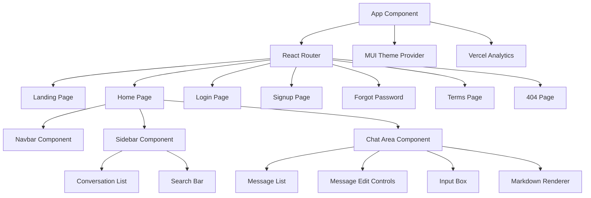
```mermaid
graph TD
    App[App Component]
    App --> Router[React Router]

    Router --> Landing[Landing Page]
    Router --> Home[Home Page]
    Router --> Login[Login Page]
    Router --> Signup[Signup Page]
    Router --> Forgot[Forgot Password]
    Router --> Terms[Terms Page]
    Router --> NotFound[404 Page]

    Home --> Navbar[Navbar Component]
    Home --> Sidebar[Sidebar Component]
    Home --> ChatArea[Chat Area Component]

    Sidebar --> ConvList[Conversation List]
    Sidebar --> Search[Search Bar]

    ChatArea --> MessageList[Message List]
    ChatArea --> MessageEdit[Message Edit Controls]
    ChatArea --> InputBox[Input Box]
    ChatArea --> MarkdownRender[Markdown Renderer]

    App --> ThemeProvider[MUI Theme Provider]
    App --> Analytics[Vercel Analytics]
```

### State Management

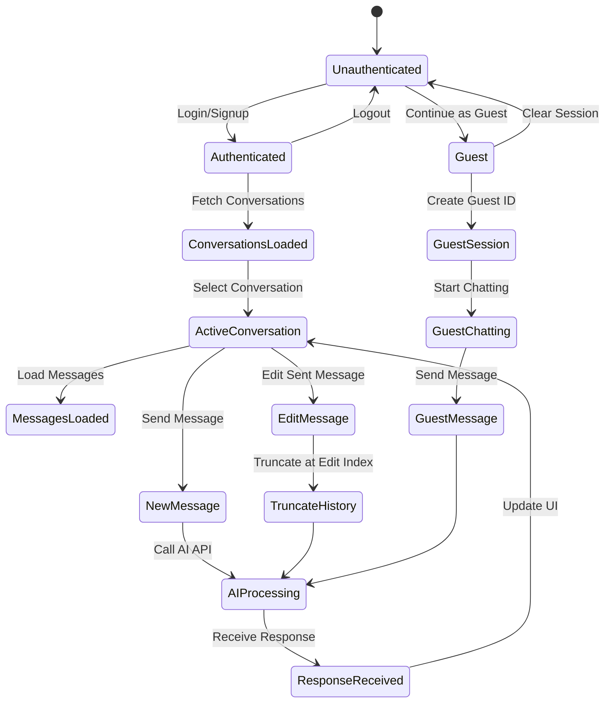
```mermaid
stateDiagram-v2
    [*] --> Unauthenticated

    Unauthenticated --> Authenticated: Login/Signup
    Unauthenticated --> Guest: Continue as Guest

    Authenticated --> ConversationsLoaded: Fetch Conversations
    ConversationsLoaded --> ActiveConversation: Select Conversation
    ActiveConversation --> MessagesLoaded: Load Messages

    Guest --> GuestSession: Create Guest ID
    GuestSession --> GuestChatting: Start Chatting

    ActiveConversation --> NewMessage: Send Message
    NewMessage --> AIProcessing: Call AI API
    AIProcessing --> ResponseReceived: Receive Response
    ResponseReceived --> ActiveConversation: Update UI

    ActiveConversation --> EditMessage: Edit Sent Message
    EditMessage --> TruncateHistory: Truncate at Edit Index
    TruncateHistory --> AIProcessing

    GuestChatting --> GuestMessage: Send Message
    GuestMessage --> AIProcessing

    Authenticated --> Unauthenticated: Logout
    Guest --> Unauthenticated: Clear Session
```

### Routing Structure

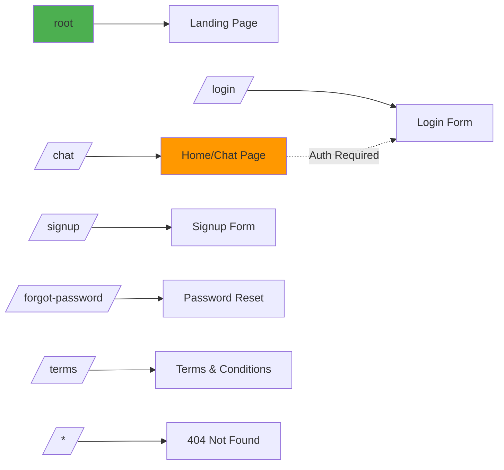
```mermaid
graph LR
    Root[root] --> LandingPage[Landing Page]

    Chat[/chat/] --> HomePage[Home/Chat Page]
    Login[/login/] --> LoginPage[Login Form]
    Signup[/signup/] --> SignupPage[Signup Form]
    Forgot[/forgot-password/] --> ForgotPage[Password Reset]
    Terms[/terms/] --> TermsPage[Terms & Conditions]
    NotFound[/*/] --> 404Page[404 Not Found]

    HomePage -.Auth Required.-> LoginPage

    style Root fill:#4CAF50
    style HomePage fill:#FF9800
```

---

## Backend Architecture

### API Layer

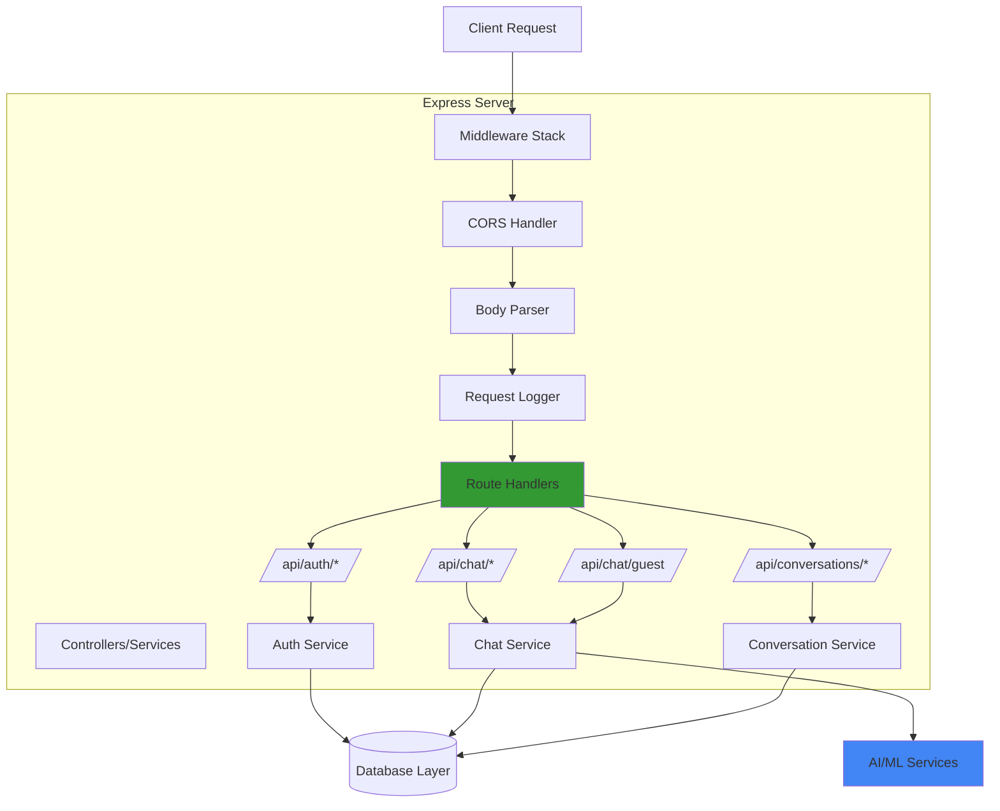
```mermaid
graph TB
    Client[Client Request]

    subgraph "Express Server"
        Middleware[Middleware Stack]
        CORS[CORS Handler]
        BodyParser[Body Parser]
        Logger[Request Logger]

        Routes[Route Handlers]
        AuthRoutes[/api/auth/*/]
        ChatRoutes[/api/chat/*/]
        ConvRoutes[/api/conversations/*/]
        GuestRoutes[/api/chat/guest/]

        Controllers[Controllers/Services]
        AuthService[Auth Service]
        ChatService[Chat Service]
        ConvService[Conversation Service]
    end

    Database[(Database Layer)]
    AI[AI/ML Services]

    Client --> Middleware
    Middleware --> CORS
    CORS --> BodyParser
    BodyParser --> Logger
    Logger --> Routes

    Routes --> AuthRoutes
    Routes --> ChatRoutes
    Routes --> ConvRoutes
    Routes --> GuestRoutes

    AuthRoutes --> AuthService
    ChatRoutes --> ChatService
    ConvRoutes --> ConvService
    GuestRoutes --> ChatService

    AuthService --> Database
    ChatService --> Database
    ChatService --> AI
    ConvService --> Database

    style Routes fill:#339933
    style AI fill:#4285F4
```

### API Endpoints Overview

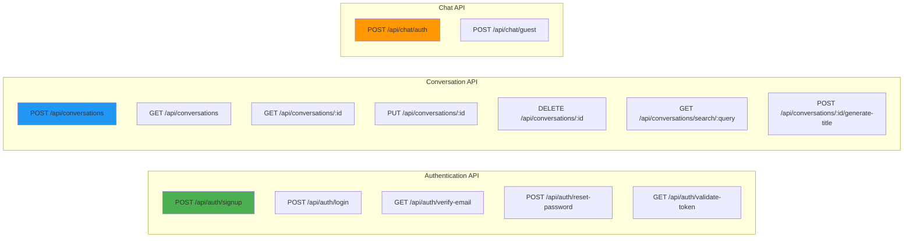
```mermaid
graph LR
    subgraph "Authentication API"
        POST_Signup[POST /api/auth/signup]
        POST_Login[POST /api/auth/login]
        GET_Verify[GET /api/auth/verify-email]
        POST_Reset[POST /api/auth/reset-password]
        GET_Validate[GET /api/auth/validate-token]
    end

    subgraph "Conversation API"
        POST_Conv[POST /api/conversations]
        GET_Convs[GET /api/conversations]
        GET_Conv[GET /api/conversations/:id]
        PUT_Conv[PUT /api/conversations/:id]
        DELETE_Conv[DELETE /api/conversations/:id]
        GET_Search[GET /api/conversations/search/:query]
        POST_GenTitle[POST /api/conversations/:id/generate-title]
    end

    subgraph "Chat API"
        POST_AuthChat[POST /api/chat/auth]
        POST_GuestChat[POST /api/chat/guest]
    end

    style POST_Signup fill:#4CAF50
    style POST_AuthChat fill:#FF9800
    style POST_Conv fill:#2196F3
```

### Service Layer

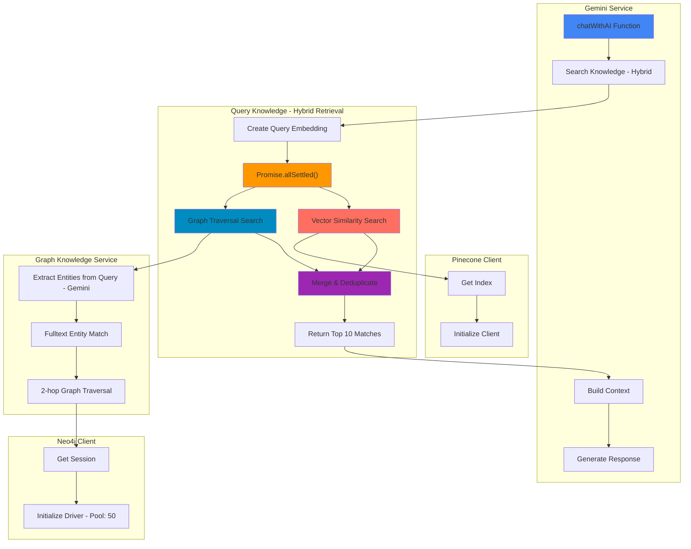
```mermaid
graph TD
    subgraph "Gemini Service"
        ChatWithAI[chatWithAI Function]
        SearchKnowledge[Search Knowledge - Hybrid]
        BuildContext[Build Context]
        GenerateResponse[Generate Response]
    end

    subgraph "Pinecone Client"
        InitPinecone[Initialize Client]
        GetIndex[Get Index]
    end

    subgraph "Neo4j Client"
        InitNeo4j[Initialize Driver - Pool: 50]
        GetSession[Get Session]
    end

    subgraph "Query Knowledge - Hybrid Retrieval"
        CreateEmbedding[Create Query Embedding]
        ParallelSearch["Promise.allSettled()"]
        VectorSearch[Vector Similarity Search]
        GraphSearch[Graph Traversal Search]
        MergeResults[Merge & Deduplicate]
        ReturnMatches[Return Top 10 Matches]
    end

    subgraph "Graph Knowledge Service"
        ExtractEntities[Extract Entities from Query - Gemini]
        FulltextMatch[Fulltext Entity Match]
        GraphTraversal[2-hop Graph Traversal]
    end

    ChatWithAI --> SearchKnowledge
    SearchKnowledge --> CreateEmbedding
    CreateEmbedding --> ParallelSearch
    ParallelSearch --> VectorSearch
    ParallelSearch --> GraphSearch
    VectorSearch --> MergeResults
    GraphSearch --> MergeResults
    MergeResults --> ReturnMatches
    ReturnMatches --> BuildContext
    BuildContext --> GenerateResponse

    VectorSearch --> GetIndex
    GetIndex --> InitPinecone

    GraphSearch --> ExtractEntities
    ExtractEntities --> FulltextMatch
    FulltextMatch --> GraphTraversal
    GraphTraversal --> GetSession
    GetSession --> InitNeo4j

    style ChatWithAI fill:#4285F4
    style VectorSearch fill:#FF6F61
    style GraphSearch fill:#008CC1
    style ParallelSearch fill:#FF9800
    style MergeResults fill:#9C27B0
```

### Data Layer

The data layer comprises three complementary data stores: MongoDB for application state, Pinecone for vector similarity search, and Neo4j AuraDB for knowledge graph traversal.

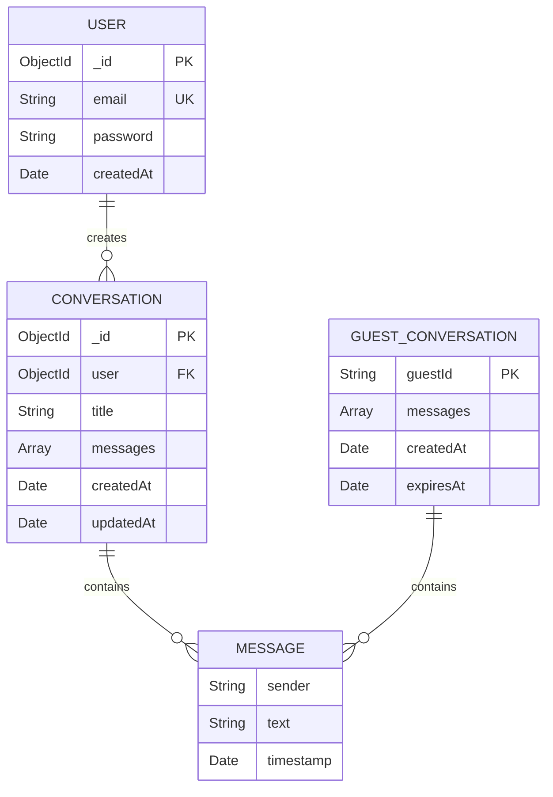
```mermaid
erDiagram
    USER ||--o{ CONVERSATION : creates
    CONVERSATION ||--o{ MESSAGE : contains
    GUEST_CONVERSATION ||--o{ MESSAGE : contains

    USER {
        ObjectId _id PK
        String email UK
        String password
        Date createdAt
    }

    CONVERSATION {
        ObjectId _id PK
        ObjectId user FK
        String title
        Array messages
        Date createdAt
        Date updatedAt
    }

    MESSAGE {
        String sender
        String text
        Date timestamp
    }

    GUEST_CONVERSATION {
        String guestId PK
        Array messages
        Date createdAt
        Date expiresAt
    }
```

#### Neo4j Knowledge Graph

Neo4j AuraDB provides a parallel graph retrieval path alongside Pinecone. Entities are extracted from document chunks at ingest time in batches of 5 chunks per Gemini AI call (with model rotation across 6 models), and graph traversal is used at query time to find contextually related chunks.

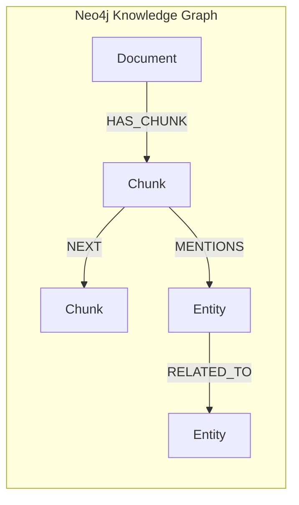
```mermaid
graph LR
    subgraph "Neo4j Knowledge Graph"
        D[Document] -->|HAS_CHUNK| C[Chunk]
        C -->|NEXT| C2[Chunk]
        C -->|MENTIONS| E[Entity]
        E -->|RELATED_TO| E2[Entity]
    end
```

**New backend services:**

| Service | File | Responsibility |
|---------|------|----------------|
| **Neo4j Client** | `neo4jClient.ts` | Connection management, pooling (max 50), health checks, graceful shutdown |
| **Graph Knowledge** | `graphKnowledge.ts` | Batch entity extraction (5 chunks/call, model rotation) at ingest, graph traversal at query time, merge algorithm |

**Knowledge CLI graph commands:**

| Command | Description |
|---------|-------------|
| `npm run graph:reset` | Wipe all nodes and relationships from the Neo4j knowledge graph |
| `npm run graph:rebuild --clean` | Wipe the graph and then rebuild it from scratch using the current knowledge sources |

**Environment variables:**

| Variable | Description |
|----------|-------------|
| `NEO4J_URI` | Neo4j AuraDB connection URI (e.g., `neo4j+s://xxxx.databases.neo4j.io`) |
| `NEO4J_USERNAME` | Neo4j authentication username |
| `NEO4J_PASSWORD` | Neo4j authentication password |
| `NEO4J_DATABASE` | Target database name (default: `neo4j`) |

### Authentication Flow

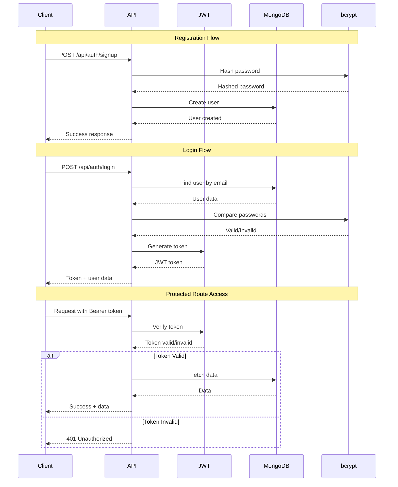
```mermaid
sequenceDiagram
    participant Client
    participant API
    participant JWT
    participant MongoDB
    participant bcrypt

    Note over Client,bcrypt: Registration Flow
    Client->>API: POST /api/auth/signup
    API->>bcrypt: Hash password
    bcrypt-->>API: Hashed password
    API->>MongoDB: Create user
    MongoDB-->>API: User created
    API-->>Client: Success response

    Note over Client,bcrypt: Login Flow
    Client->>API: POST /api/auth/login
    API->>MongoDB: Find user by email
    MongoDB-->>API: User data
    API->>bcrypt: Compare passwords
    bcrypt-->>API: Valid/Invalid
    API->>JWT: Generate token
    JWT-->>API: JWT token
    API-->>Client: Token + user data

    Note over Client,bcrypt: Protected Route Access
    Client->>API: Request with Bearer token
    API->>JWT: Verify token
    JWT-->>API: Token valid/invalid
    alt Token Valid
        API->>MongoDB: Fetch data
        MongoDB-->>API: Data
        API-->>Client: Success + data
    else Token Invalid
        API-->>Client: 401 Unauthorized
    end
```

---

## AI/ML Architecture

### RAG Implementation

The RAG (Retrieval-Augmented Generation) system grounds responses in knowledge retrieved from both Pinecone (vector similarity) and Neo4j (graph traversal), always returning inline citations with a sources list. Knowledge is ingested through CLI tools (REPL or one-off commands) and stored in MongoDB + Pinecone + Neo4j for retrieval. At query time, both retrieval paths run in parallel via `Promise.allSettled`, and results are merged, deduplicated, and scored before being passed to the generation phase. If live retrieval backends fail, the system can load static resume fallback context from local knowledge manifest/files.


```mermaid
graph TB
    UserQuery[User Query] --> ParallelRetrieval["Promise.allSettled()"]

    subgraph "Retrieval Phase - Vector Path"
        ParallelRetrieval --> EmbedQuery[Generate Query Embedding]
        EmbedQuery --> VectorSearch[Pinecone Vector Search]
        VectorSearch --> VectorTopK[Top 15 Vector Matches]
    end

    subgraph "Retrieval Phase - Graph Path"
        ParallelRetrieval --> ExtractEntities[Extract Entities from Query - Gemini]
        ExtractEntities --> GraphSearch[Neo4j Graph Traversal]
        GraphSearch --> GraphTopK[Top 15 Graph Matches]
    end

    subgraph "Merge Phase"
        VectorTopK --> MergeDedup[Merge & Deduplicate by chunkId]
        GraphTopK --> MergeDedup
        MergeDedup --> ScoreBonus["Dual-source bonus (+0.1)"]
        ScoreBonus --> LexicalBoost["Lexical boost (15%)"]
        LexicalBoost --> Top10[Return Top 10 SourceCitation]
    end

    subgraph "Augmentation Phase"
        Top10 --> BuildPrompt[Build Augmented Prompt]
        UserQuery --> BuildPrompt
        ConversationHistory[Conversation History] --> BuildPrompt
        SystemInstructions[System Instructions] --> BuildPrompt
    end

    subgraph "Generation Phase"
        BuildPrompt --> GeminiAPI[Google Gemini API]
        GeminiAPI --> GenerateResponse[Generate Response]
        GenerateResponse --> PostProcess[Post-process & Format]
    end

    PostProcess --> FinalResponse[Final Response to User]

    FinalResponse --> SaveToMongo[Save to MongoDB]

    style VectorSearch fill:#FF6F61
    style GraphSearch fill:#008CC1
    style ParallelRetrieval fill:#123467
    style MergeDedup fill:#9C27B0
    style GeminiAPI fill:#4285F4
    style SaveToMongo fill:#47A248
```

### Hybrid Retrieval Pipeline

The hybrid retrieval pipeline runs vector similarity search and graph traversal in parallel, then merges the results using a scoring algorithm that rewards chunks found by both paths. A failure in one path does not block the other, and when live backend retrieval fails entirely, static resume fallback context is used.

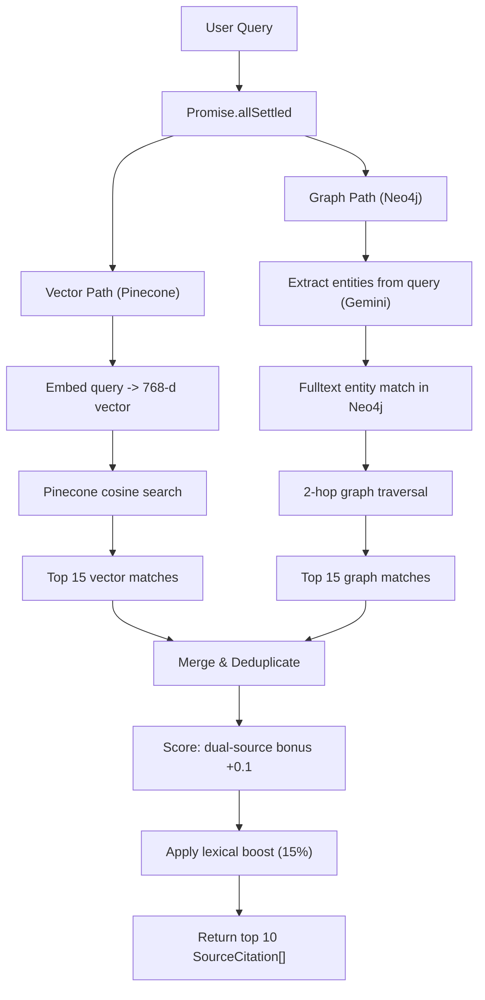
```mermaid
flowchart TD
    Q["User Query"] --> P["Promise.allSettled"]
    P --> V["Vector Path (Pinecone)"]
    P --> G["Graph Path (Neo4j)"]

    V --> V1["Embed query -> 768-d vector"]
    V1 --> V2["Pinecone cosine search"]
    V2 --> V3["Top 15 vector matches"]

    G --> G1["Extract entities from query (Gemini)"]
    G1 --> G2["Fulltext entity match in Neo4j"]
    G2 --> G3["2-hop graph traversal"]
    G3 --> G4["Top 15 graph matches"]

    V3 --> M["Merge & Deduplicate"]
    G4 --> M
    M --> S["Score: dual-source bonus +0.1"]
    S --> L["Apply lexical boost (15%)"]
    L --> R["Return top 10 SourceCitation[]"]
```

#### Merge Algorithm Details

| Step | Description |
|------|-------------|
| **1. Normalize** | Scale vector scores (0-1) and graph scores (0-1) to a common range |
| **2. Deduplicate** | Group results by `chunkId`; keep the highest score from each source |
| **3. Dual-source bonus** | Chunks appearing in both vector and graph results receive a +0.1 score bonus |
| **4. Lexical boost** | If the original query terms appear in the chunk text, apply a 15% score uplift |
| **5. Sort and trim** | Sort by final score descending, return the top 10 as `SourceCitation[]` |

### Vector Search Pipeline

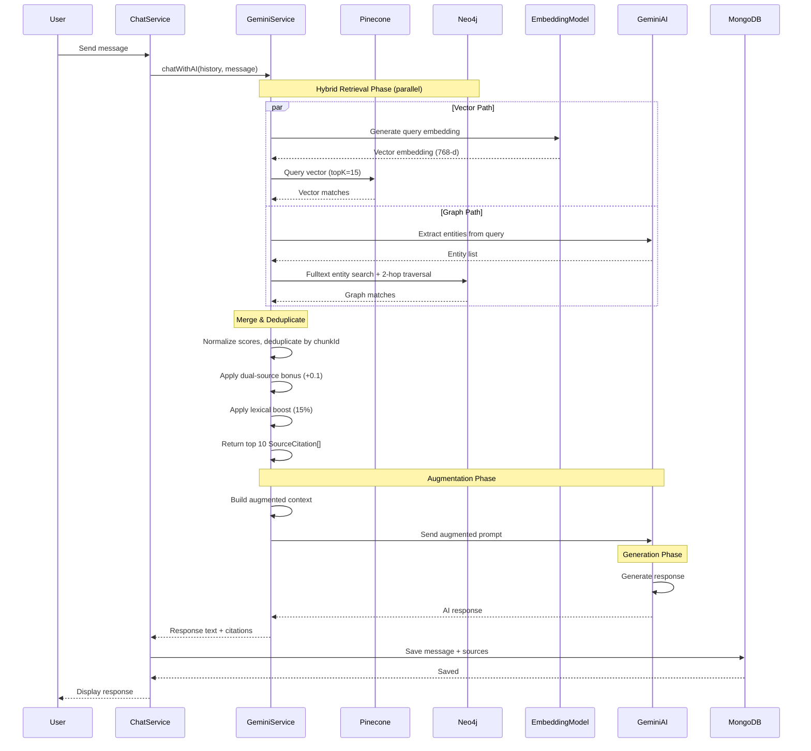
```mermaid
sequenceDiagram
    participant User
    participant ChatService
    participant GeminiService
    participant Pinecone
    participant Neo4j
    participant EmbeddingModel
    participant GeminiAI
    participant MongoDB

    User->>ChatService: Send message
    ChatService->>GeminiService: chatWithAI(history, message)

    Note over GeminiService,Neo4j: Hybrid Retrieval Phase (parallel)
    par Vector Path
        GeminiService->>EmbeddingModel: Generate query embedding
        EmbeddingModel-->>GeminiService: Vector embedding (768-d)
        GeminiService->>Pinecone: Query vector (topK=15)
        Pinecone-->>GeminiService: Vector matches
    and Graph Path
        GeminiService->>GeminiAI: Extract entities from query
        GeminiAI-->>GeminiService: Entity list
        GeminiService->>Neo4j: Fulltext entity search + 2-hop traversal
        Neo4j-->>GeminiService: Graph matches
    end

    Note over GeminiService: Merge & Deduplicate
    GeminiService->>GeminiService: Normalize scores, deduplicate by chunkId
    GeminiService->>GeminiService: Apply dual-source bonus (+0.1)
    GeminiService->>GeminiService: Apply lexical boost (15%)
    GeminiService->>GeminiService: Return top 10 SourceCitation[]

    Note over GeminiService,GeminiAI: Augmentation Phase
    GeminiService->>GeminiService: Build augmented context
    GeminiService->>GeminiAI: Send augmented prompt

    Note over GeminiAI: Generation Phase
    GeminiAI->>GeminiAI: Generate response
    GeminiAI-->>GeminiService: AI response

    GeminiService-->>ChatService: Response text + citations
    ChatService->>MongoDB: Save message + sources
    MongoDB-->>ChatService: Saved
    ChatService-->>User: Display response
```

### Graph Retrieval Pipeline

The graph path extracts entities from the user query using Gemini AI, matches them against the Neo4j fulltext index, and then performs a 2-hop traversal to find related chunks.

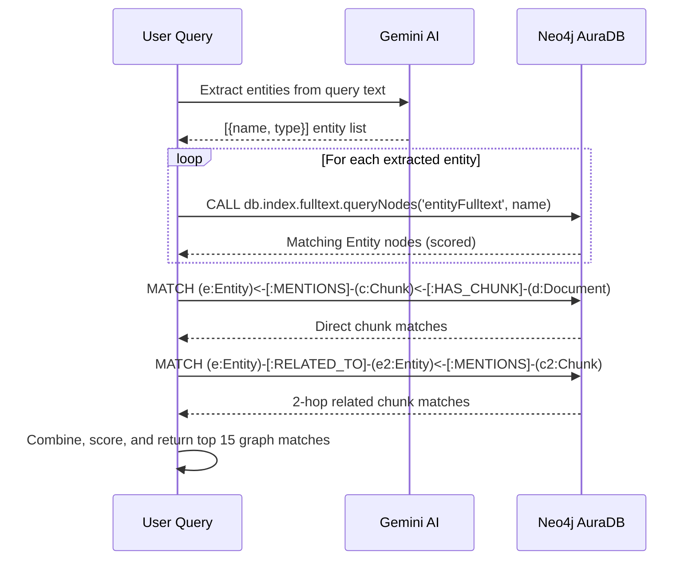
```mermaid
sequenceDiagram
    participant Query as User Query
    participant Gemini as Gemini AI
    participant Neo4j as Neo4j AuraDB

    Query->>Gemini: Extract entities from query text
    Gemini-->>Query: [{name, type}] entity list

    loop For each extracted entity
        Query->>Neo4j: CALL db.index.fulltext.queryNodes('entityFulltext', name)
        Neo4j-->>Query: Matching Entity nodes (scored)
    end

    Query->>Neo4j: MATCH (e:Entity)<-[:MENTIONS]-(c:Chunk)<-[:HAS_CHUNK]-(d:Document)
    Neo4j-->>Query: Direct chunk matches

    Query->>Neo4j: MATCH (e:Entity)-[:RELATED_TO]-(e2:Entity)<-[:MENTIONS]-(c2:Chunk)
    Neo4j-->>Query: 2-hop related chunk matches

    Query->>Query: Combine, score, and return top 15 graph matches
```

### Knowledge Storage

Knowledge is stored across three complementary systems: MongoDB (source metadata), Pinecone (vector embeddings), and Neo4j (entity graph). At ingestion time, chunks are embedded into Pinecone (with retry on rate limits) and batched in groups of 5 for entity extraction by Gemini AI (with model rotation) into Neo4j.


```mermaid
graph TD
    subgraph "Knowledge Ingestion Pipeline (CLI)"
        RawDocs[CLI Input or Files] --> Parse[Parse & Chunk]
        Parse --> Clean[Clean & Preprocess]
        Clean --> ParallelIngest["Parallel Ingestion"]
    end

    subgraph "Vector Path"
        ParallelIngest --> Embed[Generate Embeddings]
        Embed --> Metadata[Add Metadata + Source IDs]
        Metadata --> Upsert[Upsert to Pinecone]
    end

    subgraph "Graph Path"
        ParallelIngest --> BatchChunks["Batch Chunks (5 per call)"]
        BatchChunks --> ExtractEntities["Extract Entities (Gemini AI, model rotation)"]
        ExtractEntities --> CreateNodes[Create Document + Chunk + Entity Nodes]
        CreateNodes --> CreateRels[Create MENTIONS + RELATED_TO Relationships]
        CreateRels --> UpsertNeo4j[Upsert to Neo4j]
    end

    subgraph "Vector Database"
        Upsert --> PineconeIndex[(Pinecone Index)]
        PineconeIndex --> Namespace1[Namespace: knowledge]
    end

    subgraph "Graph Database"
        UpsertNeo4j --> Neo4jDB[(Neo4j AuraDB)]
        Neo4jDB --> DocNodes[Document Nodes]
        Neo4jDB --> ChunkNodes[Chunk Nodes]
        Neo4jDB --> EntityNodes[Entity Nodes]
    end

    subgraph "Retrieval"
        Query[User Query] --> HybridSearch["Hybrid Search (Parallel)"]
        HybridSearch --> QueryEmbed[Generate Query Embedding]
        HybridSearch --> QueryEntities[Extract Query Entities]
        QueryEmbed --> VectorSearch[Similarity Search]
        QueryEntities --> GraphTraversal[Graph Traversal]
        PineconeIndex --> VectorSearch
        Neo4jDB --> GraphTraversal
        VectorSearch --> MergeResults[Merge & Deduplicate]
        GraphTraversal --> MergeResults
        MergeResults --> Results[Top 10 Results]
    end

    style PineconeIndex fill:#FF6F61
    style Neo4jDB fill:#008CC1
    style Embed fill:#4285F4
    style ExtractEntities fill:#4285F4
    style HybridSearch fill:#123144
```

#### Knowledge Ingestion CLI Flow


```mermaid
flowchart LR
    Start([Run CLI]) --> LoadEnv[Load Environment Variables]
    LoadEnv --> InitPinecone[Initialize Pinecone Client]
    LoadEnv --> InitNeo4j[Initialize Neo4j Driver]
    InitPinecone --> InitEmbeddings[Initialize Embedding Model]

    InitEmbeddings --> ReadDocs[Read Content - REPL/File/Inline]
    ReadDocs --> ChunkDocs[Chunk Documents]

    ChunkDocs --> Loop{For Each Chunk}
    Loop --> CreateEmbed[Create Embedding Vector]
    CreateEmbed --> PrepareMetadata[Prepare Metadata + Source IDs]
    PrepareMetadata --> UpsertVector[Upsert to Pinecone]

    Loop --> BatchEntities["Batch Chunks (5 per LLM call)"]
    BatchEntities --> ExtractEntities["Extract Entities (Gemini AI, model rotation)"]
    ExtractEntities --> UpsertGraph["Upsert Document/Chunk/Entity Nodes to Neo4j"]
    UpsertGraph --> LinkEntities["Create MENTIONS + RELATED_TO Edges"]

    UpsertVector --> Loop
    LinkEntities --> Loop

    Loop --> PersistMongo[Save Knowledge Source in MongoDB]
    PersistMongo --> Complete([Storage Complete])

    style InitPinecone fill:#FF6F61
    style InitNeo4j fill:#008CC1
    style CreateEmbed fill:#4285F4
    style ExtractEntities fill:#4285F4
    style BatchEntities fill:#213232
```

#### Batch Entity Extraction

Entity extraction at ingest time now processes chunks in **batches of 5** per LLM call, reducing the total number of Gemini API requests by up to 80%. Each batch is sent as a single prompt that returns entities and relationships per chunk. The extraction call rotates through 6 Gemini models to spread load and avoid per-model rate limits.

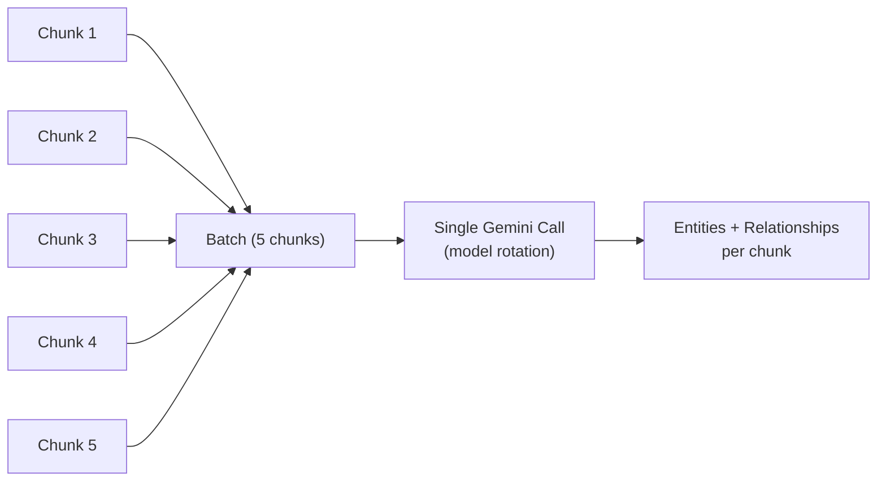
```mermaid
flowchart LR
    C1["Chunk 1"] --> B["Batch (5 chunks)"]
    C2["Chunk 2"] --> B
    C3["Chunk 3"] --> B
    C4["Chunk 4"] --> B
    C5["Chunk 5"] --> B
    B --> LLM["Single Gemini Call<br/>(model rotation)"]
    LLM --> E["Entities + Relationships<br/>per chunk"]
```

**Model rotation pool for entity extraction:**

| # | Model |
|---|-------|
| 1 | `gemini-2.5-flash` |
| 2 | `gemini-2.5-flash-lite` |
| 3 | `gemini-2.0-flash` |
| 4 | `gemini-2.0-flash-001` |
| 5 | `gemini-2.0-flash-lite` |
| 6 | `gemini-2.0-flash-lite-001` |

This is the same rotation strategy used by the chat generation path, ensuring consistent load distribution across all Gemini endpoints.

#### Manifest-Based Sync

Batch knowledge operations can be driven by a `manifest.json` file located in `server/knowledge/`. The manifest declares all knowledge source files, their metadata, and sync state, enabling reproducible bulk upserts and deletes. See [`UPDATE_KNOWLEDGE.md`](UPDATE_KNOWLEDGE.md) for the full manifest schema and workflow.

---

## MCP Server Architecture

The Lumina MCP Server is a standalone package (`mcp_server/`) that implements the [Model Context Protocol](https://modelcontextprotocol.io) — an open standard for connecting AI applications to external tools and data sources.

### MCP Protocol Overview

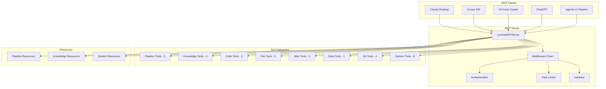
```mermaid
graph TB
    subgraph "MCP Clients"
        Claude[Claude Desktop]
        Cursor[Cursor IDE]
        VSCode[VS Code Copilot]
        ChatGPT[ChatGPT]
        Pipeline[Agentic AI Pipeline]
    end

    subgraph "MCP Server"
        Server[LuminaMCPServer]
        MW[Middleware Chain]
        Auth[Authentication]
        RL[Rate Limiter]
        Val[Validator]
    end

    subgraph "Tool Categories"
        PT[Pipeline Tools - 5]
        KT[Knowledge Tools - 4]
        CT[Code Tools - 3]
        FT[File Tools - 5]
        WT[Web Tools - 2]
        DT[Data Tools - 3]
        GT[Git Tools - 4]
        ST[System Tools - 6]
    end

    subgraph "Resources"
        PR[Pipeline Resources]
        KR[Knowledge Resources]
        SR[System Resources]
    end

    Claude --> Server
    Cursor --> Server
    VSCode --> Server
    ChatGPT --> Server
    Pipeline --> Server

    Server --> MW
    MW --> Auth
    MW --> RL
    MW --> Val

    Server --> PT
    Server --> KT
    Server --> CT
    Server --> FT
    Server --> WT
    Server --> DT
    Server --> GT
    Server --> ST
    Server --> PR
    Server --> KR
    Server --> SR
```

### Server Components

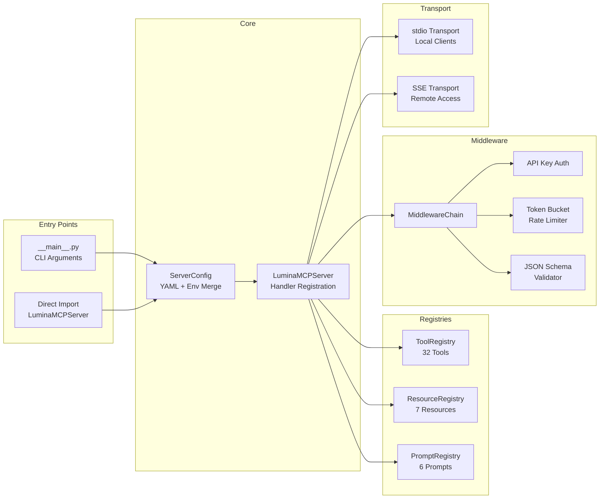
```mermaid
graph LR
    subgraph "Entry Points"
        CLI[__main__.py<br/>CLI Arguments]
        Import[Direct Import<br/>LuminaMCPServer]
    end

    subgraph "Core"
        Config[ServerConfig<br/>YAML + Env Merge]
        Server[LuminaMCPServer<br/>Handler Registration]
    end

    subgraph "Registries"
        TR[ToolRegistry<br/>32 Tools]
        RR[ResourceRegistry<br/>7 Resources]
        PR[PromptRegistry<br/>6 Prompts]
    end

    subgraph "Middleware"
        Chain[MiddlewareChain]
        Auth[API Key Auth]
        Rate[Token Bucket<br/>Rate Limiter]
        Valid[JSON Schema<br/>Validator]
    end

    subgraph "Transport"
        STDIO[stdio Transport<br/>Local Clients]
        SSE[SSE Transport<br/>Remote Access]
    end

    CLI --> Config
    Import --> Config
    Config --> Server
    Server --> TR
    Server --> RR
    Server --> PR
    Server --> Chain
    Chain --> Auth
    Chain --> Rate
    Chain --> Valid
    Server --> STDIO
    Server --> SSE
```

### Tool Architecture

Each tool category is implemented as a separate module with handlers inheriting from `ToolHandler(ABC)`:

| Category | Module | Tools | Description |
|----------|--------|-------|-------------|
| Pipeline | `pipeline_tools.py` | 5 | Run, monitor, cancel AI pipelines, get graph visualization |
| Knowledge | `knowledge_tools.py` | 4 | Search RAG knowledge base, similarity search, list sources |
| Code | `code_tools.py` | 3 | Regex code search, file analysis, project structure |
| File | `file_tools.py` | 5 | Read, write, list, search files with encoding support |
| Web | `web_tools.py` | 2 | HTTP fetch, HTML content extraction |
| Data | `data_tools.py` | 3 | CSV/JSON parsing, data transformation pipelines |
| Git | `git_tools.py` | 4 | Repository status, history, diffs, blame |
| System | `system_tools.py` | 6 | Health checks, metrics, diagnostics, tool discovery |

### MCP Client Integration

The `agentic_ai/mcp_client/` package provides a client that connects to the standalone MCP server:

```mermaid
sequenceDiagram
    participant O as Orchestrator
    participant C as MCPClient
    participant A as MCPToolAdapter
    participant T as ToolRegistry
    participant H as ToolHandler

    O->>C: initialise(config_path)
    C->>T: Import tool handlers (direct mode)
    
    O->>A: create_agent_tools("researcher")
    A->>A: Look up _AGENT_TOOL_MAP["researcher"]
    A->>C: Get tool handlers
    A-->>O: List[MCPToolAdapter] (LangChain-compatible)

    Note over O: Agent executes with tools
    O->>A: ainvoke({"query": "..."})
    A->>H: handle(arguments)
    H-->>A: Result
    A-->>O: Tool output
```

**Connection Modes:**
- **Direct** (default): In-process import — zero IPC overhead, maximum performance
- **Stdio**: Subprocess communication via stdin/stdout — process isolation

**Per-Agent Tool Assignment:**
The `tool_adapter.py` module maps each pipeline agent to a curated subset of MCP tools, ensuring agents only access relevant capabilities.

---

## Data Flow

### Chat Message Flow (Authenticated User)

```mermaid
sequenceDiagram
    participant UI as React UI
    participant API as API Service
    participant Auth as Auth Middleware
    participant Chat as Chat Route
    participant Gemini as Gemini Service
    participant Pinecone as Pinecone DB
    participant Neo4j as Neo4j AuraDB
    participant Mongo as MongoDB

    UI->>API: POST /api/chat/auth {message, conversationId, editIndex?}
    API->>Auth: Verify JWT token
    Auth-->>API: User ID

    API->>Chat: Handle chat request
    Chat->>Mongo: Fetch conversation history
    Mongo-->>Chat: Previous messages

    opt editIndex provided (message edit / conversation branching)
        Chat->>Chat: Truncate messages at editIndex
    end

    Chat->>Gemini: chatWithAI(history, message)

    par Hybrid Retrieval
        Gemini->>Pinecone: Vector similarity search (top 15)
        Pinecone-->>Gemini: Vector matches
    and
        Gemini->>Neo4j: Entity extraction + graph traversal (top 15)
        Neo4j-->>Gemini: Graph matches
    end

    Gemini->>Gemini: Merge, deduplicate, score (top 10)
    Gemini->>Gemini: Build augmented prompt
    Gemini->>Gemini: Call Google Gemini API
    Gemini-->>Chat: AI response + citations

    Chat->>Mongo: Save user message
    Chat->>Mongo: Save AI response + sources
    Mongo-->>Chat: Saved

    Chat-->>API: {answer, conversationId}
    API-->>UI: Display response
```

### Knowledge Ingestion Data Flow (Vector + Graph)

This diagram shows how data flows through both vector and graph paths during knowledge ingestion.

```mermaid
flowchart TD
    Input["CLI Input (REPL / File / Inline)"] --> Parse["Parse & Chunk Document"]
    Parse --> StoreMongo["Save KnowledgeSource to MongoDB"]

    Parse --> ParallelIngest{"Parallel Ingestion"}

    subgraph "Vector Ingestion"
        ParallelIngest --> Embed["Generate Embedding (Gemini)"]
        Embed --> PineconeUpsert["Upsert vector + metadata to Pinecone"]
    end

    subgraph "Graph Ingestion"
        ParallelIngest --> CreateDoc["MERGE Document node in Neo4j"]
        CreateDoc --> CreateChunk["MERGE Chunk node with text + metadata"]
        CreateChunk --> LinkChunk["CREATE HAS_CHUNK + NEXT relationships"]
        LinkChunk --> BatchChunks["Batch chunks (5 per call)"]
        BatchChunks --> ExtractEntities["Extract entities via Gemini AI<br/>(model rotation, 6 models)"]
        ExtractEntities --> CreateEntities["MERGE Entity nodes (normalized name + type)"]
        CreateEntities --> LinkMentions["CREATE MENTIONS relationships (Chunk -> Entity)"]
        LinkMentions --> LinkRelated["CREATE RELATED_TO relationships (Entity <-> Entity)"]
    end

    PineconeUpsert --> Done([Ingestion Complete])
    LinkRelated --> Done

    style PineconeUpsert fill:#FF6F61
    style CreateDoc fill:#008CC1
    style ExtractEntities fill:#4285F4
```

### Hybrid Retrieval Data Flow

This diagram shows how data flows through both vector and graph paths during query-time retrieval.

```mermaid
flowchart TD
    Query["User Message"] --> Parallel["Promise.allSettled()"]

    subgraph "Vector Retrieval"
        Parallel --> EmbedQ["Embed query -> 768-d vector"]
        EmbedQ --> PineconeQ["Pinecone cosine similarity (topK=15)"]
        PineconeQ --> VectorResults["Vector SourceCitation[]"]
    end

    subgraph "Graph Retrieval"
        Parallel --> ExtractQ["Extract entities from query (Gemini)"]
        ExtractQ --> FulltextQ["Neo4j fulltext index search"]
        FulltextQ --> TraverseQ["2-hop graph traversal (Entity -> Chunk -> Entity -> Chunk)"]
        TraverseQ --> GraphResults["Graph SourceCitation[]"]
    end

    VectorResults --> Merge["Merge & Deduplicate by chunkId"]
    GraphResults --> Merge
    Merge --> Normalize["Normalize scores to 0-1 range"]
    Normalize --> DualBonus["Dual-source bonus: +0.1 for chunks in both"]
    DualBonus --> LexBoost["Lexical boost: +15% if query terms in chunk"]
    LexBoost --> Top10["Sort descending, return top 10"]
    Top10 --> BuildPrompt["Build augmented prompt for Gemini"]

    style Parallel fill:#FF9800
    style PineconeQ fill:#FF6F61
    style FulltextQ fill:#008CC1
    style Merge fill:#9C27B0
```

If both live retrieval paths fail due backend errors, fallback sources are loaded from `server/knowledge/manifest.json` and the referenced local files. This keeps responses grounded without introducing a UI-based knowledge mutation flow.

### Exhaustive List Retrieval

For list-type queries (e.g., "list all projects", "show every skill", "what are all the awards"), the system detects list intent via regex and ensures complete coverage rather than returning only a top-K slice.

**How it works:**

1. The query is matched against list-intent patterns (`list all`, `every`, `show all`, etc.).
2. Normal hybrid retrieval runs with an expanded top-20 window.
3. If 50% or more of those top results originate from a single source document, the system fetches **all** chunks from that dominant source.
4. The complete source content (plus any extras from other sources) is passed to the LLM so it can produce an exhaustive answer.

```mermaid
flowchart TD
    Q["User: 'List all projects'"] --> D{"List query?"}
    D -->|No| N["Normal top-K retrieval"]
    D -->|Yes| H["Hybrid retrieval (top-20)"]
    H --> DOM{"50%+ from<br/>one source?"}
    DOM -->|No| R1["Return top-20"]
    DOM -->|Yes| ALL["Fetch ALL chunks<br/>from dominant source"]
    ALL --> R2["Return complete source + extras"]
```

### Conversation Management Flow

```mermaid
flowchart TD
    Start([User Action]) --> Action{Action Type}

    Action -->|Create New| CreateConv[POST /api/conversations]
    CreateConv --> SaveMongo1[Save to MongoDB]
    SaveMongo1 --> Return1[Return conversation ID]

    Action -->|Load All| GetConvs[GET /api/conversations]
    GetConvs --> QueryMongo1[Query user's conversations]
    QueryMongo1 --> Return2[Return conversation list]

    Action -->|Load Specific| GetConv[GET /api/conversations/:id]
    GetConv --> QueryMongo2[Query by ID]
    QueryMongo2 --> Verify{User owns conversation?}
    Verify -->|Yes| Return3[Return conversation with messages]
    Verify -->|No| Error1[403 Forbidden]

    Action -->|Rename| PutConv[PUT /api/conversations/:id]
    PutConv --> UpdateMongo[Update title in MongoDB]
    UpdateMongo --> Return4[Return updated conversation]

    Action -->|Auto-Generate Title| GenTitle[POST /api/conversations/:id/generate-title]
    GenTitle --> GetMessages[Fetch conversation messages]
    GetMessages --> CallAI[Call Gemini AI for title]
    CallAI --> ReturnTitle[Return generated title]

    Action -->|Search| SearchConv[GET /api/conversations/search/:query]
    SearchConv --> TextSearch[MongoDB text search]
    TextSearch --> Return5[Return matching conversations]

    Action -->|Delete| DeleteConv[DELETE /api/conversations/:id]
    DeleteConv --> RemoveMongo[Remove from MongoDB]
    RemoveMongo --> Return6[Return success]

    style CreateConv fill:#4CAF50
    style QueryMongo1 fill:#47A248
    style SaveMongo1 fill:#47A248
    style GenTitle fill:#4285F4
```

### Guest vs Authenticated User Flow

```mermaid
flowchart TD
    UserLands[User Lands on App] --> AuthCheck{Authenticated?}

    AuthCheck -->|Yes| LoadToken[Load JWT from localStorage]
    LoadToken --> ValidateToken{Token Valid?}
    ValidateToken -->|Yes| FetchConvs[Fetch Conversations]
    FetchConvs --> AuthUI[Show Authenticated UI]
    ValidateToken -->|No| ClearToken[Clear Token]
    ClearToken --> GuestMode

    AuthCheck -->|No| GuestCheck{Has Guest ID?}
    GuestCheck -->|Yes| LoadGuestID[Load Guest ID from localStorage]
    LoadGuestID --> GuestMode[Enter Guest Mode]
    GuestCheck -->|No| CreateGuestID[Create New Guest ID]
    CreateGuestID --> SaveGuestID[Save to localStorage]
    SaveGuestID --> GuestMode

    GuestMode --> GuestUI[Show Guest UI]
    GuestUI --> LimitedFeatures[Limited Features]

    AuthUI --> SendMessage{Send Message}
    SendMessage --> AuthAPI[POST /api/chat/auth]
    AuthAPI --> PersistMongo[(Persist to MongoDB)]

    GuestUI --> SendGuestMessage{Send Message}
    SendGuestMessage --> GuestAPI[POST /api/chat/guest]
    GuestAPI --> EphemeralStorage[(Ephemeral Storage)]

    LimitedFeatures -.Upgrade.-> Login[Redirect to Login]
    Login --> AuthCheck

    style AuthUI fill:#4CAF50
    style GuestUI fill:#FF9800
    style PersistMongo fill:#47A248
```

### Message Editing & Conversation Branching

Users can edit any previously sent message to branch the conversation from that point. The edit replaces the original message and discards all subsequent messages, then generates a fresh AI response.

```mermaid
sequenceDiagram
    participant UI as React UI
    participant API as Chat API
    participant Mongo as MongoDB

    UI->>UI: User clicks edit icon on sent message
    UI->>UI: Show inline edit TextField
    UI->>UI: User submits edited text

    Note over UI: Local state: truncate messages[0..editIndex-1], append edited message

    UI->>API: POST /api/chat/auth/stream {message, conversationId, editIndex}
    API->>Mongo: Fetch conversation
    API->>API: Truncate messages at editIndex
    API->>API: Build history from truncated messages
    API->>API: Generate AI response (streamed)
    API-->>UI: SSE chunks
    API->>Mongo: Save truncated history + new user message + AI response
    UI->>UI: Render new branch of conversation
```

**Key implementation details:**

| Aspect | Detail |
|--------|--------|
| **Frontend state** | `editingIndex` / `editText` in `ChatArea.tsx`; cleared on conversation switch |
| **Backend parameter** | `editIndex` (optional integer) on all four chat endpoints (`/auth`, `/auth/stream`, `/guest`, `/guest/stream`) |
| **Truncation** | `conversation.messages.slice(0, editIndex)` — everything from editIndex onward is discarded before the new exchange |
| **Retry policy** | Retries are disabled (`maxRetries = 1`) for edit requests to prevent corrupted message state from partial streams |
| **UX** | Pencil icon appears beside each user message; inline `TextField` with Enter to submit, Escape to cancel |

---

## Database Schema

### MongoDB Collections

#### Users Collection

```javascript
{
  _id: ObjectId,
  email: String (unique, indexed),
  password: String (bcrypt hashed),
  createdAt: Date,
  __v: Number
}
```

#### Conversations Collection

```typescript
{
  _id: ObjectId,
  user: ObjectId (ref: 'User', indexed),
  title: String (default: "Untitled Conversation"),
  messages: [
    {
      sender: String ("user" | "model"),
      text: String,
      sources: [
        {
          id: String,
          sourceId: String,
          title: String,
          url: String,
          snippet: String,
          score: Number,
          sourceType: String,
          chunkIndex: Number
        }
      ],
      timestamp: Date,
      _id: ObjectId
    }
  ],
  createdAt: Date,
  updatedAt: Date,
  __v: Number
}
```

#### Guest Conversations Collection

```typescript
{
  guestId: String (unique, indexed),
  messages: [
    {
      sender: String ("user" | "model"),
      text: String,
      sources: [
        {
          id: String,
          sourceId: String,
          title: String,
          url: String,
          snippet: String,
          score: Number,
          sourceType: String,
          chunkIndex: Number
        }
      ],
      timestamp: Date,
      _id: ObjectId
    }
  ],
  createdAt: Date,
  expiresAt: Date (TTL index: 24 hours),
  __v: Number
}
```

#### Knowledge Sources Collection

```javascript
{
  _id: ObjectId,
  user: ObjectId (optional, ref: 'User'),
  title: String,
  content: String,
  sourceType: String ("resume" | "note" | "link" | "project" | "bio" | "other"),
  sourceUrl: String,
  tags: [String],
  externalId: String (unique),
  chunkCount: Number,
  createdAt: Date,
  updatedAt: Date,
  __v: Number
}
```

### Pinecone Vector Database Schema

```javascript
{
  id: String (unique),
  values: Array<Number> (embedding vector, dimension: 768),
  metadata: {
    text: String,
    sourceId: String,
    title: String,
    sourceType: String,
    sourceUrl: String,
    chunkIndex: Number
  }
}
```

### Neo4j Knowledge Graph Schema

The Neo4j knowledge graph stores documents, chunks, and entities with rich relationships. Entities are extracted from document chunks at ingest time using Gemini AI in batches of 5 chunks per call, with model rotation across 6 Gemini models.

```mermaid
erDiagram
    Document {
        string sourceId PK
        string title
        string sourceType
        string sourceUrl
    }
    Chunk {
        string chunkId PK
        string text
        int chunkIndex
        string sourceId FK
        string title
        string sourceType
    }
    Entity {
        string normalizedName
        string type
        string name
        string description
    }
    Document ||--o{ Chunk : HAS_CHUNK
    Chunk ||--o| Chunk : NEXT
    Chunk }o--o{ Entity : MENTIONS
    Entity }o--o{ Entity : RELATED_TO
```

#### Entity Types

| Entity Type | Description | Examples |
|-------------|-------------|----------|
| **Person** | Individuals mentioned in knowledge sources | Names, authors, colleagues |
| **Organization** | Companies, institutions, teams | Employers, universities, open-source orgs |
| **Project** | Software projects, initiatives | Repository names, product names |
| **Technology** | Programming languages, frameworks, tools | React, Python, Kubernetes |
| **Skill** | Technical or professional competencies | Machine learning, system design |
| **Location** | Geographic locations | Cities, states, countries |
| **Certification** | Professional certifications | AWS Solutions Architect, PMP |
| **Education** | Degrees, courses, academic programs | B.S. Computer Science, Coursera course |
| **Award** | Honors, recognitions | Dean's List, hackathon prizes |
| **Publication** | Papers, articles, blog posts | Conference papers, journal articles |

#### Relationship Types

| Relationship | From | To | Description |
|-------------|------|-----|-------------|
| **HAS_CHUNK** | Document | Chunk | Document contains this chunk |
| **NEXT** | Chunk | Chunk | Sequential ordering of chunks within a document |
| **MENTIONS** | Chunk | Entity | This chunk mentions this entity |
| **RELATED_TO** | Entity | Entity | Semantic relationship between entities |
| **WORKED_AT** | Person | Organization | Employment relationship |
| **WORKED_ON** | Person | Project | Project contribution |
| **USES_TECH** | Project | Technology | Technology used by a project |
| **HAS_SKILL** | Person | Skill | Person possesses this skill |
| **STUDIED_AT** | Person | Education | Educational background |
| **EARNED** | Person | Certification | Certification achieved |
| **PUBLISHED** | Person | Publication | Authorship of a publication |
| **AWARDED** | Person | Award | Award received |
| **LOCATED_IN** | Organization | Location | Geographic location of an organization |

### Database Indexing Strategy

```mermaid
graph LR
    subgraph "MongoDB Indexes"
        UserEmail[Users.email - Unique]
        ConvUser[Conversations.user - Regular]
        ConvCreated[Conversations.createdAt - Descending]
        GuestID[GuestConversations.guestId - Unique]
        GuestExpire[GuestConversations.expiresAt - TTL]
        KnowledgeExternalId[KnowledgeSources.externalId - Unique]
    end

    subgraph "Pinecone Indexes"
        VectorIndex[Vector Similarity - HNSW]
        MetadataFilter[Metadata Filtering]
    end

    subgraph "Neo4j Indexes & Constraints"
        DocUnique["Document.sourceId - Unique Constraint"]
        ChunkUnique["Chunk.chunkId - Unique Constraint"]
        EntityComposite["Entity(normalizedName, type) - Composite Index"]
        EntityFulltext["Entity(name, normalizedName) - Fulltext Index"]
    end

    style UserEmail fill:#47A248
    style VectorIndex fill:#FF6F61
    style DocUnique fill:#008CC1
    style EntityFulltext fill:#008CC1
```

---

## Graceful Degradation

The system is designed to operate seamlessly even when individual components are unavailable. The Neo4j graph retrieval path is fully optional -- if the `NEO4J_URI` environment variable is not set, or if the Neo4j connection fails at runtime, the system automatically falls back to vector-only retrieval mode. If live backend retrieval fails, a static resume fallback from local manifest/files is used before returning empty citations.

```mermaid
flowchart TD
    Start["Query arrives"] --> CheckNeo4j{"NEO4J_URI configured?"}

    CheckNeo4j -->|No| VectorOnly["Vector-only mode (Pinecone)"]
    CheckNeo4j -->|Yes| CheckHealth{"Neo4j connection healthy?"}

    CheckHealth -->|Yes| HybridMode["Hybrid mode (Pinecone + Neo4j in parallel)"]
    CheckHealth -->|No| FallbackVector["Fallback to vector-only mode"]

    HybridMode --> PromiseAllSettled["Promise.allSettled()"]
    PromiseAllSettled --> CheckResults{"Both paths succeeded?"}

    CheckResults -->|Yes| MergeBoth["Merge both result sets"]
    CheckResults -->|Vector only| UseVector["Use vector results only"]
    CheckResults -->|Graph only| UseGraph["Use graph results only"]
    CheckResults -->|Both failed| StaticFallback["Load static resume fallback<br/>(manifest + local files)"]
    StaticFallback --> StaticAvailable{"Fallback sources found?"}
    StaticAvailable -->|Yes| UseStatic["Use static fallback sources"]
    StaticAvailable -->|No| EmptyResults["Return empty citations"]

    VectorOnly --> PineconeSearch["Standard Pinecone search"]
    FallbackVector --> PineconeSearch

    style VectorOnly fill:#FF6F61
    style HybridMode fill:#9C27B0
    style FallbackVector fill:#FF9800
```

### Degradation Modes

| Scenario | Behavior | User Impact |
|----------|----------|-------------|
| **Full hybrid** | Both Pinecone and Neo4j available | Best retrieval quality -- dual-source scoring |
| **Neo4j URI not set** | Graph path skipped entirely | Identical to pre-Neo4j behavior (fully backwards compatible) |
| **Neo4j connection failure** | Graph path returns empty via `Promise.allSettled` | Slightly reduced retrieval diversity; no errors surfaced |
| **Neo4j timeout** | Graph path settles as rejected | Vector results used; response time unaffected |
| **Pinecone failure** | Vector path returns empty | Graph results used alone (reduced coverage) |
| **Both live retrieval backends fail** | Load static resume fallback from local manifest/files; if unavailable, return empty citations | Responses are usually still grounded by fallback context |

### Key Design Decisions

- **`Promise.allSettled` over `Promise.all`**: Ensures one failing path never blocks the other
- **No hard dependency**: The `neo4jClient.ts` module initializes only when `NEO4J_URI` is present
- **Connection health checks**: Neo4j driver verifies connectivity at startup; failures are logged but do not prevent server boot
- **File-backed fallback context**: Static resume fallback reads `server/knowledge/manifest.json` and source files, so insert/update/delete remains easy through existing manifest/CLI workflows
- **Rate-limit awareness**: Entity extraction uses exponential backoff to avoid Gemini API throttling
- **Embedding retry with backoff**: Embedding generation retries up to 5 attempts with a 3-second backoff between each attempt on rate-limit (429) or transient errors, preventing ingestion failures during high-throughput upserts
- **Batch entity extraction**: Chunks are grouped into batches of 5 per LLM call, reducing API request volume by up to 80% and improving ingestion throughput

---

## Security Architecture

### Security Layers

```mermaid
graph TB
    subgraph "Network Security"
        HTTPS[HTTPS/TLS Encryption]
        CORS[CORS Protection]
        RateLimit[Rate Limiting]
    end

    subgraph "Application Security"
        JWT[JWT Authentication]
        Bcrypt[Password Hashing - bcrypt]
        Validation[Input Validation]
        Sanitization[Data Sanitization]
    end

    subgraph "Data Security"
        Encryption[Data Encryption at Rest]
        Access[Role-Based Access Control]
        Audit[Audit Logging]
    end

    subgraph "Infrastructure Security"
        Firewall[Firewall Rules]
        VPC[Virtual Private Cloud]
        Secrets[Secrets Management]
    end

    Client[Client Request] --> HTTPS
    HTTPS --> CORS
    CORS --> RateLimit
    RateLimit --> JWT
    JWT --> Validation
    Validation --> Sanitization
    Sanitization --> Access
    Access --> Encryption

    style JWT fill:#FF6F61
    style Bcrypt fill:#4CAF50
```

### JWT Authentication Flow

```mermaid
sequenceDiagram
    participant Client
    participant Server
    participant JWT as JWT Service
    participant DB as Database

    Note over Client,DB: Login Process
    Client->>Server: POST /login {email, password}
    Server->>DB: Find user by email
    DB-->>Server: User data
    Server->>Server: Verify password (bcrypt)
    Server->>JWT: Generate token {userId, exp}
    JWT-->>Server: Signed JWT
    Server-->>Client: {token, user}

    Client->>Client: Store token in localStorage

    Note over Client,DB: Authenticated Request
    Client->>Server: Request with Authorization: Bearer <token>
    Server->>JWT: Verify token signature
    JWT-->>Server: Decoded payload {userId}
    Server->>DB: Fetch user data
    DB-->>Server: User data
    Server-->>Client: Protected resource
```

### Data Security Measures

| Layer | Security Measure | Implementation |
|-------|------------------|----------------|
| **Transport** | HTTPS/TLS 1.3 | All API communications encrypted |
| **Authentication** | JWT Tokens | Signed with secret, 24h expiration |
| **Passwords** | bcrypt Hashing | Salt rounds: 10, one-way encryption |
| **Input Validation** | Schema Validation | Mongoose schemas, Express validators |
| **CORS** | Whitelisted Origins | Configurable allowed domains |
| **Rate Limiting** | Request Throttling | Per-IP rate limits (future) |
| **SQL Injection** | Parameterized Queries | Mongoose ORM protection |
| **XSS Prevention** | Content Sanitization | React's built-in XSS protection |
| **API Keys** | Environment Variables | Never committed to version control |

---

## Deployment Architecture

### Current Deployment (Vercel)

```mermaid
graph TB
    subgraph "Edge Network"
        CDN[Vercel Edge Network]
    end

    subgraph "Frontend Deployment"
        ReactBuild[React Build Artifacts]
        VercelFrontend[Vercel Frontend]
    end

    subgraph "Backend Deployment"
        ServerlessFunctions[Vercel Serverless Functions]
        VercelBackend[Vercel Backend]
    end

    subgraph "External Services"
        MongoDB[MongoDB Atlas]
        Pinecone[Pinecone Cloud]
        Neo4j[Neo4j AuraDB]
        Gemini[Google Gemini API]
    end

    Users[Users] --> CDN
    CDN --> VercelFrontend
    VercelFrontend --> ReactBuild

    VercelFrontend -.API Calls.-> VercelBackend
    VercelBackend --> ServerlessFunctions

    ServerlessFunctions --> MongoDB
    ServerlessFunctions --> Pinecone
    ServerlessFunctions --> Neo4j
    ServerlessFunctions --> Gemini

    style VercelFrontend fill:#000000
    style MongoDB fill:#47A248
    style Pinecone fill:#FF6F61
    style Neo4j fill:#008CC1
    style Gemini fill:#4285F4
```

### Docker Containerization

```mermaid
graph LR
    subgraph "Docker Compose Setup"
        FrontendContainer[Frontend Container<br/>Node.js + React<br/>Port 3000]
        BackendContainer[Backend Container<br/>Node.js + Express<br/>Port 5000]
        MongoContainer[MongoDB Container<br/>Port 27017]
    end

    subgraph "External Services"
        PineconeCloud[Pinecone Cloud]
        Neo4jAura[Neo4j AuraDB]
        GeminiAPI[Gemini API]
    end

    FrontendContainer -.HTTP.-> BackendContainer
    BackendContainer -.MongoDB Protocol.-> MongoContainer
    BackendContainer -.HTTPS.-> PineconeCloud
    BackendContainer -."Bolt (neo4j+s://)".-> Neo4jAura
    BackendContainer -.HTTPS.-> GeminiAPI

    style FrontendContainer fill:#61DAFB
    style BackendContainer fill:#339933
    style MongoContainer fill:#47A248
    style Neo4jAura fill:#008CC1
```

### CI/CD Pipeline

```mermaid
flowchart TD
    Start([Git Push]) --> GitHubActions[GitHub Actions Triggered]

    GitHubActions --> Checkout[Checkout Code]
    Checkout --> InstallDeps[Install Dependencies]

    InstallDeps --> LintFrontend[Lint Frontend]
    InstallDeps --> LintBackend[Lint Backend]

    LintFrontend --> TestFrontend[Run Frontend Tests]
    LintBackend --> TestBackend[Run Backend Tests]

    TestFrontend --> BuildFrontend[Build React App]
    TestBackend --> BuildBackend[Build Express Server]

    BuildFrontend --> DeployCheck{Tests Passed?}
    BuildBackend --> DeployCheck

    DeployCheck -->|Yes| DeployFrontend[Deploy to Vercel Frontend]
    DeployCheck -->|Yes| DeployBackend[Deploy to Vercel Backend]
    DeployCheck -->|No| NotifyFailure[Notify Team]

    DeployFrontend --> VerifyDeploy[Verify Deployment]
    DeployBackend --> VerifyDeploy

    VerifyDeploy --> NotifySuccess[Notify Success]

    NotifyFailure --> End([End])
    NotifySuccess --> End

    style DeployCheck fill:#FF9800
    style NotifySuccess fill:#4CAF50
    style NotifyFailure fill:#F44336
```

### Future AWS Deployment Architecture

```mermaid
graph TB
    subgraph "User Access"
        Users[Users]
        Route53[Amazon Route 53<br/>DNS]
    end

    subgraph "Edge Layer"
        CloudFront[Amazon CloudFront<br/>CDN]
        WAF[AWS WAF<br/>Web Application Firewall]
    end

    subgraph "Application Layer - Availability Zone 1"
        ALB1[Application Load Balancer]
        ECS1[ECS/Fargate<br/>Frontend Container]
        ECS2[ECS/Fargate<br/>Backend Container]
    end

    subgraph "Application Layer - Availability Zone 2"
        ECS3[ECS/Fargate<br/>Frontend Container]
        ECS4[ECS/Fargate<br/>Backend Container]
    end

    subgraph "Caching Layer"
        ElastiCache[Amazon ElastiCache<br/>Redis]
    end

    subgraph "Data Layer"
        DocumentDB[Amazon DocumentDB<br/>MongoDB Compatible]
        S3[Amazon S3<br/>Static Assets]
    end

    subgraph "AI/ML Services"
        Pinecone[Pinecone Cloud<br/>Vector DB]
        Neo4jAura[Neo4j AuraDB<br/>Knowledge Graph]
        Gemini[Google Gemini API]
    end

    subgraph "Monitoring & Security"
        CloudWatch[Amazon CloudWatch]
        Secrets[AWS Secrets Manager]
        IAM[AWS IAM]
    end

    Users --> Route53
    Route53 --> CloudFront
    CloudFront --> WAF
    WAF --> ALB1

    ALB1 --> ECS1
    ALB1 --> ECS2
    ALB1 --> ECS3
    ALB1 --> ECS4

    ECS2 --> ElastiCache
    ECS4 --> ElastiCache

    ECS2 --> DocumentDB
    ECS4 --> DocumentDB

    ECS1 --> S3
    ECS3 --> S3

    ECS2 --> Pinecone
    ECS4 --> Pinecone
    ECS2 --> Neo4jAura
    ECS4 --> Neo4jAura
    ECS2 --> Gemini
    ECS4 --> Gemini

    ECS1 --> CloudWatch
    ECS2 --> CloudWatch
    ECS3 --> CloudWatch
    ECS4 --> CloudWatch

    ECS2 --> Secrets
    ECS4 --> Secrets

    style CloudFront fill:#FF9900
    style ECS1 fill:#61DAFB
    style ECS2 fill:#339933
    style DocumentDB fill:#47A248
    style Pinecone fill:#FF6F61
    style Neo4jAura fill:#008CC1
```

---

## Performance Considerations

### Performance Optimization Strategies

```mermaid
graph TD
    subgraph "Frontend Optimizations"
        LazyLoad[Lazy Loading Components]
        CodeSplit[Code Splitting]
        Memoization[React Memoization]
        ImageOpt[Image Optimization]
    end

    subgraph "Backend Optimizations"
        Caching[Response Caching]
        DBIndexing[Database Indexing]
        ConnectionPool[Connection Pooling]
        Compression[Response Compression]
    end

    subgraph "Network Optimizations"
        CDN[CDN Distribution]
        HTTP2[HTTP/2 Protocol]
        Minification[Asset Minification]
        Bundling[Asset Bundling]
    end

    subgraph "AI/ML Optimizations"
        VectorCache[Vector Search Caching]
        BatchEmbedding[Batch Embedding Generation]
        ModelOptimization[Model Parameter Tuning]
        ParallelRetrieval[Parallel Hybrid Retrieval]
        GraphPooling[Neo4j Connection Pooling]
        RateLimitBackoff[Rate-Limit-Aware Backoff]
    end

    style Caching fill:#4CAF50
    style CDN fill:#FF9900
    style VectorCache fill:#FF6F61
    style ParallelRetrieval fill:#FF9800
    style GraphPooling fill:#008CC1
```

### Caching Strategy

```mermaid
graph LR
    Request[User Request] --> CheckCache{Cache Hit?}

    CheckCache -->|Yes| ReturnCached[Return Cached Data]
    CheckCache -->|No| FetchDB[Fetch from Database]

    FetchDB --> ProcessData[Process Data]
    ProcessData --> StoreCache[Store in Cache]
    StoreCache --> ReturnData[Return Data]

    ReturnCached --> CheckExpiry{Expired?}
    CheckExpiry -->|Yes| FetchDB
    CheckExpiry -->|No| End[Return to User]

    ReturnData --> End

    style CheckCache fill:#FF9800
    style ReturnCached fill:#4CAF50
```

### Response Time Targets

| Operation | Target Time | Current Performance |
|-----------|-------------|---------------------|
| Page Load (First Contentful Paint) | < 1.5s | ~1.2s |
| API Authentication | < 200ms | ~150ms |
| Chat Message (without AI) | < 300ms | ~250ms |
| AI Response Generation | < 3s | ~2.5s |
| Conversation Load | < 500ms | ~400ms |
| Vector Search (Pinecone) | < 100ms | ~80ms |
| Graph Traversal (Neo4j) | < 150ms | ~120ms |
| Hybrid Retrieval (parallel, both paths) | < 200ms | ~150ms |
| Entity Extraction (Gemini, query-time) | < 300ms | ~200ms |

### Neo4j Graph Performance

| Optimization | Details |
|-------------|---------|
| **Connection Pooling** | Max 50 connections to Neo4j AuraDB; connections reused across requests |
| **Parallel Retrieval** | Both vector and graph paths execute simultaneously via `Promise.allSettled`, so total retrieval time equals the slower of the two paths rather than the sum |
| **Graph Indexes** | Unique constraint on `Document.sourceId` and `Chunk.chunkId`; composite index on `Entity(normalizedName, type)`; fulltext index on `Entity(name, normalizedName)` for sub-millisecond lookups |
| **Rate-Limit-Aware Extraction** | Entity extraction at ingest time uses exponential backoff (base 1s, max 30s) to handle Gemini API rate limits without dropping chunks |
| **Batch Entity Extraction** | Chunks are grouped into batches of 5 per LLM call; combined with model rotation across 6 Gemini models, this reduces API calls by up to 80% and distributes load evenly |
| **Embedding Retry** | Embedding generation retries up to 5 times with 3-second backoff on rate-limit or transient errors, ensuring no chunks are silently dropped during ingestion |
| **Bounded Traversal** | Graph traversal limited to 2 hops to prevent combinatorial explosion on densely connected entities |
| **Graceful Timeout** | Graph path has a configurable timeout; if exceeded, `Promise.allSettled` settles the graph path as rejected and vector results are used alone |

---

## Scalability Strategy

### Horizontal Scaling Architecture

```mermaid
graph TB
    subgraph "Load Distribution"
        LB[Load Balancer]
    end

    subgraph "Application Tier - Auto Scaling Group"
        App1[App Instance 1]
        App2[App Instance 2]
        App3[App Instance 3]
        AppN[App Instance N...]
    end

    subgraph "Data Tier"
        Primary[(Primary DB)]
        Replica1[(Read Replica 1)]
        Replica2[(Read Replica 2)]
    end

    subgraph "Cache Tier"
        Redis1[(Redis Primary)]
        Redis2[(Redis Replica)]
    end

    Users[Increasing Users] --> LB
    LB --> App1
    LB --> App2
    LB --> App3
    LB --> AppN

    App1 --> Redis1
    App2 --> Redis1
    App3 --> Redis1
    AppN --> Redis1

    Redis1 -.Replication.-> Redis2

    App1 --> Primary
    App2 --> Replica1
    App3 --> Replica2
    AppN --> Replica1

    Primary -.Replication.-> Replica1
    Primary -.Replication.-> Replica2

    style LB fill:#FF9800
    style App1 fill:#339933
    style Primary fill:#47A248
```

### Scalability Metrics & Thresholds

```mermaid
graph TD
    Monitor[Monitoring System] --> CheckCPU{CPU > 70%}
    Monitor --> CheckMemory{Memory > 80%}
    Monitor --> CheckLatency{Latency > 500ms}
    Monitor --> CheckRequests{Requests/s > Threshold}

    CheckCPU -->|Yes| ScaleOut[Trigger Scale Out]
    CheckMemory -->|Yes| ScaleOut
    CheckLatency -->|Yes| ScaleOut
    CheckRequests -->|Yes| ScaleOut

    ScaleOut --> AddInstance[Add New Instance]
    AddInstance --> RegisterLB[Register with Load Balancer]
    RegisterLB --> HealthCheck[Perform Health Check]
    HealthCheck --> Active[Instance Active]

    CheckCPU -->|No| Continue[Continue Monitoring]
    CheckMemory -->|No| Continue
    CheckLatency -->|No| Continue
    CheckRequests -->|No| Continue

    style ScaleOut fill:#FF9800
    style Active fill:#4CAF50
```

### Database Scaling Strategy

| Strategy | Implementation | Use Case |
|----------|----------------|----------|
| **Vertical Scaling** | Increase instance size (MongoDB, Neo4j) | Initial growth phase |
| **Read Replicas** | Add read-only copies (MongoDB) | Distribute read load |
| **Sharding** | Partition by user ID (MongoDB) | Massive dataset growth |
| **Caching** | Redis/ElastiCache | Reduce DB queries |
| **Connection Pooling** | MongoDB + Neo4j (max 50) connection reuse | Handle concurrent users |
| **Neo4j AuraDB Scaling** | AuraDB managed tier auto-scales | Graph query load growth |
| **Parallel Retrieval** | Vector + graph paths run simultaneously | Reduce total latency |

---

## Monitoring and Observability

### Monitoring Architecture

```mermaid
graph TB
    subgraph "Application Instrumentation"
        Frontend[Frontend Metrics]
        Backend[Backend Metrics]
        Database[Database Metrics]
    end

    subgraph "Monitoring Services"
        CloudWatch[AWS CloudWatch]
        Prometheus[Prometheus]
        Grafana[Grafana Dashboards]
    end

    subgraph "Alerting"
        SNS[AWS SNS]
        Email[Email Alerts]
        Slack[Slack Notifications]
        PagerDuty[PagerDuty]
    end

    subgraph "Logging"
        CloudWatchLogs[CloudWatch Logs]
        ElasticSearch[Elasticsearch]
        Kibana[Kibana]
    end

    Frontend --> CloudWatch
    Backend --> CloudWatch
    Database --> CloudWatch

    CloudWatch --> Prometheus
    Prometheus --> Grafana

    CloudWatch --> SNS
    SNS --> Email
    SNS --> Slack
    SNS --> PagerDuty

    Backend --> CloudWatchLogs
    CloudWatchLogs --> ElasticSearch
    ElasticSearch --> Kibana

    style Grafana fill:#FF9800
    style Prometheus fill:#E6522C
```

### Key Metrics to Monitor

1. **Application Metrics**
   - Request throughput (requests/second)
   - Response time (p50, p95, p99)
   - Error rate (4xx, 5xx)
   - Active users (concurrent connections)

2. **Infrastructure Metrics**
   - CPU utilization
   - Memory usage
   - Disk I/O
   - Network throughput

3. **Database Metrics**
   - Query execution time
   - Connection pool usage
   - Replication lag
   - Cache hit ratio

4. **AI/ML Metrics**
   - AI response time
   - Vector search latency (Pinecone)
   - Graph traversal latency (Neo4j)
   - Hybrid merge/dedup time
   - Entity extraction latency (Gemini)
   - Pinecone query performance
   - Neo4j connection pool utilization
   - Dual-source hit rate (% of queries with matches from both paths)
   - Token usage/costs

---

## Disaster Recovery

### Backup Strategy

```mermaid
graph LR
    subgraph "Data Sources"
        MongoDB[MongoDB]
        Pinecone[Pinecone Vectors]
        S3Assets[S3 Assets]
    end

    subgraph "Backup Storage"
        S3Backup[S3 Backup Bucket]
        Glacier[S3 Glacier]
    end

    subgraph "Backup Schedule"
        Continuous[Continuous: Binlog]
        Daily[Daily: Full Backup]
        Weekly[Weekly: Archive]
    end

    MongoDB -->|Real-time| Continuous
    MongoDB -->|24h| Daily
    MongoDB -->|7d| Weekly

    Continuous --> S3Backup
    Daily --> S3Backup
    Weekly --> Glacier

    Pinecone -->|Snapshot| Daily
    S3Assets -->|Versioning| S3Backup

    style S3Backup fill:#FF9900
    style Glacier fill:#4CAF50
```

### Recovery Time Objectives (RTO) and Recovery Point Objectives (RPO)

| Component | RPO | RTO | Strategy |
|-----------|-----|-----|----------|
| **MongoDB** | < 5 minutes | < 30 minutes | Point-in-time restore |
| **Pinecone** | < 1 hour | < 2 hours | Daily snapshots |
| **Neo4j AuraDB** | < 1 hour | < 1 hour | AuraDB managed backups; re-ingest from MongoDB/Pinecone if needed |
| **Frontend** | 0 (immutable) | < 5 minutes | Redeployment |
| **Backend** | 0 (stateless) | < 5 minutes | Redeployment |

---

## Future Enhancements

### Planned Architectural Improvements

1. **Microservices Decomposition**
   - Separate authentication service
   - Dedicated chat service
   - Independent AI/ML service

2. **Event-Driven Architecture**
   - AWS EventBridge or SNS/SQS
   - Asynchronous processing
   - Event sourcing for audit trails

3. **Advanced Caching**
   - Multi-level caching (L1: in-memory, L2: Redis)
   - Conversation caching
   - AI response caching for common queries

4. **Real-Time Features**
   - WebSocket & SSE support for live chat
   - Server-sent events for streaming responses
   - Collaborative features

5. **Enhanced Security**
   - OAuth2/OIDC integration
   - Multi-factor authentication
   - API rate limiting with Redis
   - DDoS protection

6. **Observability**
   - Distributed tracing (OpenTelemetry)
   - Advanced metrics (Prometheus + Grafana)
   - Log aggregation (ELK stack)

7. **AI/ML Improvements**
   - Fine-tuned custom models
   - Multi-model support
   - Response quality feedback loop
   - A/B testing for AI parameters

8. **MCP Ecosystem Expansion**
   - Additional tool categories (database, cloud, messaging)
   - MCP server marketplace integration
   - Custom tool plugin system
   - Remote MCP server clustering
   - Tool usage analytics and optimization

---

## Conclusion

This architecture document provides a comprehensive overview of the Lumina AI Assistant application's design, from high-level system architecture to detailed component interactions. The system is designed with scalability, security, and maintainability in mind, leveraging modern cloud-native technologies and best practices.

### Key Architectural Strengths

- **Modular Design**: Clear separation between frontend, backend, and AI/ML components
- **Hybrid Retrieval**: Parallel vector similarity (Pinecone) and graph traversal (Neo4j) with merged scoring for higher relevance
- **Graceful Degradation**: Full backwards compatibility -- system operates in vector-only mode when Neo4j is unavailable and can use static resume fallback context when live retrieval backends fail
- **Scalable Infrastructure**: Ready for horizontal scaling with cloud-native patterns
- **Secure by Design**: Multiple layers of security from network to data
- **Observable**: Comprehensive monitoring and logging capabilities
- **Flexible Deployment**: Support for multiple deployment strategies (Vercel, Docker, AWS)
- **MCP Integration**: Standardized tool access through Model Context Protocol for broad AI client compatibility

### Next Steps

1. Implement AWS/Terraform infrastructure (see `aws/` and `terraform/` directories)
2. Set up production monitoring and alerting
3. Establish automated backup and disaster recovery procedures
4. Conduct load testing and performance optimization
5. Implement advanced features (real-time chat, enhanced AI capabilities)
6. Expand MCP server tool catalog and add remote clustering support

---

**Document Version**: 3.1
**Last Updated**: 2026-03-30
**Maintained By**: David Nguyen
**Contact**: hoangson091104@gmail.com
