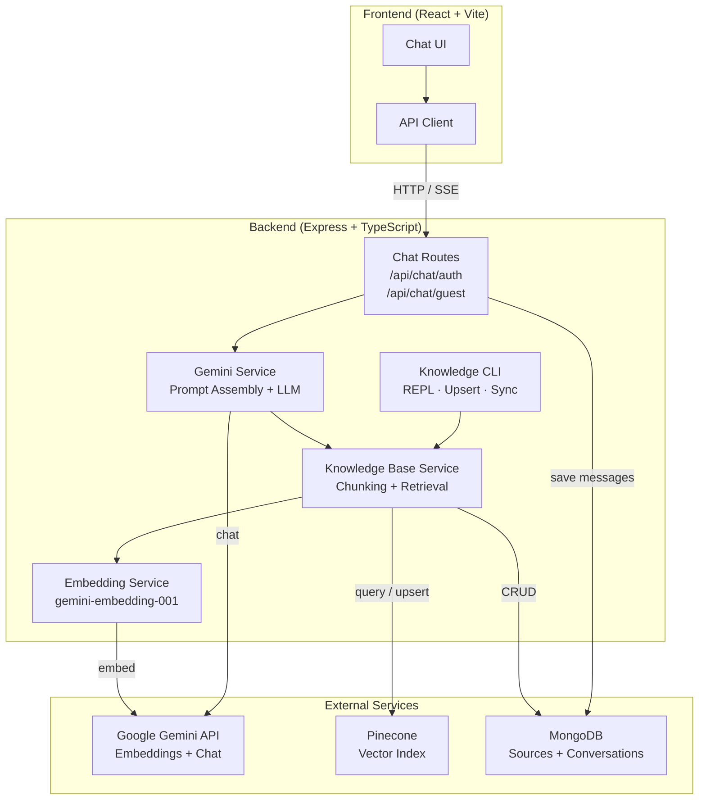
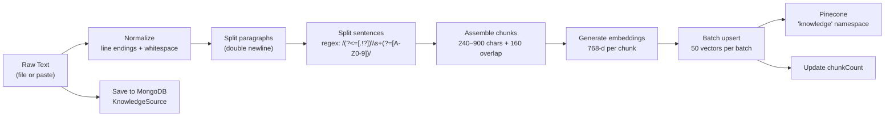
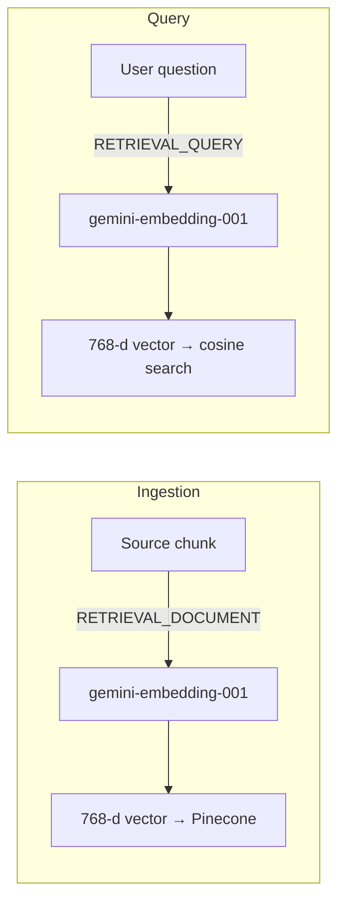
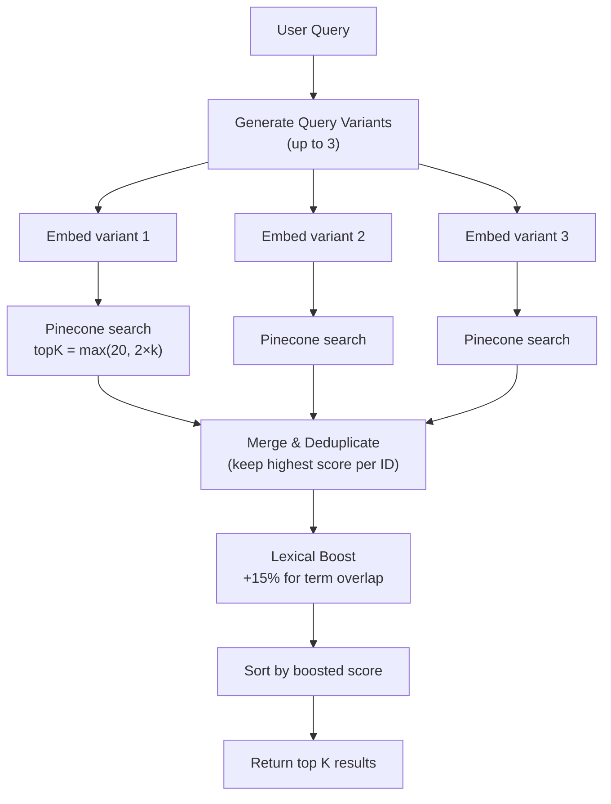
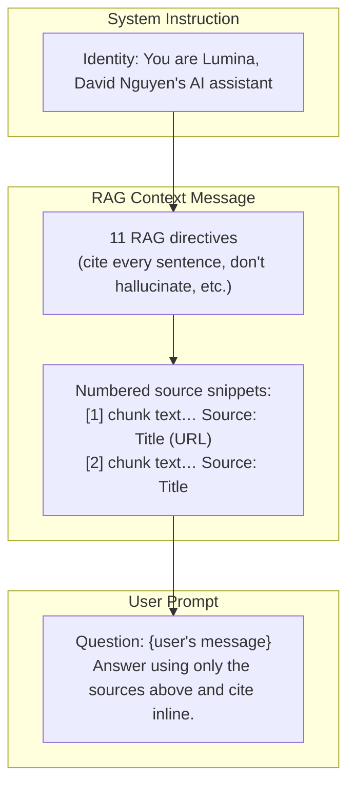
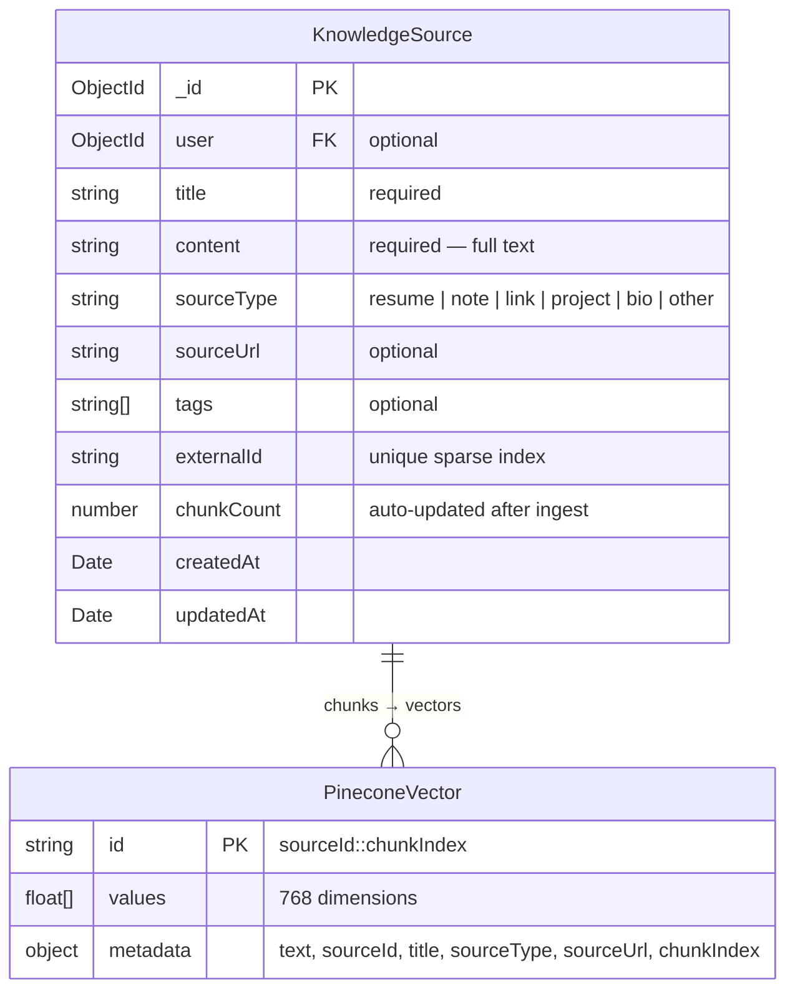
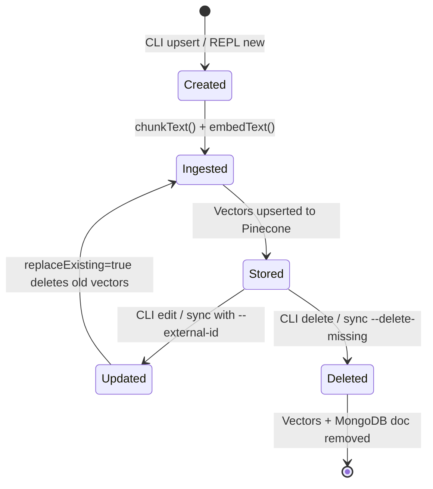
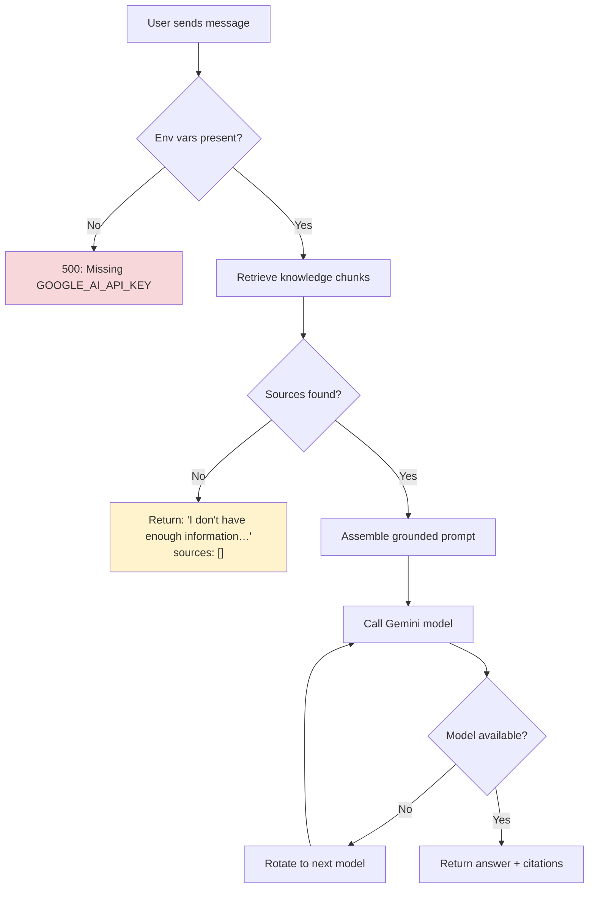

# RAG - Retrieval-Augmented Generation in Lumina

Lumina uses a strict RAG pipeline: every answer is grounded in vector-indexed knowledge sources, and every sentence carries an inline citation that maps to a numbered sources list shown in the UI. If no sources match the user's question, the assistant says so rather than hallucinating.

## Table of Contents

- [Architecture Overview](#architecture-overview)
- [End-to-End Chat Flow](#end-to-end-chat-flow)
- [Knowledge Ingestion Pipeline](#knowledge-ingestion-pipeline)
- [Embedding Generation](#embedding-generation)
- [Vector Storage (Pinecone)](#vector-storage-pinecone)
- [Retrieval & Ranking](#retrieval--ranking)
- [Grounded Response Generation](#grounded-response-generation)
- [Knowledge Source Model](#knowledge-source-model)
- [Knowledge CLI](#knowledge-cli)
- [Configuration](#configuration)
- [Error Handling & Graceful Degradation](#error-handling--graceful-degradation)

---

## Architecture Overview



---

## End-to-End Chat Flow

The diagram below traces a single user message from input through retrieval, grounding, and response.

```mermaid
sequenceDiagram
  participant U as User
  participant C as Chat Route
  participant K as Knowledge Base
  participant E as Embedding Service
  participant P as Pinecone
  participant G as Gemini LLM

  U->>C: POST /api/chat/auth { message, conversationId? }
  C->>C: Load conversation history from MongoDB

  rect rgb(0, 0, 0)
    note over C,P: RAG Retrieval Phase
    C->>K: retrieveKnowledgeChunks(message, topK=10)
    K->>K: Build query variants (up to 3)
    loop Each variant
      K->>E: embedText(variant, RETRIEVAL_QUERY)
      E->>G: Gemini embedding request (768-d)
      G-->>E: Embedding vector
      E-->>K: Float[768]
      K->>P: query({ vector, topK: 20, includeMetadata })
      P-->>K: Scored matches with metadata
    end
    K->>K: Merge & deduplicate across variants
    K->>K: Compute lexical boost (15% weight)
    K->>K: Sort by boosted score → top 10
    K-->>C: SourceCitation[]
  end

  alt No sources found
    C-->>U: "I do not have enough information…"
  else Sources available
    rect rgb(0, 0, 0)
      note over C,G: Grounded Generation Phase
      C->>G: System: "You are Lumina…" + RAG instructions
      C->>G: Context: Numbered source snippets [1]…[N]
      C->>G: User prompt with citation directive
      G-->>C: Response text with inline [1], [2] citations
    end
    C->>C: Save user + model messages to MongoDB
    C-->>U: { answer, sources, conversationId }
  end
```



### Streaming Variant

The `/api/chat/auth/stream` and `/api/chat/guest/stream` endpoints use Server-Sent Events:

| SSE Event Type     | Payload                          | When Sent                  |
| ------------------ | -------------------------------- | -------------------------- |
| `conversationId`   | `{ conversationId }`             | Immediately after creation |
| `chunk`            | `{ text }`                       | Each generated token chunk |
| `sources`          | `{ sources: SourceCitation[] }`  | After generation completes |
| `done`             | `{}`                             | Stream end signal          |
| `error`            | `{ message }`                    | On failure                 |

---

## Knowledge Ingestion Pipeline



### Chunking Strategy

The `chunkText()` function in `server/src/services/knowledgeBase.ts` implements a multi-level splitter:

| Constant             | Value | Purpose                              |
| -------------------- | ----- | ------------------------------------ |
| `MAX_CHUNK_CHARS`    | 900   | Maximum characters per chunk         |
| `MIN_CHUNK_CHARS`    | 240   | Minimum characters (merge if under)  |
| `CHUNK_OVERLAP_CHARS`| 160   | Overlap between adjacent chunks      |
| `UPSERT_BATCH_SIZE`  | 50    | Vectors sent per Pinecone batch      |

**Process:**

1. **Normalize** — Converts `\r\n` → `\n`, collapses runs of blank lines, trims edges.
2. **Paragraph split** — Splits on double newlines to preserve semantic boundaries.
3. **Sentence split** — Uses `/(?<=[.!?])\s+(?=[A-Z0-9"'])/g` within paragraphs that exceed 900 chars. Force-splits any sentence that still exceeds the limit.
4. **Assemble with overlap** — Accumulates segments up to 900 chars, keeps a 160-char suffix as overlap for the next chunk, and merges any trailing runt below 240 chars into the previous chunk.

### Vector Structure

Each chunk is stored in Pinecone as:

```jsonc
{
  "id": "{sourceId}::{chunkIndex}",   // composite key
  "values": [/* 768 floats */],
  "metadata": {
    "text": "The chunk content…",
    "sourceId": "65a3f2…",            // MongoDB ObjectId
    "title": "Resume 2025",
    "sourceType": "resume",
    "sourceUrl": "https://…",         // optional
    "chunkIndex": 0
  }
}
```

---

## Embedding Generation

**File:** `server/src/services/geminiEmbeddings.ts`

| Setting              | Value                         |
| -------------------- | ----------------------------- |
| Model                | `models/gemini-embedding-001` |
| Dimensions           | 768                           |
| Document task type   | `RETRIEVAL_DOCUMENT`          |
| Query task type      | `RETRIEVAL_QUERY`             |

Google's Gemini embedding model supports asymmetric task types — documents are embedded with `RETRIEVAL_DOCUMENT` for richer content representation, while user queries use `RETRIEVAL_QUERY` for semantic matching optimized toward questions.



The embedding service validates that every response contains exactly 768 floats before returning. Malformed responses throw immediately.

---

## Vector Storage (Pinecone)

**File:** `server/src/services/pineconeClient.ts`

### Index Requirements

| Setting    | Value        | Notes                                |
| ---------- | ------------ | ------------------------------------ |
| Dimensions | 768          | Must match Gemini embeddings         |
| Metric     | `cosine`     | Normalized similarity scoring (0–1)  |
| Namespace  | `knowledge`  | All RAG vectors live here            |

### Operations

| Operation  | Method                                         | Batch Size |
| ---------- | ---------------------------------------------- | ---------- |
| **Upsert** | `index.namespace("knowledge").upsert(batch)`   | 50 vectors |
| **Query**  | `index.namespace("knowledge").query(…)`        | Single     |
| **Delete** | `index.namespace("knowledge").deleteMany(…)`   | By filter  |

Deletion filters by `sourceId` metadata and gracefully ignores 404 (already-deleted) errors.

---

## Retrieval & Ranking

**File:** `server/src/services/knowledgeBase.ts` — `retrieveKnowledgeChunks()`



### Query Variant Expansion

The retriever builds up to 3 query variants to improve recall:

| Pattern Detected                          | Added Variant                              |
| ----------------------------------------- | ------------------------------------------ |
| `project`, `portfolio`, `built`, `work`   | `"recent projects portfolio notable projects"` |
| `experience`, `worked`, `work history`    | `"work experience projects"`               |

### Hybrid Scoring

Each result's final score combines vector similarity with a lexical boost:

```
finalScore = vectorSimilarity + (termMatchRatio × 0.15)
```

- **Term extraction:** The query is tokenized; words under 3 characters and common stopwords (≈40 words including "the", "what", "how", "your", "recent") are removed.
- **Lexical match:** Each term is checked against `title + sourceType + snippet` (lowercased). The hit ratio is multiplied by `LEXICAL_BOOST_WEIGHT` (0.15).
- **Validation:** Results missing required metadata (`text`, `title`, `sourceId`) are discarded before final sorting.

### Retrieval Constants

| Constant               | Value | Purpose                                  |
| ---------------------- | ----- | ---------------------------------------- |
| `RAG_TOP_K`            | 10    | Default number of results returned       |
| `MIN_SEARCH_TOP_K`     | 8     | Minimum initial candidates per variant   |
| `QUERY_VARIANT_LIMIT`  | 3     | Maximum query expansions                 |
| `MIN_QUERY_TERM_LENGTH`| 3     | Minimum characters for a lexical term    |
| `LEXICAL_BOOST_WEIGHT` | 0.15  | Lexical score contribution (15%)         |

---

## Grounded Response Generation

**File:** `server/src/services/geminiService.ts`

### Prompt Assembly

The LLM receives a carefully structured prompt with three layers:



### RAG Directives (Key Rules)

1. Answer **only** using the provided sources.
2. Cite inline using `[number]` matching the sources list.
3. Every sentence must include at least one citation.
4. If sources don't contain the answer, say so — don't guess.
5. Don't use general knowledge for questions about the knowledge base owner.
6. Be concise; de-duplicate list items by title/project name.

### Generation Config

| Parameter        | Value  | Notes                         |
| ---------------- | ------ | ----------------------------- |
| `temperature`    | 1      | Full creativity within bounds |
| `topP`           | 0.95   | 95% cumulative probability    |
| `topK`           | 64     | Top 64 tokens considered      |
| `maxOutputTokens`| 8192   | Up to ~6K words output        |

### Model Rotation

`runWithModelRotation()` ensures availability:

1. Fetches the current model list from the Google API (cached for 10 minutes).
2. Tries each model in order; on failure, falls back to the next.
3. Static fallback list includes `gemini-2.5-flash` and several `gemini-2.0-flash` variants.

### Context Snippet Limit

Each source snippet is truncated to **1,200 characters** (`MAX_CONTEXT_SNIPPET_CHARS`) before injection into the prompt to keep total context manageable.

---

## Knowledge Source Model

**File:** `server/src/models/KnowledgeSource.ts` — MongoDB collection `knowledgesources`



### Source Types

| Type      | Use Case                            |
| --------- | ----------------------------------- |
| `resume`  | Work experience, education          |
| `bio`     | Personal biography / summary        |
| `project` | Project descriptions, portfolios    |
| `note`    | General notes (default type)        |
| `link`    | External content with URL           |
| `other`   | Anything not covered above          |

### Source Lifecycle



---

## Knowledge CLI

All commands run from the `server/` directory. The CLI validates that `MONGODB_URI`, `GOOGLE_AI_API_KEY`, `PINECONE_API_KEY`, and `PINECONE_INDEX_NAME` are set before proceeding.

### Interactive REPL (Recommended)

```bash
npm run knowledge:repl
```

| Command       | Description                                     |
| ------------- | ----------------------------------------------- |
| `list`        | Show all sources with chunk counts              |
| `view <id>`   | Display full content of a source                |
| `new`         | Create a new source (interactive prompts)       |
| `edit <id>`   | Update title, type, URL, tags, or content       |
| `delete <id>` | Remove source from MongoDB and Pinecone         |
| `help`        | Show available commands                         |
| `exit`        | Quit the REPL                                   |

**Multi-line content entry:** Paste freely, type `.done` to finish or `.cancel` to abort.

### Single Upsert

```bash
# From a file
npm run knowledge:upsert -- \
  --title "Resume 2025" \
  --file ./knowledge/resume.txt \
  --type resume \
  --tags "resume,profile" \
  --external-id "resume-2025"

# Inline text
npm run knowledge:upsert -- \
  --title "Bio Draft" \
  --content "Paste your text here..." \
  --type bio \
  --external-id "bio-draft"
```

| Flag             | Required | Description                                     |
| ---------------- | -------- | ----------------------------------------------- |
| `--title`        | Yes      | Source title                                    |
| `--content`      | One of   | Inline text content                             |
| `--file`         | One of   | Path to a text file                             |
| `--type`         | No       | Source type (default: `note`)                   |
| `--url`          | No       | Source URL for citations                        |
| `--tags`         | No       | Comma-separated tags                            |
| `--id`           | No       | Existing source ID to update                    |
| `--external-id`  | No       | Stable ID for idempotent sync                   |

> **Tip:** Use the same `--external-id` across upserts to update a source without changing its MongoDB `_id`.

### Delete

```bash
npm run knowledge:delete -- --id <sourceId>
```

Removes the source from MongoDB and deletes all associated vectors from Pinecone.

### List

```bash
npm run knowledge:list
```

Displays a table of all sources: `ObjectId | Title | Type | Chunks`.

### Batch Sync (Manifest)

```bash
npm run knowledge:sync -- --manifest ./knowledge/manifest.json
```

**Manifest format:**

```json
{
  "sources": [
    {
      "externalId": "resume-2025",
      "title": "Resume 2025",
      "sourceType": "resume",
      "sourceUrl": "https://example.com",
      "tags": ["resume", "profile"],
      "file": "./knowledge/resume.txt"
    },
    {
      "externalId": "bio-short",
      "title": "Short Bio",
      "sourceType": "bio",
      "content": "Direct content here."
    }
  ]
}
```

**Delete sources not in the manifest:**

```bash
npm run knowledge:sync -- --manifest ./knowledge/manifest.json --delete-missing
```

When `--delete-missing` is set, every manifest entry **must** have an `externalId`. Sources whose `externalId` is not present in the manifest are removed from both MongoDB and Pinecone.

---

## Configuration

### Required Environment Variables

Set these in `server/.env`:

```env
MONGODB_URI=mongodb://localhost:27017/ai-assistant
GOOGLE_AI_API_KEY=your_google_ai_api_key_here
PINECONE_API_KEY=your_pinecone_api_key_here
PINECONE_INDEX_NAME=lumina-index
```

### Optional Variables

| Variable          | Default  | Purpose                              |
| ----------------- | -------- | ------------------------------------ |
| `PORT`            | `5000`   | Express server port                  |
| `JWT_SECRET`      | —        | Token signing for auth routes        |
| `AI_INSTRUCTIONS` | —        | Custom system prompt override        |

### Pinecone Index Setup

Create the index in the [Pinecone console](https://app.pinecone.io) or via their API:

| Setting          | Value      |
| ---------------- | ---------- |
| Dimensions       | `768`      |
| Metric           | `cosine`   |
| Namespace        | `knowledge`|

Enable metadata indexing on `sourceId`, `sourceType`, and `title` for filtering support.

---

## Error Handling & Graceful Degradation



| Scenario                        | Behavior                                                       |
| ------------------------------- | -------------------------------------------------------------- |
| Missing env vars at startup     | CLI exits with error; server throws on first request           |
| Embedding API failure           | Error propagated as 500 to client                              |
| No matching sources             | Polite fallback message, empty sources array (not an error)    |
| Pinecone query failure          | Error propagated as 500 to client                              |
| Vector deletion 404             | Silently ignored (already deleted)                             |
| Primary Gemini model down       | Automatic rotation through fallback models                     |
| All Gemini models fail          | Last error thrown as 500 to client                             |
| Model list API unavailable      | Falls back to static model list, then retries                  |
