# RAG - Retrieval-Augmented Generation in Lumina

Lumina uses a hybrid RAG pipeline that combines **vector search** (Pinecone) with **graph-based retrieval** (Neo4j AuraDB) to ground every answer in indexed knowledge sources. Both retrieval paths run in parallel at query time, and their results are merged, deduplicated, and ranked before being fed to the LLM. Every sentence in a response carries an inline citation that maps to a numbered sources list shown in the UI. If no sources match the user's question, the assistant says so rather than hallucinating.

## Table of Contents

- [Architecture Overview](#architecture-overview)
- [End-to-End Chat Flow](#end-to-end-chat-flow)
- [Knowledge Ingestion Pipeline](#knowledge-ingestion-pipeline)
- [Embedding Generation](#embedding-generation)
- [Vector Storage (Pinecone)](#vector-storage-pinecone)
- [Graph Storage (Neo4j)](#graph-storage-neo4j)
- [Knowledge Graph Schema](#knowledge-graph-schema)
- [Entity Extraction](#entity-extraction)
- [Hybrid Retrieval & Ranking](#hybrid-retrieval--ranking)
- [Grounded Response Generation](#grounded-response-generation)
- [Knowledge Source Model](#knowledge-source-model)
- [Knowledge CLI](#knowledge-cli)
- [Configuration](#configuration)
- [Error Handling & Graceful Degradation](#error-handling--graceful-degradation)

---

## Architecture Overview

Lumina implements a hybrid RAG architecture with the following components:

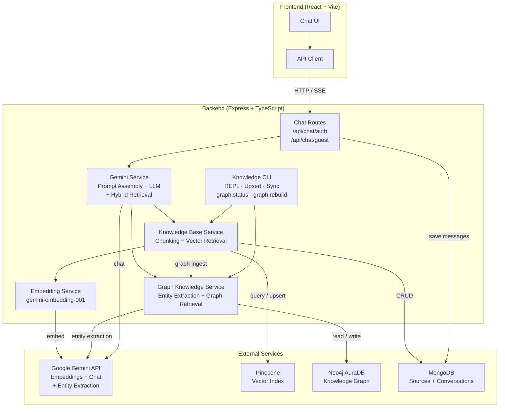

This architecture allows Lumina to leverage the strengths of both vector similarity and structured graph relationships for robust retrieval, while maintaining a clean separation of concerns across services. The Gemini Service orchestrates the retrieval and generation process, ensuring that every response is grounded in the indexed knowledge base with transparent citations.

---

## End-to-End Chat Flow

The diagram below traces a single user message from input through hybrid retrieval, grounding, and response.

```mermaid
sequenceDiagram
  participant U as User
  participant C as Chat Route
  participant G as Gemini Service
  participant K as Knowledge Base
  participant Gr as Graph Knowledge
  participant E as Embedding Service
  participant P as Pinecone
  participant N as Neo4j
  participant LLM as Gemini LLM

  U->>C: POST /api/chat/auth { message, conversationId? }
  C->>C: Load conversation history from MongoDB

  rect rgb(0, 0, 0)
    note over C,N: Hybrid RAG Retrieval Phase (parallel)
    C->>G: retrieveHybridSources(message, topK=10)

    par Vector Path
      G->>K: retrieveKnowledgeChunks(message, topK=15)
      K->>K: Build query variants (up to 3)
      loop Each variant
        K->>E: embedText(variant, RETRIEVAL_QUERY)
        E->>LLM: Gemini embedding request (768-d)
        LLM-->>E: Embedding vector
        E-->>K: Float[768]
        K->>P: query({ vector, topK: 20, includeMetadata })
        P-->>K: Scored matches with metadata
      end
      K->>K: Merge & deduplicate across variants
      K->>K: Compute lexical boost (15% weight)
      K->>K: Sort by boosted score
      K-->>G: SourceCitation[] (vector)
    and Graph Path
      G->>Gr: retrieveGraphChunks(message, topK=15)
      Gr->>LLM: Extract entity names from query
      LLM-->>Gr: ["entity1", "entity2"]
      Gr->>N: Fulltext search on entity_name_ft index
      N-->>Gr: Matching entities + RELATED_TO neighbors
      Gr->>N: Traverse MENTIONS edges to find Chunk nodes
      N-->>Gr: Chunk nodes ranked by entity match count
      Gr-->>G: SourceCitation[] (graph)
    end

    G->>G: mergeRetrievalResults(vectorSources, graphSources)
    G->>G: Deduplicate by chunkId, +0.1 bonus for dual-source hits
    G->>G: Sort by merged score → top 10
    G-->>C: SourceCitation[]
  end

  alt No sources found
    C-->>U: "I do not have enough information..."
  else Sources available
    rect rgb(0, 0, 0)
      note over C,LLM: Grounded Generation Phase
      C->>LLM: System: "You are Lumina..." + RAG instructions
      C->>LLM: Context: Numbered source snippets [1]...[N]
      C->>LLM: User prompt with citation directive
      LLM-->>C: Response text with inline [1], [2] citations
    end
    C->>C: Save user + model messages to MongoDB
    C-->>U: { answer, sources, conversationId }
  end
```

### Streaming Variant

The `/api/chat/auth/stream` and `/api/chat/guest/stream` endpoints use Server-Sent Events:

| SSE Event Type     | Payload                          | When Sent                  |
| ------------------ | -------------------------------- | -------------------------- |
| `conversationId`   | `{ conversationId }`             | Immediately after creation |
| `chunk`            | `{ text }`                       | Each generated token chunk |
| `sources`          | `{ sources: SourceCitation[] }`  | After generation completes |
| `done`             | `{}`                             | Stream end signal          |
| `error`            | `{ message }`                    | On failure                 |

---

## Knowledge Ingestion Pipeline

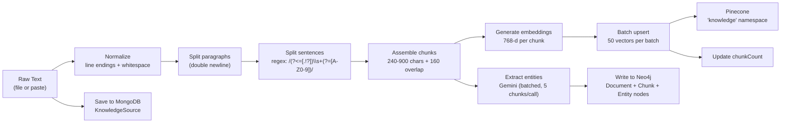

### Chunking Strategy

The `chunkText()` function in `server/src/services/knowledgeBase.ts` implements a multi-level splitter:

| Constant             | Value | Purpose                              |
| -------------------- | ----- | ------------------------------------ |
| `MAX_CHUNK_CHARS`    | 900   | Maximum characters per chunk         |
| `MIN_CHUNK_CHARS`    | 240   | Minimum characters (merge if under)  |
| `CHUNK_OVERLAP_CHARS`| 160   | Overlap between adjacent chunks      |
| `UPSERT_BATCH_SIZE`  | 50    | Vectors sent per Pinecone batch      |

**Process:**

1. **Normalize** -- Converts `\r\n` to `\n`, collapses runs of blank lines, trims edges.
2. **Paragraph split** -- Splits on double newlines to preserve semantic boundaries.
3. **Sentence split** -- Uses `/(?<=[.!?])\s+(?=[A-Z0-9"'])/g` within paragraphs that exceed 900 chars. Force-splits any sentence that still exceeds the limit.
4. **Assemble with overlap** -- Accumulates segments up to 900 chars, keeps a 160-char suffix as overlap for the next chunk, and merges any trailing runt below 240 chars into the previous chunk.

### Dual Ingestion: Vector + Graph

After chunking, the ingestion pipeline writes to both storage backends:

1. **Vector path** -- Each chunk is embedded via `gemini-embedding-001` (768-d, `RETRIEVAL_DOCUMENT` task type) and upserted to Pinecone in batches of 50.
2. **Graph path** -- If Neo4j is configured, chunks are batched (5 per LLM call) and sent to Gemini for entity extraction (concurrency of 2 batches). The resulting `Document`, `Chunk`, and `Entity` nodes plus their relationships are written to Neo4j in a single transaction. Graph ingestion is **non-fatal**: if it fails, the vector ingestion result is preserved and a warning is logged.

### Vector Structure

Each chunk is stored in Pinecone as:

```jsonc
{
  "id": "{sourceId}::{chunkIndex}",   // composite key
  "values": [/* 768 floats */],
  "metadata": {
    "text": "The chunk content...",
    "sourceId": "65a3f2...",            // MongoDB ObjectId
    "title": "Resume 2025",
    "sourceType": "resume",
    "sourceUrl": "https://...",         // optional
    "chunkIndex": 0
  }
}
```

---

## Embedding Generation

**File:** `server/src/services/geminiEmbeddings.ts`

| Setting              | Value                         |
| -------------------- | ----------------------------- |
| Model                | `models/gemini-embedding-001` |
| Dimensions           | 768                           |
| Document task type   | `RETRIEVAL_DOCUMENT`          |
| Query task type      | `RETRIEVAL_QUERY`             |

Google's Gemini embedding model supports asymmetric task types -- documents are embedded with `RETRIEVAL_DOCUMENT` for richer content representation, while user queries use `RETRIEVAL_QUERY` for semantic matching optimized toward questions.

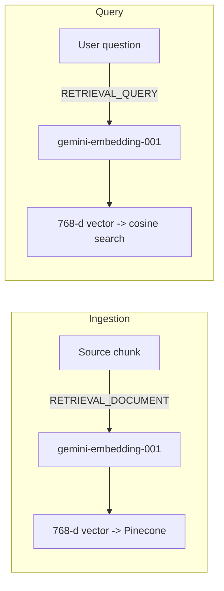

The embedding service validates that every response contains exactly 768 floats before returning. Malformed responses throw immediately.

### Embedding Retry on Rate Limits

The embedding service retries automatically on HTTP 429 (rate limit) errors using exponential backoff. Previously, a 429 response would crash the request; now the service backs off and retries up to 5 times.

| Constant               | Value    | Purpose                                   |
| ---------------------- | -------- | ----------------------------------------- |
| `EMBED_RETRY_ATTEMPTS` | 5        | Maximum retry attempts on 429 errors      |
| `EMBED_RETRY_BASE_MS`  | 3,000 ms | Base backoff delay (doubles each attempt) |

---

## Vector Storage (Pinecone)

**File:** `server/src/services/pineconeClient.ts`

### Index Requirements

| Setting    | Value        | Notes                                |
| ---------- | ------------ | ------------------------------------ |
| Dimensions | 768          | Must match Gemini embeddings         |
| Metric     | `cosine`     | Normalized similarity scoring (0-1)  |
| Namespace  | `knowledge`  | All RAG vectors live here            |

### Operations

| Operation  | Method                                         | Batch Size |
| ---------- | ---------------------------------------------- | ---------- |
| **Upsert** | `index.namespace("knowledge").upsert(batch)`   | 50 vectors |
| **Query**  | `index.namespace("knowledge").query(...)`      | Single     |
| **Delete** | `index.namespace("knowledge").deleteMany(...)` | By filter  |

Deletion filters by `sourceId` metadata and gracefully ignores 404 (already-deleted) errors.

---

## Graph Storage (Neo4j)

**Files:** `server/src/services/neo4jClient.ts`, `server/src/services/graphKnowledge.ts`

Neo4j AuraDB serves as a parallel retrieval backend that stores knowledge as a property graph. The graph captures entities extracted from document chunks and the semantic relationships between them, enabling entity-centric queries that complement vector similarity search.

### Connection

| Setting                      | Value                          |
| ---------------------------- | ------------------------------ |
| Driver                       | `neo4j-driver` (official)      |
| Max connection pool           | 50                             |
| Connection acquisition timeout | 10,000 ms                     |
| Max transaction retry time    | 30,000 ms                     |
| Default database              | `neo4j` (configurable)        |

### Graph Model

The graph uses a hybrid **entity + chunk** model with three primary node labels:

| Node Label   | Key Properties                                      | Purpose                                |
| ------------ | --------------------------------------------------- | -------------------------------------- |
| `Document`   | `sourceId` (unique), `title`, `sourceType`, `sourceUrl` | Represents a knowledge source          |
| `Chunk`      | `chunkId` (unique), `text`, `chunkIndex`, `sourceId`, `title`, `sourceType` | One text chunk from a document |
| `Entity`     | `name`, `normalizedName`, `type`, `description`     | A named entity extracted from chunks   |

### Relationships

| Relationship   | From       | To       | Properties       | Purpose                                 |
| -------------- | ---------- | -------- | ---------------- | --------------------------------------- |
| `HAS_CHUNK`    | Document   | Chunk    | --               | Links a document to its chunks          |
| `NEXT`         | Chunk      | Chunk    | --               | Links consecutive chunks in order       |
| `MENTIONS`     | Chunk      | Entity   | --               | Indicates a chunk mentions an entity    |
| `RELATED_TO`   | Entity     | Entity   | `type` (string)  | Semantic relationship between entities  |

### RELATED_TO Relationship Types

| Type          | Meaning                                     |
| ------------- | ------------------------------------------- |
| `WORKED_AT`   | Person worked at an organization            |
| `WORKED_ON`   | Person worked on a project                  |
| `USES_TECH`   | Project or person uses a technology         |
| `HAS_SKILL`   | Person possesses a skill                    |
| `STUDIED_AT`  | Person studied at an educational institution|
| `EARNED`      | Person earned a certification               |
| `PUBLISHED`   | Person published a publication              |
| `AWARDED`     | Person received an award                    |
| `LOCATED_IN`  | Entity is located in a place                |

### Entity Types

| Type            | Examples                                     |
| --------------- | -------------------------------------------- |
| `Person`        | David Nguyen, Ben Taylor                     |
| `Organization`  | LexisNexis, UNC-Chapel Hill                  |
| `Project`       | DocuThinker, Navigator, MovieVerse           |
| `Technology`    | React, TypeScript, Neo4j, LangGraph          |
| `Skill`         | Full-stack development, Agentic AI           |
| `Location`      | Raleigh NC, Chapel Hill                      |
| `Certification` | AWS Solutions Architect                      |
| `Education`     | B.S. Computer Science                        |
| `Award`         | Dean's List                                  |
| `Publication`   | Research papers, technical articles          |

### Indexes and Constraints

| Index / Constraint           | Type                | Target                                    |
| ---------------------------- | ------------------- | ----------------------------------------- |
| `doc_source_id`              | Unique constraint   | `Document.sourceId`                       |
| `chunk_id`                   | Unique constraint   | `Chunk.chunkId`                           |
| `entity_normalized`          | Composite index     | `Entity(normalizedName, type)`            |
| `entity_name_ft`             | Fulltext index      | `Entity(name, normalizedName)`            |

The fulltext index powers Lucene-based fuzzy search at query time. Query entity names are escaped for Lucene special characters before search.

---

## Knowledge Graph Schema

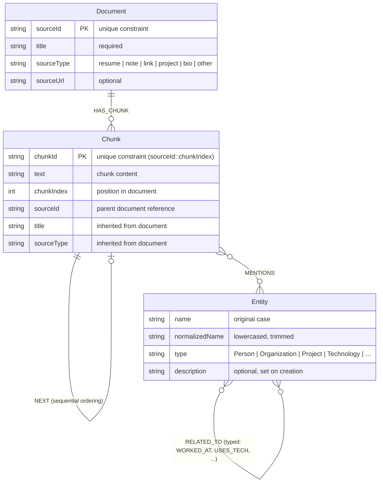

### Graph Traversal at Query Time

The graph retrieval query follows this traversal pattern:

1. **Fulltext search** -- Query entities are looked up via the `entity_name_ft` fulltext index.
2. **Neighbor expansion** -- For each matched entity, `RELATED_TO` neighbors are collected.
3. **Chunk discovery** -- All entities (direct matches + neighbors) are traversed backward via `MENTIONS` edges to find relevant `Chunk` nodes.
4. **Ranking** -- Chunks are ranked by the count of distinct matched entities they mention, normalized to a 0-1 score.
5. **Metadata enrichment** -- Each chunk's parent `Document` is joined to provide `sourceUrl` for citation linking.

---

## Entity Extraction

**File:** `server/src/services/graphKnowledge.ts`

Entity extraction uses Gemini to identify named entities and their relationships from text. Extraction happens at two points in the pipeline: during ingestion (per chunk) and during query processing (per user question).

### Ingest-Time Extraction

When a knowledge source is ingested, chunks are sent to Gemini in **batches of 5** (`ENTITY_EXTRACTION_BATCH_SIZE`) with a structured prompt that requests:

- All meaningful named entities (people, organizations, projects, technologies, skills, locations, certifications, awards, publications)
- Relationships between the extracted entities using the defined relationship types

The batch prompt uses `[CHUNK N]` delimiters to separate chunks within a single LLM call and returns per-chunk results. This reduces API calls by approximately **80%** compared to the previous per-chunk approach. The extraction runs with a concurrency limit of 2 batches at a time to manage API rate limits. The model returns JSON that is validated against the allowed entity types and relationship types. Invalid entities or relationships referencing non-extracted entities are silently discarded.

**Model rotation:** Entity extraction uses the same 6-model rotation pool as chat generation (`gemini-2.5-flash`, `gemini-2.5-flash-lite`, `gemini-2.0-flash`, and additional variants) via `runWithModelRotation()`. If one model returns a 429 or fails, the next model in the rotation is tried automatically.

**Extraction prompt summary:**
```
Extract ALL meaningful entities from each chunk below. Chunks are delimited
by [CHUNK 1], [CHUNK 2], etc. For each chunk, extract people, companies,
projects, technologies, skills, locations, certifications, awards,
publications. Create relationships only between entities you extracted.
Return valid JSON with per-chunk results.
```

### Query-Time Extraction

When a user sends a question, Gemini extracts entity names from the query text. These names are then used to search the Neo4j fulltext index. If no entities are found in the query (e.g., "What skills does he have?"), the graph path returns an empty result and the system relies solely on vector retrieval.

**Query extraction prompt summary:**
```
Extract entity names mentioned in this question. Return ONLY a valid JSON
array of strings. If no specific entities, return [].
```

### Rate Limit Handling

Entity extraction includes exponential backoff retry for Gemini 429 (rate limit) errors:

| Constant                         | Value      | Purpose                                  |
| -------------------------------- | ---------- | ---------------------------------------- |
| `ENTITY_EXTRACTION_BATCH_SIZE`   | 5          | Chunks per LLM extraction call           |
| `EXTRACTION_RETRY_ATTEMPTS`      | 3          | Maximum retry attempts                   |
| `EXTRACTION_BASE_DELAY_MS`       | 15,000 ms  | Base delay between retries               |
| `EXTRACTION_CONCURRENCY`         | 2          | Max concurrent batch extractions         |

The delay multiplier increases linearly: 15s, 30s, 45s for successive retries.

### Lucene Escaping

Query entity names are escaped for Lucene special characters (`+ - & | ! ( ) { } [ ] ^ " ~ * ? : \ /`) before being passed to the Neo4j fulltext index to prevent query injection or syntax errors.

---

## Hybrid Retrieval & Ranking

**Files:** `server/src/services/geminiService.ts`, `server/src/services/knowledgeBase.ts`, `server/src/services/graphKnowledge.ts`

At query time, the system runs **vector retrieval** and **graph retrieval** in parallel using `Promise.allSettled`, then merges the results into a single ranked list.

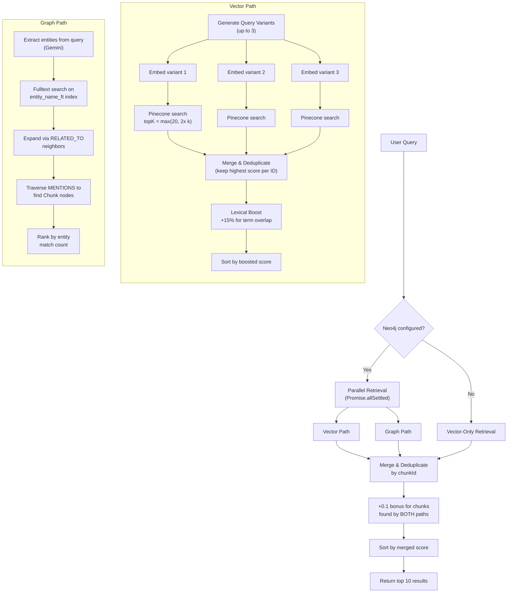

### Vector Path: Query Variant Expansion

The retriever builds up to 3 query variants to improve recall:

| Pattern Detected                          | Added Variant                              |
| ----------------------------------------- | ------------------------------------------ |
| `project`, `portfolio`, `built`, `work`   | `"recent projects portfolio notable projects"` |
| `experience`, `worked`, `work history`    | `"work experience projects"`               |

### Vector Path: Hybrid Scoring

Each result's final score combines vector similarity with a lexical boost:

```
finalScore = vectorSimilarity + (termMatchRatio x 0.15)
```

- **Term extraction:** The query is tokenized; words under 3 characters and common stopwords (approximately 40 words including "the", "what", "how", "your", "recent") are removed.
- **Lexical match:** Each term is checked against `title + sourceType + snippet` (lowercased). The hit ratio is multiplied by `LEXICAL_BOOST_WEIGHT` (0.15).
- **Validation:** Results missing required metadata (`text`, `title`, `sourceId`) are discarded before final sorting.

### Graph Path: Entity-Based Retrieval

The graph retrieval path works as follows:

1. **Query entity extraction** -- Gemini identifies entity names from the user's question.
2. **Fulltext search** -- Entity names (Lucene-escaped) are searched against the `entity_name_ft` index using OR logic.
3. **Neighbor expansion** -- Matched entities are expanded via `RELATED_TO` edges to include semantically related entities.
4. **Chunk traversal** -- All matched and related entities are traced back through `MENTIONS` edges to their source `Chunk` nodes.
5. **Ranking** -- Chunks are scored by the count of distinct matched entities, normalized to a 0-1 range (highest match count = 1.0).

### Merge Algorithm

The `mergeRetrievalResults()` function in `geminiService.ts` combines the two result sets:

1. **Seed with vector results** -- All vector results are added to a `Map<chunkId, SourceCitation>` with their original scores.
2. **Merge graph results** -- For each graph result:
   - If the `chunkId` already exists (dual-source hit): take the higher of the two scores and add a **+0.1 bonus** (`DUAL_SOURCE_BONUS`).
   - If the `chunkId` is new: add it with its graph score.
3. **Sort and trim** -- The merged map is sorted by final score (descending) and the top K results are returned.

The dual-source bonus rewards chunks that both retrieval paths independently identified as relevant, increasing confidence in those results.

### Retrieval Constants

| Constant                 | Value | Purpose                                    |
| ------------------------ | ----- | ------------------------------------------ |
| `RAG_TOP_K`              | 10    | Default number of results returned         |
| `MIN_SEARCH_TOP_K`       | 8     | Minimum initial candidates per variant     |
| `QUERY_VARIANT_LIMIT`    | 3     | Maximum query expansions                   |
| `MIN_QUERY_TERM_LENGTH`  | 3     | Minimum characters for a lexical term      |
| `LEXICAL_BOOST_WEIGHT`   | 0.15  | Lexical score contribution (15%)           |
| `GRAPH_RETRIEVAL_TOP_K`  | 15    | Default graph retrieval candidate count    |
| `DUAL_SOURCE_BONUS`      | 0.1   | Score bonus for dual-path hits             |

### Exhaustive List Retrieval

When a user asks a list-type question (e.g., "List all projects", "What are all your skills?"), the standard top-10 retrieval may miss relevant content spread across many chunks. The system detects list queries and automatically widens the retrieval window to return complete results.

**Detection:** A regex pattern identifies list-intent keywords in the query:

```
/\b(list|all|every|everything|comprehensive|complete|full list|enumerate|name all|show all|what are all)\b/i
```

**Retrieval flow:**

1. Normal hybrid retrieval runs with an expanded `topK=20`.
2. If **50% or more** of the returned results come from a single `sourceId`, the system treats that source as dominant and fetches **all** chunks from that source via a Pinecone metadata filter (`sourceId` match).
3. The complete source content (all chunks) plus any non-dominant extras from the initial retrieval are passed to the LLM.

This ensures that when a single knowledge source contains the comprehensive answer (e.g., a projects list file), the LLM receives the full document rather than a truncated sample.

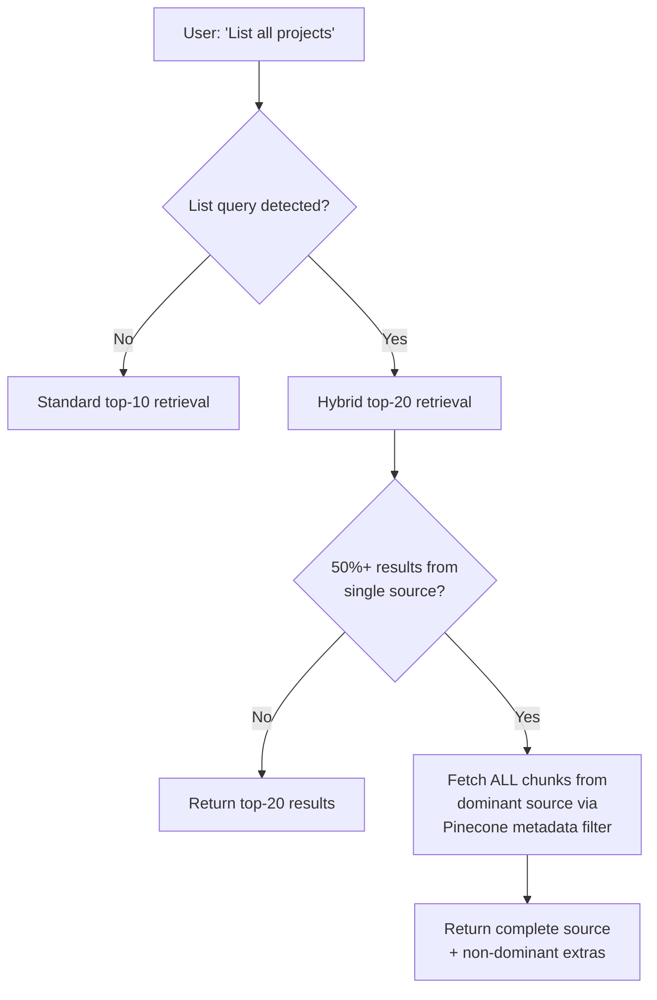

---

## Grounded Response Generation

**File:** `server/src/services/geminiService.ts`

### Prompt Assembly

The LLM receives a carefully structured prompt with three layers:

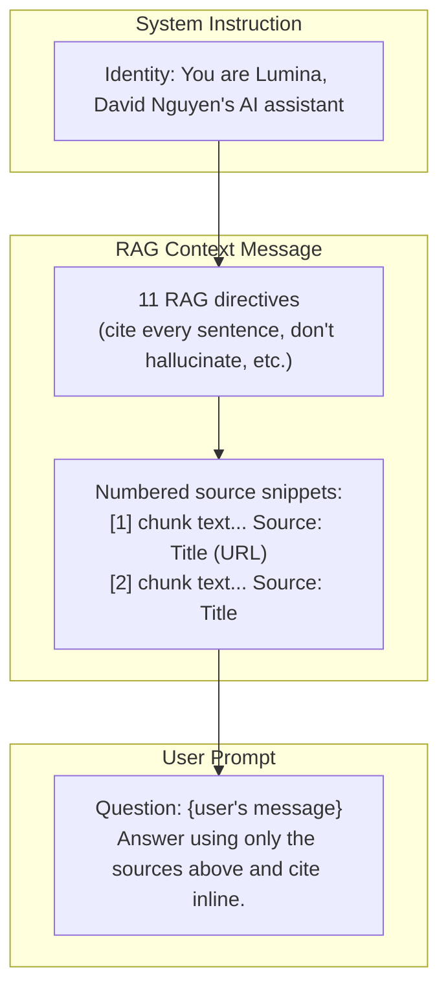

### RAG Directives (Key Rules)

1. Answer **only** using the provided sources.
2. Cite inline using `[number]` matching the sources list.
3. Every sentence must include at least one citation.
4. If sources don't contain the answer, say so -- don't guess.
5. Don't use general knowledge for questions about the knowledge base owner.
6. Be concise; de-duplicate list items by title/project name.

### Generation Config

| Parameter        | Value  | Notes                         |
| ---------------- | ------ | ----------------------------- |
| `temperature`    | 1      | Full creativity within bounds |
| `topP`           | 0.95   | 95% cumulative probability    |
| `topK`           | 64     | Top 64 tokens considered      |
| `maxOutputTokens`| 8192   | Up to ~6K words output        |

### Model Rotation

`runWithModelRotation()` ensures availability:

1. Fetches the current model list from the Google API (cached for 10 minutes).
2. Tries each model in order; on failure, falls back to the next.
3. Static fallback list includes `gemini-2.5-flash` and several `gemini-2.0-flash` variants.

### Context Snippet Limit

Each source snippet is truncated to **1,200 characters** (`MAX_CONTEXT_SNIPPET_CHARS`) before injection into the prompt to keep total context manageable.

---

## Knowledge Source Model

**File:** `server/src/models/KnowledgeSource.ts` -- MongoDB collection `knowledgesources`

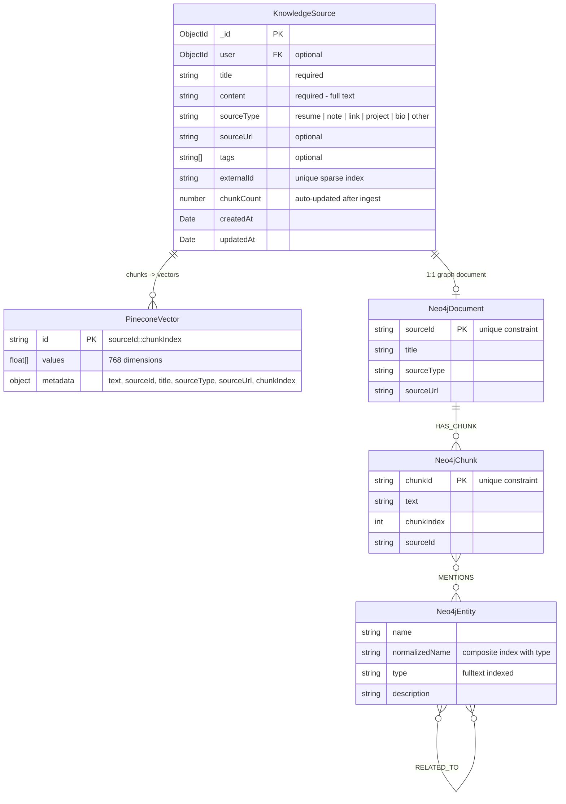

### Source Types

| Type      | Use Case                            |
| --------- | ----------------------------------- |
| `resume`  | Work experience, education          |
| `bio`     | Personal biography / summary        |
| `project` | Project descriptions, portfolios    |
| `note`    | General notes (default type)        |
| `link`    | External content with URL           |
| `other`   | Anything not covered above          |

### Source Lifecycle

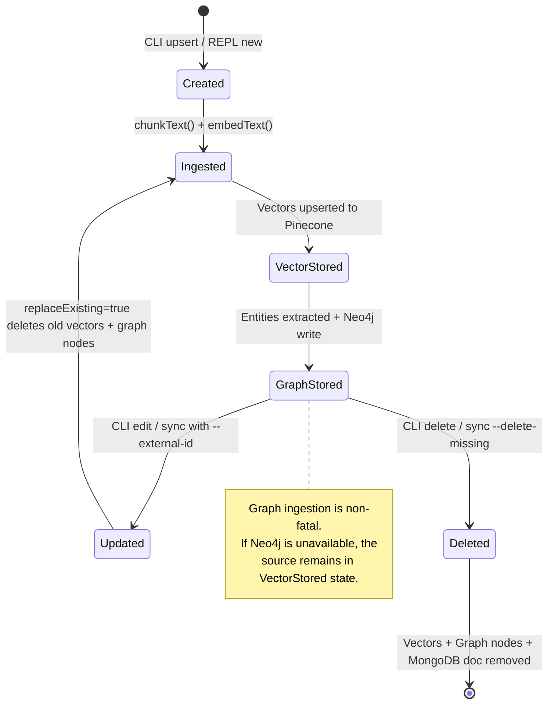

---

## Knowledge CLI

All commands run from the `server/` directory. The CLI validates that `MONGODB_URI`, `GOOGLE_AI_API_KEY`, `PINECONE_API_KEY`, and `PINECONE_INDEX_NAME` are set before proceeding.

### Interactive REPL (Recommended)

```bash
npm run knowledge:repl
```

| Command          | Description                                     |
| ---------------- | ----------------------------------------------- |
| `list`           | Show all sources with chunk counts              |
| `view <id>`      | Display full content of a source                |
| `new`            | Create a new source (interactive prompts)       |
| `edit <id>`      | Update title, type, URL, tags, or content       |
| `delete <id>`    | Remove source from MongoDB, Pinecone, and Neo4j |
| `graph:status`   | Show Neo4j graph database statistics            |
| `graph:rebuild`  | Rebuild entire graph from all MongoDB sources   |
| `graph:rebuild --clean` | Wipe graph, then rebuild from all sources |
| `graph:reset`    | Wipe the entire Neo4j graph                     |
| `help`           | Show available commands                         |
| `exit`           | Quit the REPL                                   |

**Multi-line content entry:** Paste freely, type `.done` to finish or `.cancel` to abort.

### Graph Commands

#### graph:status

Displays current graph database statistics:

```
Neo4j Graph Status:
  Documents: 12
  Chunks:    148
  Entities:  327
  Relations: 89
```

If Neo4j is not configured, prints a message indicating which environment variables are missing.

#### graph:rebuild

Re-ingests all existing MongoDB knowledge sources into the Neo4j graph. This is useful after first connecting Neo4j to a system that already has Pinecone data, or to repair a corrupted graph.

```bash
# Via REPL
graph:rebuild

# Via direct CLI
npm run knowledge:graph:rebuild
```

The rebuild process:
1. Initializes the Neo4j schema (constraints and indexes).
2. Loads all `KnowledgeSource` documents from MongoDB.
3. Re-chunks each source and runs entity extraction via Gemini.
4. Writes all nodes and relationships to Neo4j.
5. Prints final statistics.

Requires confirmation (`yes`) when run from the REPL. Sources with no chunks are skipped.

#### graph:reset

Wipes the entire Neo4j graph (all nodes, relationships, indexes, and constraints). Useful when you want a completely clean slate before rebuilding.

```bash
# Via REPL
graph:reset

# Via npm script
npm run knowledge:graph:reset
```

#### graph:rebuild --clean

Combines `graph:reset` and `graph:rebuild` into a single operation -- wipes the graph first, then rebuilds it from all MongoDB sources.

```bash
# Via REPL
graph:rebuild --clean

# Via npm script
npm run knowledge:graph:rebuild:clean
```

> For detailed knowledge management instructions, see [UPDATE_KNOWLEDGE.md](UPDATE_KNOWLEDGE.md).

### Single Upsert

```bash
# From a file
npm run knowledge:upsert -- \
  --title "Resume 2025" \
  --file ./knowledge/resume.txt \
  --type resume \
  --tags "resume,profile" \
  --external-id "resume-2025"

# Inline text
npm run knowledge:upsert -- \
  --title "Bio Draft" \
  --content "Paste your text here..." \
  --type bio \
  --external-id "bio-draft"
```

| Flag             | Required | Description                                     |
| ---------------- | -------- | ----------------------------------------------- |
| `--title`        | Yes      | Source title                                    |
| `--content`      | One of   | Inline text content                             |
| `--file`         | One of   | Path to a text file                             |
| `--type`         | No       | Source type (default: `note`)                   |
| `--url`          | No       | Source URL for citations                        |
| `--tags`         | No       | Comma-separated tags                            |
| `--id`           | No       | Existing source ID to update                    |
| `--external-id`  | No       | Stable ID for idempotent sync                   |

> **Tip:** Use the same `--external-id` across upserts to update a source without changing its MongoDB `_id`.

When Neo4j is configured, upsert automatically ingests entities into the graph after the Pinecone vector upsert completes.

### Delete

```bash
npm run knowledge:delete -- --id <sourceId>
```

Removes the source from MongoDB, deletes all associated vectors from Pinecone, and removes the corresponding `Document`, `Chunk`, and orphaned `Entity` nodes from Neo4j.

### List

```bash
npm run knowledge:list
```

Displays a table of all sources: `ObjectId | Title | Type | Chunks`.

### Batch Sync (Manifest)

```bash
npm run knowledge:sync -- --manifest ./knowledge/manifest.json
```

**Manifest format:**

```json
{
  "sources": [
    {
      "externalId": "resume-2025",
      "title": "Resume 2025",
      "sourceType": "resume",
      "sourceUrl": "https://example.com",
      "tags": ["resume", "profile"],
      "file": "./knowledge/resume.txt"
    },
    {
      "externalId": "bio-short",
      "title": "Short Bio",
      "sourceType": "bio",
      "content": "Direct content here."
    }
  ]
}
```

**Delete sources not in the manifest:**

```bash
npm run knowledge:sync -- --manifest ./knowledge/manifest.json --delete-missing
```

When `--delete-missing` is set, every manifest entry **must** have an `externalId`. Sources whose `externalId` is not present in the manifest are removed from both MongoDB and Pinecone.

---

## Configuration

### Required Environment Variables

Set these in `server/.env`:

```env
MONGODB_URI=mongodb://localhost:27017/ai-assistant
GOOGLE_AI_API_KEY=your_google_ai_api_key_here
PINECONE_API_KEY=your_pinecone_api_key_here
PINECONE_INDEX_NAME=lumina-index
```

### Neo4j Environment Variables (Optional)

When all three Neo4j variables are set, the graph retrieval path activates automatically. When they are absent, the system operates as a pure vector RAG pipeline.

```env
NEO4J_URI=neo4j+s://xxxxxxxx.databases.neo4j.io
NEO4J_USERNAME=neo4j
NEO4J_PASSWORD=your_neo4j_password_here
NEO4J_DATABASE=neo4j
```

| Variable          | Required | Default  | Purpose                                       |
| ----------------- | -------- | -------- | --------------------------------------------- |
| `NEO4J_URI`       | Yes*     | --       | Neo4j AuraDB connection URI                   |
| `NEO4J_USERNAME`  | Yes*     | --       | Neo4j authentication username                 |
| `NEO4J_PASSWORD`  | Yes*     | --       | Neo4j authentication password                 |
| `NEO4J_DATABASE`  | No       | `neo4j`  | Neo4j database name                           |

*Required only if graph RAG is desired. The system degrades gracefully without them.

### Other Optional Variables

| Variable          | Default  | Purpose                              |
| ----------------- | -------- | ------------------------------------ |
| `PORT`            | `5000`   | Express server port                  |
| `JWT_SECRET`      | --       | Token signing for auth routes        |
| `AI_INSTRUCTIONS` | --       | Custom system prompt override        |

### Pinecone Index Setup

Create the index in the [Pinecone console](https://app.pinecone.io) or via their API:

| Setting          | Value      |
| ---------------- | ---------- |
| Dimensions       | `768`      |
| Metric           | `cosine`   |
| Namespace        | `knowledge`|

Enable metadata indexing on `sourceId`, `sourceType`, and `title` for filtering support.

### Neo4j AuraDB Setup

1. Create a free or professional instance at [Neo4j AuraDB](https://neo4j.com/cloud/aura/).
2. Copy the connection URI, username, and password into your `server/.env`.
3. Start the server -- schema constraints and indexes are created automatically on first boot via `initGraphSchema()`.
4. If you already have Pinecone data, run `graph:rebuild` from the Knowledge CLI to backfill the graph.

### RAG Pipeline Constants

Summary of key constants governing the RAG pipeline behavior:

| Constant                         | Value      | File                     | Purpose                                        |
| -------------------------------- | ---------- | ------------------------ | ---------------------------------------------- |
| `ENTITY_EXTRACTION_BATCH_SIZE`   | 5          | `graphKnowledge.ts`      | Chunks per entity extraction LLM call          |
| `EXTRACTION_RETRY_ATTEMPTS`      | 3          | `graphKnowledge.ts`      | Max retries for extraction rate limits         |
| `EXTRACTION_BASE_DELAY_MS`       | 15,000 ms  | `graphKnowledge.ts`      | Base delay between extraction retries          |
| `EXTRACTION_CONCURRENCY`         | 2          | `graphKnowledge.ts`      | Max concurrent extraction batches              |
| `EMBED_RETRY_ATTEMPTS`           | 5          | `geminiEmbeddings.ts`    | Max retries for embedding 429 errors           |
| `EMBED_RETRY_BASE_MS`            | 3,000 ms   | `geminiEmbeddings.ts`    | Base backoff for embedding retries             |
| `MAX_CHUNK_CHARS`                | 900        | `knowledgeBase.ts`       | Maximum characters per chunk                   |
| `MIN_CHUNK_CHARS`                | 240        | `knowledgeBase.ts`       | Minimum characters per chunk                   |
| `CHUNK_OVERLAP_CHARS`            | 160        | `knowledgeBase.ts`       | Overlap between adjacent chunks                |
| `UPSERT_BATCH_SIZE`              | 50         | `knowledgeBase.ts`       | Vectors per Pinecone upsert batch              |
| `RAG_TOP_K`                      | 10         | `geminiService.ts`       | Default results returned to LLM               |
| `DUAL_SOURCE_BONUS`              | 0.1        | `geminiService.ts`       | Score bonus for dual-path hits                 |
| `LEXICAL_BOOST_WEIGHT`           | 0.15       | `knowledgeBase.ts`       | Lexical score contribution                     |

---

## Error Handling & Graceful Degradation

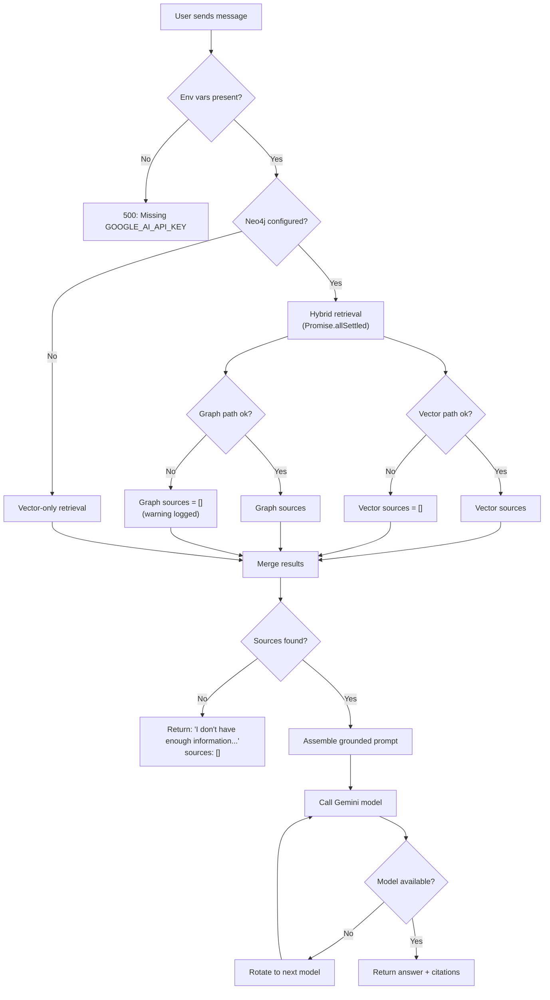

| Scenario                          | Behavior                                                                            |
| --------------------------------- | ----------------------------------------------------------------------------------- |
| Missing env vars at startup       | CLI exits with error; server throws on first request                                |
| Embedding API 429 (rate limit)    | Exponential backoff retry (3s base, up to 5 attempts) before propagating error      |
| Embedding API failure (non-429)   | Error propagated as 500 to client                                                   |
| No matching sources               | Polite fallback message, empty sources array (not an error)                         |
| Pinecone query failure            | Error propagated as 500 to client                                                   |
| Vector deletion 404               | Silently ignored (already deleted)                                                  |
| Primary Gemini model down         | Automatic rotation through fallback models                                          |
| All Gemini models fail            | Last error thrown as 500 to client                                                  |
| Model list API unavailable        | Falls back to static model list, then retries                                       |
| Neo4j not configured              | System operates as pure vector RAG; graph features silently disabled                |
| Neo4j connection failure at boot  | Warning logged; server continues without graph features                             |
| Neo4j query failure at runtime    | Graph path returns empty results; vector results used alone (warning logged)        |
| Neo4j transient error             | Automatic retry with exponential backoff (500ms base, up to 3 attempts)             |
| Graph ingestion failure           | Non-fatal; vector ingestion is preserved, warning logged                            |
| Entity extraction rate limit (429)| Exponential backoff retry (15s, 30s, 45s) + model rotation through 6 Gemini models  |
| Entity extraction parse failure   | Chunk treated as having no entities; graph ingestion continues for other chunks     |
| Fulltext query syntax error       | Lucene special characters are escaped before query; malformed input handled safely  |
