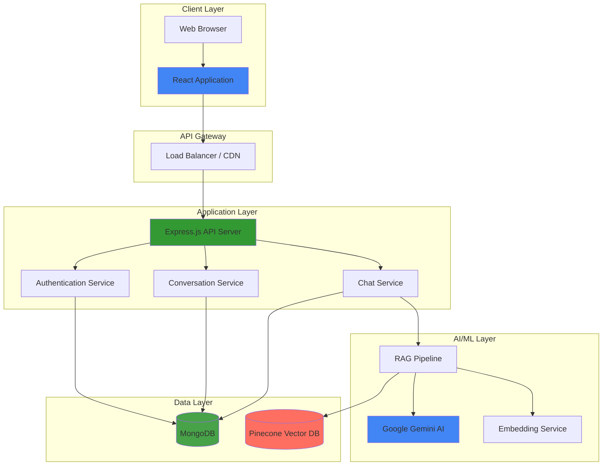
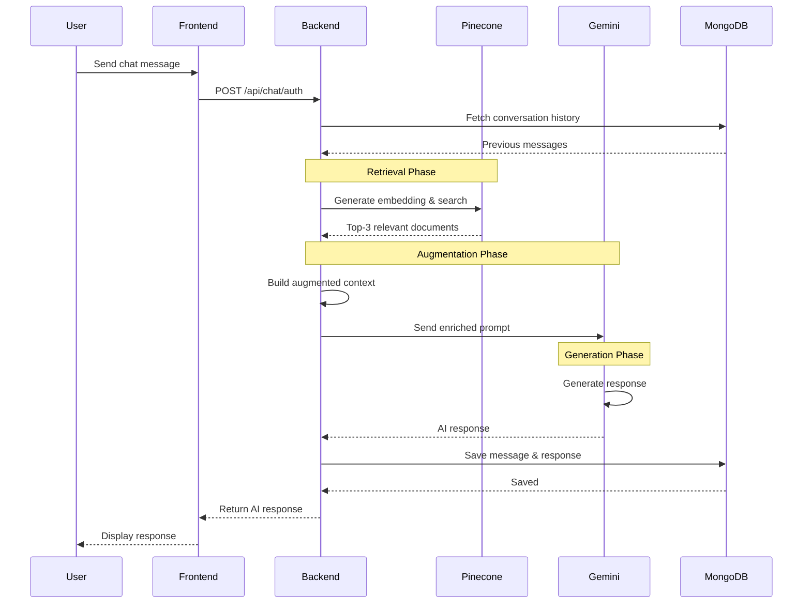
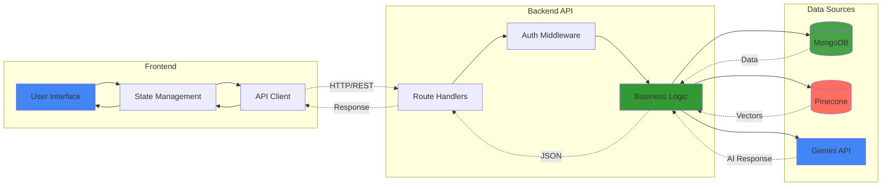
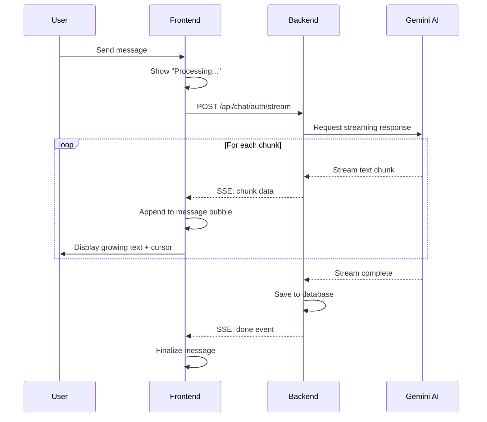
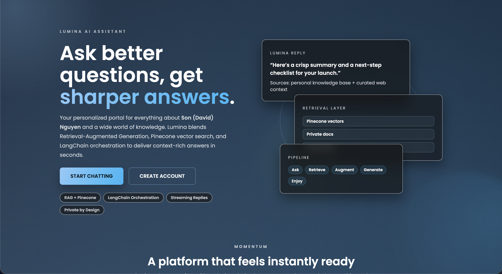
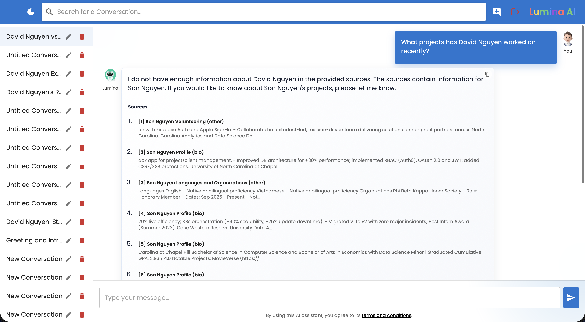
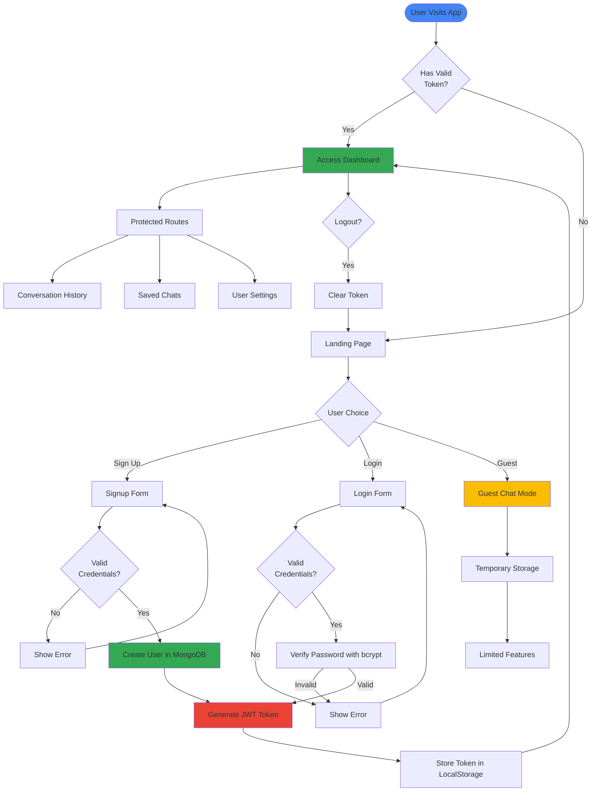
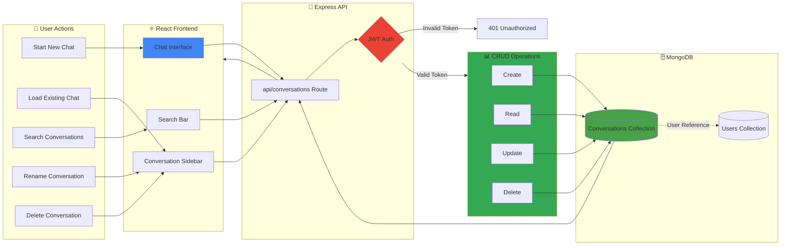

# My Personal AI Assistant Project - Lumina 👨🏻‍💻

**David Nguyen's Personal AI Assistant** - **Lumina** is a full-stack web application that allows users to ask questions about David Nguyen, as well as any other topics, and receive instant, personalized responses powered by state‑of‑the‑art AI & RAG. Users can log in to save their conversation history or continue as guests. The app uses modern technologies and provides a sleek, responsive user interface with intuitive UX and lots of animations. 🚀

<p align="center">
  <a href="https://lumina-david.vercel.app/" target="_blank" rel="noopener noreferrer">
    
  </a>
</p>

## Table of Contents

- [Live App](#live-app)
  - [Key Technologies](#key-technologies)
- [Features](#features)
- [Architecture](#architecture)
  - [High-Level System Architecture](#high-level-system-architecture)
  - [RAG Flow](#rag-retrieval-augmented-generation-flow)
  - [Data Flow Architecture](#data-flow-architecture)
- [Detailed Architecture Documentation](#detailed-architecture-documentation)
- [Setup & Installation](#setup--installation)
  - [Backend Setup](#backend-setup)
  - [Frontend Setup](#frontend-setup)
  - [AI/ML Setup](#aiml-setup)
- [Deployment](#deployment)
  - [Current Deployment (Vercel)](#current-deployment-vercel)
  - [Docker Deployment](#docker-deployment)
  - [AWS Production Deployment](#aws-production-deployment)
- [Usage](#usage)
- [Streaming Responses](#streaming-responses)
  - [How It Works](#how-it-works)
  - [Technical Implementation](#technical-implementation)
  - [Key Features](#key-features)
  - [API Endpoints](#api-endpoints-1)
  - [Event Types](#event-types)
  - [Error Recovery](#error-recovery)
- [User Interface](#user-interface)
- [API Endpoints](#api-endpoints)
  - [Authentication](#authentication)
  - [Conversations](#conversations)
  - [Chat](#chat)
  - [Swagger API Documentation](#swagger-api-documentation)
- [Project Structure](#project-structure)
- [Dockerization](#dockerization)
- [OpenAPI Specification](#openapi-specification)
- [CI / CD with GitHub Actions](#ci--cd-with-github-actions)
- [Testing](#testing)
- [Contributing](#contributing)
- [License](#license)

## Live App

> [!IMPORTANT]
> Currently, the app is deployed live on Vercel at: [https://lumina-david.vercel.app/](https://lumina-david.vercel.app). Feel free to check it out!
> 
> For the backend (with Swagger docs), it is deployed live also on Vercel at: [https://ai-assistant-chatbot-server.vercel.app/](https://ai-assistant-chatbot-server.vercel.app/).

Alternatively, the backup app is deployed live on Netlify at: [https://lumina-ai-chatbot.netlify.app/](https://lumina-ai-chatbot.netlify.app/).

> [!TIP]
> Go straight to [https://lumina-david.vercel.app/chat](https://lumina-david.vercel.app/chat) if you want to chat with the AI right away!

### Key Technologies


## Features

- **AI Chatbot:** Ask questions about David Nguyen and general topics; receive responses from an AI.
- **User Authentication:** Sign up, log in, and log out using JWT authentication.
- **Conversation History:** Save, retrieve, rename, and search past conversations (only for authenticated users).
- **Updated & Vast Knowledge Base:** Use RAG (Retrieval-Augmented Generation) & LangChain to enhance AI responses.
- **Dynamic Responses:** AI-generated responses with `markdown` formatting for rich text.
- **Interactive Chat:** Real-time chat interface with smooth animations and transitions.
- **Reset Password:** Verify email and reset a user’s password.
- **Responsive UI:** Built with React and Material‑UI (MUI) with a fully responsive, modern, and animated interface.
- **Landing Page:** A dynamic landing page with animations, feature cards, and call-to-action buttons.
- **Guest Mode:** Users may interact with the AI assistant as a guest, though conversations will not be saved.
- **Conversation Search:** Search through conversation titles and messages to find relevant discussions.
- **Collapsible Sidebar:** A sidebar that displays conversation history, allowing users to switch between conversations easily.
- **Reinforced Learning from Human Feedback (RLHF):** Implement a feedback loop to continuously improve the AI's responses based on user interactions.
- **Dark/Light Mode:** Users can toggle between dark and light themes, with the preference stored in local storage.

## Architecture

The project follows a modern, full-stack architecture with clear separation of concerns across three main layers:

- **Frontend Layer:**
  A React application built with TypeScript and Material-UI (MUI) that provides:
  - Modern, animated user interface with responsive design
  - Client-side routing with React Router
  - JWT-based authentication and authorization
  - Real-time chat interface with markdown support
  - Theme toggling (dark/light mode)
  - Collapsible sidebar for conversation history

- **Backend Layer:**
  An Express.js server written in TypeScript that handles:
  - RESTful API endpoints for authentication and data management
  - JWT token generation and validation
  - User authentication (signup, login, password reset)
  - Conversation management (CRUD operations)
  - Integration with AI services
  - Request validation and error handling

- **AI/ML Layer:**
  RAG (Retrieval-Augmented Generation) implementation that includes:
  - **Retrieval**: Vector similarity search using Pinecone
  - **Augmentation**: Context building with conversation history
  - **Generation**: Response generation using Google Gemini AI
  - **Knowledge Storage**: Document embeddings in Pinecone vector database
  - **LangChain**: Orchestration of the entire RAG pipeline

For detailed architecture documentation, including component diagrams, data flows, and deployment strategies, see [ARCHITECTURE.md](ARCHITECTURE.md).

### High-Level System Architecture



### RAG (Retrieval-Augmented Generation) Flow



### Data Flow Architecture



> [!NOTE]
> These diagrams provide a high-level overview of the system architecture. For detailed component interactions, database schemas, deployment strategies, and security architecture, please refer to [ARCHITECTURE.md](ARCHITECTURE.md).

## Detailed Architecture Documentation

For comprehensive architecture documentation including:
- Detailed component diagrams and interactions
- Database schema and data models
- Security architecture and authentication flows
- Deployment strategies (Docker, AWS, Terraform)
- Performance optimization and scalability
- Monitoring and observability
- Disaster recovery and backup strategies

Please see **[ARCHITECTURE.md](ARCHITECTURE.md)**

## Setup & Installation

### Backend Setup

1. **Clone the repository:**

   ```bash
   git clone https://github.com/hoangsonww/AI-Assistant-Chatbot.git
   cd AI-Assistant-Chatbot/server
   ```

2. **Install dependencies:**

   ```bash
   npm install
   ```

3. **Environment Variables:**  
   Create a `.env` file in the `server` folder with the following (adjust values as needed):

   ```env
   PORT=5000
   MONGODB_URI=mongodb://localhost:27017/ai-assistant
   JWT_SECRET=your_jwt_secret_here
   GOOGLE_AI_API_KEY=your_google_ai_api_key_here
   AI_INSTRUCTIONS=Your system instructions for the AI assistant
   PINECONE_API_KEY=your_pinecone_api_key_here
   PINECONE_INDEX_NAME=your_pinecone_index_name_here
   ```

4. **Run the server in development mode:**

   ```bash
   npm run dev
   ```

   This uses nodemon with `ts-node` to watch for file changes.

### Frontend Setup

1. **Navigate to the client folder:**

   ```bash
   cd ../client
   ```

2. **Install dependencies:**

   ```bash
   npm install
   ```

3. **Run the frontend development server:**

   ```bash
   npm start
   ```

   The app will run on [http://localhost:3000](http://localhost:3000) (or any other port you've specified in the `.env` file's `PORT` key).

### AI/ML Setup

1. Install necessary Node.js packages:

   ```bash
   npm install
   ```

2. Store knowledge data in Pinecone vector database:

   ```bash
   npm run store
   ```

   Or

   ```bash
   ts-node server/src/scripts/storeKnowledge.ts
   ```

3. Ensure you run this command before starting the backend server to store the knowledge data in the Pinecone vector database.

## Deployment

### Current Deployment (Vercel)

The application is currently deployed on Vercel with the following setup:

- **Frontend**: Deployed at [https://lumina-david.vercel.app/](https://lumina-david.vercel.app)
- **Backend**: Deployed at [https://ai-assistant-chatbot-server.vercel.app/](https://ai-assistant-chatbot-server.vercel.app/)
- **Database**: MongoDB Atlas (cloud-hosted)
- **Vector Database**: Pinecone (cloud-hosted)

#### Deployment Architecture

```mermaid
graph TB
    subgraph "Client Devices"
        Browser[Web Browser]
        Mobile[Mobile Browser]
    end
    
    subgraph "CDN Layer"
        Vercel[Vercel Edge Network]
        Netlify[Netlify CDN - Backup]
    end
    
    subgraph "Frontend Deployment"
        FrontendVercel[React App on Vercel]
        FrontendNetlify[React App on Netlify]
        StaticAssets[Static Assets]
    end
    
    subgraph "Backend Deployment"
        BackendVercel[Express API on Vercel]
        ServerlessFunctions[Serverless Functions]
    end
    
    subgraph "External Services"
        MongoDB[(MongoDB Atlas)]
        Pinecone[(Pinecone Vector DB)]
        GeminiAPI[Google Gemini AI API]
    end
    
    subgraph "CI/CD Pipeline"
        GitHub[GitHub Repository]
        GitHubActions[GitHub Actions]
        AutoDeploy[Auto Deploy on Push]
    end
    
    subgraph "Monitoring & Analytics"
        VercelAnalytics[Vercel Analytics]
        Logs[Application Logs]
    end
    
    Browser --> Vercel
    Mobile --> Vercel
    Vercel --> FrontendVercel
    Netlify --> FrontendNetlify
    
    FrontendVercel --> StaticAssets
    FrontendVercel --> BackendVercel
    FrontendNetlify --> BackendVercel
    
    BackendVercel --> ServerlessFunctions
    ServerlessFunctions --> MongoDB
    ServerlessFunctions --> Pinecone
    ServerlessFunctions --> GeminiAPI
    
    GitHub --> GitHubActions
    GitHubActions --> AutoDeploy
    AutoDeploy --> Vercel
    AutoDeploy --> Netlify
    
    BackendVercel --> VercelAnalytics
    BackendVercel --> Logs
    FrontendVercel --> VercelAnalytics
    
    style Browser fill:#4285F4
    style Vercel fill:#000000
    style FrontendVercel fill:#61DAFB
    style BackendVercel fill:#339933
    style MongoDB fill:#47A248
    style Pinecone fill:#FF6F61
    style GeminiAPI fill:#4285F4
    style GitHub fill:#181717
```



### Docker Deployment

Run the entire application stack locally using Docker:

```bash
# Build and start all services
docker-compose up --build

# Or run in detached mode
docker-compose up -d

# Stop all services
docker-compose down
```

This will start:
- Frontend on `http://localhost:3000`
- Backend on `http://localhost:5000`
- MongoDB on `localhost:27017`

### AWS Production Deployment

For production-grade AWS deployment with high availability and scalability:

```bash
# Navigate to infrastructure directory
cd terraform/

# Initialize Terraform
terraform init

# Review deployment plan
terraform plan

# Deploy infrastructure
terraform apply

# Or use provided scripts
cd ../aws/scripts/
./deploy-production.sh
```

**AWS Infrastructure includes:**
- ECS/Fargate for container orchestration
- Application Load Balancer for traffic distribution
- DocumentDB (MongoDB-compatible) for database
- ElastiCache (Redis) for caching
- CloudFront CDN for static asset delivery
- CloudWatch for monitoring and logging
- Auto-scaling groups for high availability
- Multi-AZ deployment for fault tolerance

See [aws/README.md](aws/README.md) and [terraform/README.md](terraform/README.md) for detailed deployment instructions.

## Usage

- **Landing Page:**  
  The landing page provides an overview of the app’s features and two main actions: Create Account (for new users) and Continue as Guest.

- **Authentication:**  
  Users can sign up, log in, and reset their password. Authenticated users can save and manage their conversation history.

- **Chatting:**  
  The main chat area allows users to interact with the AI assistant. The sidebar displays saved conversations (for logged-in users) and allows renaming and searching.

- **Theme:**  
  Toggle between dark and light mode via the navbar. The chosen theme is saved in local storage and persists across sessions.

## Streaming Responses

Lumina features real-time streaming responses that make conversations feel more natural and engaging. Instead of waiting for the complete response, you'll see the AI's thoughts appear word-by-word as they're generated.

### How It Works

The streaming implementation uses **Server-Sent Events (SSE)** to deliver AI responses in real-time:

1. **User sends a message** → Frontend displays "Processing Message..."
2. **Backend processes** → Shows "Thinking & Reasoning..."
3. **Connection established** → Displays "Connecting..."
4. **Streaming begins** → Text appears word-by-word with a blinking cursor
5. **Response complete** → Message is saved to conversation history

### Technical Implementation



### Key Features

- **Live Text Rendering:** See responses appear in real-time with markdown formatting
- **Visual Feedback:** Multiple loading states (Processing → Thinking → Connecting → Streaming)
- **Blinking Cursor:** Animated cursor indicates active streaming
- **Automatic Retries:** Up to 3 retry attempts with exponential backoff (1s, 2s, 4s)
- **Error Handling:** Graceful degradation with user-friendly error messages
- **Works Everywhere:** Available for both authenticated and guest users

### API Endpoints

**Authenticated Streaming:**
```
POST /api/chat/auth/stream
Content-Type: application/json
Authorization: Bearer <token>

{
  "message": "Your question here",
  "conversationId": "optional-conversation-id"
}
```

**Guest Streaming:**
```
POST /api/chat/guest/stream
Content-Type: application/json

{
  "message": "Your question here",
  "guestId": "optional-guest-id"
}
```

### Event Types

The SSE stream sends different event types:

- **`conversationId`/`guestId`:** Sent at the start with the conversation identifier
- **`chunk`:** Each piece of text as it's generated from the AI
- **`done`:** Signals that streaming is complete
- **`error`:** Indicates an error occurred during streaming

### Error Recovery

If a connection fails during streaming:
1. **First retry:** Wait 1 second, then retry
2. **Second retry:** Wait 2 seconds, then retry
3. **Third retry:** Wait 4 seconds, then retry
4. **All failed:** Display error message to user

The retry logic uses exponential backoff to avoid overwhelming the server while providing a smooth user experience.

## User Interface

### Landing Page

<p align="center">
  
</p>

#### Landing Page - Dark Mode

<p align="center">
  
</p>

### Homepage

<p align="center">
  
</p>

#### Homepage - Dark Mode

<p align="center">
  
</p>

### Login Page

<p align="center">
  
</p>

#### Login Page - Dark Mode

<p align="center">
  
</p>

### Signup Page

<p align="center">
  
</p>

#### Signup Page - Dark Mode

<p align="center">
  
</p>

### Reset Password Page

<p align="center">
  
</p>

#### Reset Password Page - Dark Mode

<p align="center">
  
</p>

### Homepage - Unauthenticated User

<p align="center">
  
</p>

#### Homepage - Unauthenticated User - Dark Mode

<p align="center">
  
</p>

### 404 Page

<p align="center">
  
</p>

## API Endpoints

### Authentication

- **POST /api/auth/signup:** Create a new user.
- **POST /api/auth/login:** Authenticate a user and return a JWT.
- **GET /api/auth/verify-email?email=example@example.com:** Check if an email exists.
- **POST /api/auth/reset-password:** Reset a user's password.
- **GET /api/auth/validate-token:** Validate the current JWT token.

#### Authentication Flow



### Conversations

- **POST /api/conversations:** Create a new conversation.
- **GET /api/conversations:** Get all conversations for a user.
- **GET /api/conversations/:id:** Retrieve a conversation by ID.
- **PUT /api/conversations/:id:** Rename a conversation.
- **GET /api/conversations/search/:query:** Search for conversations by title or message content.
- **DELETE /api/conversations/:id:** Delete a conversation.

#### Conversation Management Flow



### Chat

- **POST /api/chat/auth:** Process a chat query for authenticated users and return an AI-generated response.
- **POST /api/chat/auth/stream:** Stream AI responses in real-time for authenticated users using Server-Sent Events (SSE).
- **POST /api/chat/guest:** Process a chat query for guest users and return an AI-generated response.
- **POST /api/chat/guest/stream:** Stream AI responses in real-time for guest users using Server-Sent Events (SSE).

### Swagger API Documentation

<p align="center">
  
</p>

## Project Structure

```
AI-Assistant-Chatbot/
├── docker-compose.yml
├── openapi.yaml
├── README.md
├── ARCHITECTURE.md
├── LICENSE
├── Jenkinsfile
├── package.json
├── tsconfig.json
├── .env
├── shell/                          # Shell scripts for app setups
├── terraform/                      # Infrastructure as Code (Terraform)
├── aws/                            # AWS deployment configurations
├── img/                            # Images and screenshots
├── client/                         # Frontend React application
│   ├── package.json
│   ├── tsconfig.json
│   ├── docker-compose.yml
│   ├── Dockerfile
│   └── src/
│       ├── App.tsx
│       ├── index.tsx
│       ├── theme.ts
│       ├── globals.css
│       ├── index.css
│       ├── dev/
│       │   ├── palette.tsx
│       │   ├── previews.tsx
│       │   ├── index.ts
│       │   └── useInitial.ts
│       ├── services/
│       │   └── api.ts              # API client with streaming support
│       ├── types/
│       │   ├── conversation.d.ts
│       │   └── user.d.ts
│       ├── components/
│       │   ├── Navbar.tsx
│       │   ├── Sidebar.tsx
│       │   ├── ChatArea.tsx        # Main chat interface with streaming
│       │   └── CopyIcon.tsx
│       ├── styles/
│       │   └── (various style files)
│       └── pages/
│           ├── LandingPage.tsx
│           ├── Home.tsx
│           ├── Login.tsx
│           ├── Signup.tsx
│           ├── NotFoundPage.tsx
│           ├── ForgotPassword.tsx
│           └── Terms.tsx
└── server/                         # Backend Express application
    ├── package.json
    ├── tsconfig.json
    ├── Dockerfile
    ├── docker-compose.yml
    └── src/
        ├── server.ts
        ├── models/
        │   ├── Conversation.ts
        │   ├── GuestConversation.ts
        │   └── User.ts
        ├── routes/
        │   ├── auth.ts
        │   ├── conversations.ts
        │   ├── chat.ts             # Authenticated chat with streaming
        │   └── guest.ts            # Guest chat with streaming
        ├── services/
        │   ├── geminiService.ts    # AI service with streaming support
        │   └── pineconeClient.ts
        ├── scripts/
        │   ├── storeKnowledge.ts
        │   ├── queryKnowledge.ts
        │   └── langchainPinecone.ts
        ├── utils/
        │   └── (utility functions)
        ├── middleware/
        │   └── auth.ts
        └── public/
            └── favicon.ico
```

## Agentic AI Pipeline

There is also an Agentic AI pipeline implemented in Python using LangChain. This pipeline demonstrates how to create an autonomous agent that can perform tasks using tools and interact with the AI model.

The pipeline is located in the `agentic_ai/` directory. It was developed to complement the main RAG-based AI assistant by showcasing advanced AI capabilities, as well as enhancing the RAG responses with agentic reasoning when needed (e.g. for complex queries).

> [!TIP]
> For more information on the Agentic AI pipeline, please refer to the [`agentic_ai/README.md`](agentic_ai/README.md) file.

## Dockerization

To run the application using Docker, simply run `docker-compose up` in the root directory of the project. This will start both the backend and frontend services as defined in the `docker-compose.yml` file.

**Why Dockerize?**

- **Consistency:** Ensures the application runs the same way in different environments.
- **Isolation:** Keeps dependencies and configurations contained.
- **Scalability:** Makes it easier to scale services independently.
- **Simplified Deployment:** Streamlines the deployment process.
- **Easier Collaboration:** Provides a consistent environment for all developers.

## OpenAPI Specification

There is an OpenAPI specification file (`openapi.yaml`) in the root directory that describes the API endpoints, request/response formats, and authentication methods. This can be used to generate client SDKs or documentation.

To view the API documentation, you can use tools like Swagger UI or Postman to import the `openapi.yaml` file. Or just go to the `/docs` endpoint of the deployed backend.

## CI / CD with GitHub Actions

This project includes a GitHub Actions workflow for continuous integration and deployment. The workflow is defined in the `.github/workflows/workflow.yml` file and includes steps to:
- Install dependencies for both the frontend and backend.
- Run tests for both the frontend and backend.
- Build the frontend and backend applications.
- Deploy the applications to Vercel and Netlify.
- Notify the team via email on successful deployments.
- Notify the team via email on failed builds or tests.
- Generate and upload artifacts for the frontend and backend builds.
- Run linting checks for both the frontend and backend code.
- _and more..._

This workflow ensures that every commit and pull request is tested and deployed automatically, providing a robust CI/CD pipeline.

Please ensure you have the necessary secrets configured in your GitHub repository for deployment (e.g, Vercel and Netlify tokens, etc.). Also, feel free to customize the workflow under [`.github/workflows/workflow.yml`](.github/workflows/workflow.yml) to suit your needs.

## Testing

This project includes unit and integration tests with Jest for both the frontend and backend. To run the tests:

- **Frontend:**  
  Navigate to the `client` directory and run:

  ```bash
  npm test
  ```
  
- **Backend:**  
  Navigate to the `server` directory and run:

  ```bash
  npm test
  ```

## Contributing

1. Fork the repository.
2. Create your feature branch: `git checkout -b feature/your-feature-name`
3. Commit your changes: `git commit -m 'Add some feature'`
4. Push to the branch: `git push origin feature/your-feature-name`
5. Open a Pull Request.

## License

This project is licensed under the [MIT License](LICENSE).

## Contact

If you have any questions or suggestions, feel free to reach out to me:

- **David Nguyen**
  - [LinkedIn](https://www.linkedin.com/in/hoangsonw/)
  - [GitHub](https://github.com/hoangsonww)
  - [Email](mailto:hoangson091104@gmail.com)

---

Thank you for checking out the AI Assistant Project! If you have any questions or feedback, feel free to reach out. Happy coding! 🚀

[⬆️ Back to Top](#table-of-contents)
