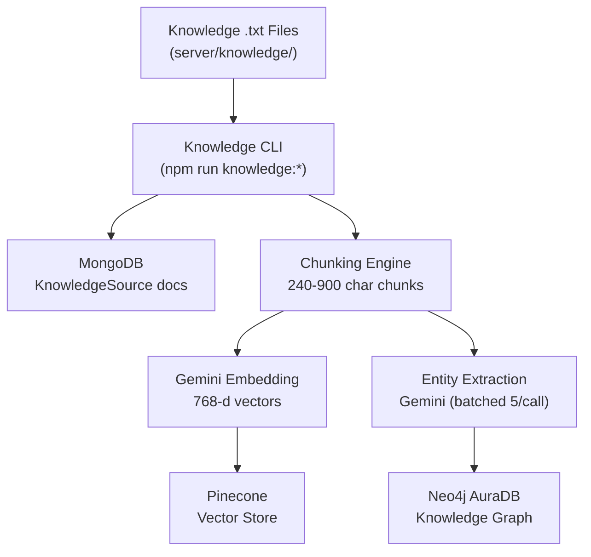
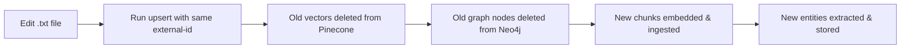

# Knowledge Management Guide

This guide covers how to add, update, and delete knowledge in Lumina's dual-store RAG system (Pinecone vectors + Neo4j graph).

## Table of Contents

- [Architecture Overview](#architecture-overview)
- [Knowledge File Structure](#knowledge-file-structure)
- [Adding New Knowledge](#adding-new-knowledge)
  - [Add a New Experience / Job](#add-a-new-experience--job)
  - [Add a New Project](#add-a-new-project)
  - [Add a New Publication](#add-a-new-publication)
  - [Add a New Skill](#add-a-new-skill)
  - [Add a New Certification](#add-a-new-certification)
  - [Add a Completely New Knowledge File](#add-a-completely-new-knowledge-file)
- [Updating Existing Knowledge](#updating-existing-knowledge)
- [Deleting Knowledge](#deleting-knowledge)
- [Bulk Operations](#bulk-operations)
  - [Full Rebuild (Nuclear Option)](#full-rebuild-nuclear-option)
  - [Manifest Sync](#manifest-sync)
- [CLI Reference](#cli-reference)
- [Troubleshooting](#troubleshooting)

---

## Architecture Overview



Every knowledge update flows through this pipeline:
1. **Edit the `.txt` file** in `server/knowledge/`
2. **Run the CLI upsert** — this re-chunks, re-embeds (Pinecone), re-extracts entities (Neo4j), and updates MongoDB
3. Both stores are always kept in sync via the CLI

---

## Knowledge File Structure

```
server/knowledge/
├── manifest.json                        # Manifest for batch sync
├── son-nguyen-profile.txt               # Bio, education, work experience
├── son-nguyen-alias.txt                 # Name aliases
├── son-nguyen-projects.txt              # All 87+ projects (detailed)
├── son-nguyen-skills.txt                # Skills by category
├── son-nguyen-publications.txt          # Research papers
├── son-nguyen-honors-awards.txt         # Awards, distinctions
├── son-nguyen-certifications.txt        # Professional certifications
├── son-nguyen-volunteering.txt          # Volunteer roles
├── son-nguyen-coursework.txt            # University coursework
├── son-nguyen-languages-organizations.txt  # Languages & orgs
└── son-nguyen-test-scores.txt           # Standardized test scores
```

**Rules:**
- Each file covers ONE topic — no overlap between files
- Profile has experience only (no projects, no skills)
- Projects file has ALL projects (no projects in profile)
- Skills file has ALL skills (no skills listed elsewhere)

---

## Adding New Knowledge

All commands run from the `server/` directory.

### Add a New Experience / Job

1. Edit `server/knowledge/son-nguyen-profile.txt`
2. Add the new role in the WORK EXPERIENCE section (reverse chronological order)
3. Re-ingest:

```bash
npm run knowledge:upsert -- \
  --title "Son Nguyen Profile" \
  --file ./knowledge/son-nguyen-profile.txt \
  --type bio \
  --external-id "profile"
```

### Add a New Project

1. Edit `server/knowledge/son-nguyen-projects.txt`
2. Add the project under the appropriate category section using this format:

```
Project: [Project Name]
Category: [AI/ML & Agentic AI | Full-Stack Web Applications | Developer Tools | etc.]
Description: [3-6 sentences about what it does, key features, notable aspects]
Tech Stack: [comprehensive list of technologies]
GitHub: https://github.com/hoangsonww/[repo-name]
Live: [URL if deployed]
Stars: [count if notable]
```

3. Re-ingest:

```bash
npm run knowledge:upsert -- \
  --title "Son Nguyen Projects" \
  --file ./knowledge/son-nguyen-projects.txt \
  --type project \
  --external-id "projects"
```

### Add a New Publication

1. Edit `server/knowledge/son-nguyen-publications.txt`
2. Add the publication with title, venue, date, description, and ResearchGate link
3. Re-ingest:

```bash
npm run knowledge:upsert -- \
  --title "Son Nguyen Publications" \
  --file ./knowledge/son-nguyen-publications.txt \
  --type other \
  --external-id "publications"
```

### Add a New Skill

1. Edit `server/knowledge/son-nguyen-skills.txt`
2. Add the skill under the appropriate category
3. Re-ingest:

```bash
npm run knowledge:upsert -- \
  --title "Son Nguyen Skills" \
  --file ./knowledge/son-nguyen-skills.txt \
  --type other \
  --external-id "skills"
```

### Add a New Certification

1. Edit `server/knowledge/son-nguyen-certifications.txt`
2. Add the certification with issuer, date, and URL
3. Re-ingest:

```bash
npm run knowledge:upsert -- \
  --title "Son Nguyen Certifications" \
  --file ./knowledge/son-nguyen-certifications.txt \
  --type other \
  --external-id "certifications"
```

### Add a Completely New Knowledge File

1. Create a new `.txt` file in `server/knowledge/`
2. Add it to `server/knowledge/manifest.json`:

```json
{
  "externalId": "new-topic",
  "title": "Son Nguyen New Topic",
  "sourceType": "other",
  "file": "./knowledge/son-nguyen-new-topic.txt"
}
```

3. Ingest:

```bash
npm run knowledge:upsert -- \
  --title "Son Nguyen New Topic" \
  --file ./knowledge/son-nguyen-new-topic.txt \
  --type other \
  --external-id "new-topic"
```

---

## Updating Existing Knowledge



The `--external-id` flag is key. When you upsert with the same external-id:
- The existing MongoDB document is found and updated
- Old Pinecone vectors are deleted (`replaceExisting: true`)
- Old Neo4j nodes for that document are deleted
- New chunks are embedded and stored in both Pinecone and Neo4j

**Example — update the profile after getting a new job:**

```bash
# 1. Edit the file
vim server/knowledge/son-nguyen-profile.txt

# 2. Re-ingest (same external-id = update in place)
cd server
npm run knowledge:upsert -- \
  --title "Son Nguyen Profile" \
  --file ./knowledge/son-nguyen-profile.txt \
  --type bio \
  --external-id "profile"
```

---

## Deleting Knowledge

### Delete a Single Source

```bash
# Find the source ID
npm run knowledge:list

# Delete by ID (removes from MongoDB, Pinecone, and Neo4j)
npm run knowledge:delete -- --id <sourceId>
```

### Delete via REPL

```bash
npm run knowledge:repl
# Then:
knowledge> list
knowledge> delete <id>
```

### Delete Sources Not in Manifest

```bash
npm run knowledge:sync -- --manifest ./knowledge/manifest.json --delete-missing
```

This removes any source with an `externalId` that is NOT in the manifest. Useful for cleanup.

---

## Bulk Operations

### Full Rebuild (Nuclear Option)

Wipe everything and re-ingest from scratch. Use when:
- Knowledge files have been restructured
- Databases are corrupted or inconsistent
- Major changes across multiple files

```bash
cd server

# Step 1: Wipe all databases
node -e "
require('dotenv').config();
const mongoose = require('mongoose');
const KS = require('./dist/models/KnowledgeSource').default;
const { index } = require('./dist/services/pineconeClient');
const { resetGraph } = require('./dist/services/graphKnowledge');
const { initGraphSchema, closeNeo4j } = require('./dist/services/neo4jClient');
(async () => {
  await mongoose.connect(process.env.MONGODB_URI);
  await index.namespace('knowledge').deleteAll();
  await resetGraph();
  await initGraphSchema();
  await KS.deleteMany({});
  console.log('All databases wiped.');
  await closeNeo4j();
  await mongoose.disconnect();
  process.exit(0);
})();
"

# Step 2: Re-ingest all files (vectors only — fast, no rate limits)
NEO4J_URI="" npm run knowledge:sync -- --manifest ./knowledge/manifest.json

# Step 3: Rebuild the graph (entity extraction — uses batched calls)
npm run knowledge:graph:rebuild --clean
```

### Manifest Sync

The manifest file (`server/knowledge/manifest.json`) defines all knowledge sources. Use it for batch operations:

```bash
# Sync all sources defined in the manifest
npm run knowledge:sync -- --manifest ./knowledge/manifest.json

# Sync and delete any sources NOT in the manifest
npm run knowledge:sync -- --manifest ./knowledge/manifest.json --delete-missing
```

**Manifest format:**

```json
{
  "sources": [
    {
      "externalId": "profile",
      "title": "Son Nguyen Profile",
      "sourceType": "bio",
      "file": "./knowledge/son-nguyen-profile.txt"
    }
  ]
}
```

---

## CLI Reference

All commands run from `server/`:

| Command | Description |
|---------|-------------|
| `npm run knowledge:list` | List all sources with chunk counts |
| `npm run knowledge:repl` | Interactive REPL for managing sources |
| `npm run knowledge:upsert -- [flags]` | Add or update a single source |
| `npm run knowledge:delete -- --id <id>` | Delete a source from all stores |
| `npm run knowledge:sync -- --manifest <path>` | Batch sync from manifest |
| `npm run knowledge:graph:status` | Show Neo4j node/edge counts |
| `npm run knowledge:graph:rebuild` | Rebuild graph from existing sources |
| `npm run knowledge:graph:rebuild:clean` | Wipe graph then rebuild from scratch |
| `npm run knowledge:graph:reset` | Wipe graph completely |

### Upsert Flags

| Flag | Required | Description |
|------|----------|-------------|
| `--title` | Yes | Source title |
| `--file` | One of | Path to a .txt file |
| `--content` | One of | Inline text content |
| `--type` | No | `resume`, `bio`, `project`, `note`, `link`, `other` (default: `note`) |
| `--external-id` | Recommended | Stable ID for updates (same ID = update in place) |
| `--url` | No | Source URL for citations |
| `--tags` | No | Comma-separated tags |

---

## Troubleshooting

### Rate Limits on Gemini API

Entity extraction uses Gemini `generateContent` which has free-tier limits. The system handles this by:
- **Batched extraction** — 5 chunks per LLM call (reduces calls by 80%)
- **Model rotation** — cycles through 6 Gemini models
- **Retry with backoff** — retries on 429 errors

If you still hit limits:
1. Use a different API key from a new Google Cloud project
2. Or ingest vectors first (`NEO4J_URI="" npm run knowledge:sync ...`), then rebuild graph later (`npm run knowledge:graph:rebuild`)

### Pinecone Embedding Rate Limits

Embedding calls retry automatically with 3-second backoff (5 attempts). The 100 requests/minute quota is usually sufficient.

### Verifying Data Integrity

```bash
# Check all three stores match
npm run knowledge:list                    # MongoDB sources + chunk counts
npm run knowledge:graph:status            # Neo4j node/edge counts

# Pinecone vector count (should match total chunks)
node -e "
require('dotenv').config();
const { Pinecone } = require('@pinecone-database/pinecone');
new Pinecone({ apiKey: process.env.PINECONE_API_KEY })
  .index(process.env.PINECONE_INDEX_NAME)
  .describeIndexStats()
  .then(s => console.log('Pinecone vectors:', s.totalRecordCount));
"
```

**Expected:** MongoDB chunk count total = Pinecone vector count = Neo4j chunk count

### Graph Has Fewer Entities Than Expected

Run a clean graph rebuild to re-extract all entities:

```bash
npm run knowledge:graph:rebuild:clean
```

This wipes the graph and re-runs batched entity extraction on all sources.
