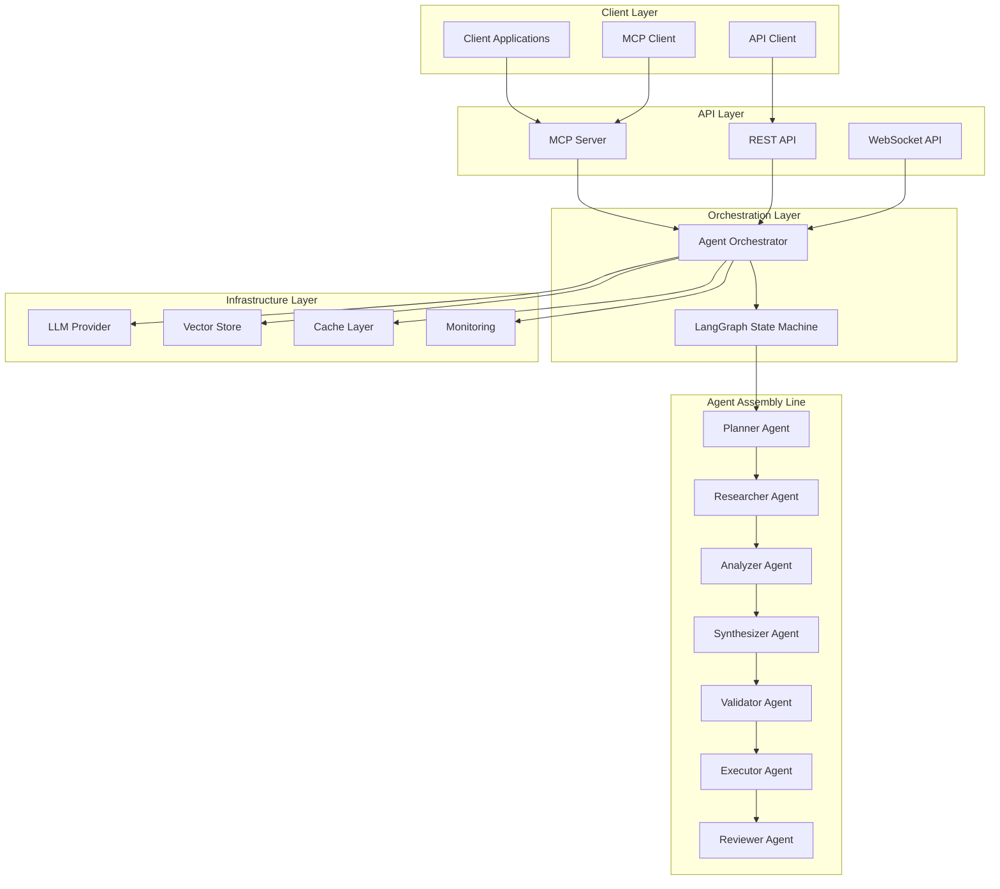
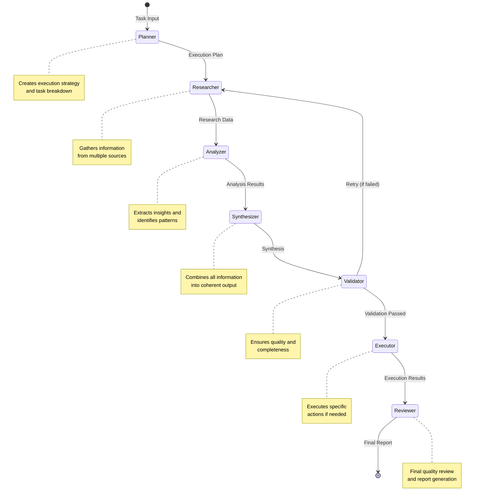
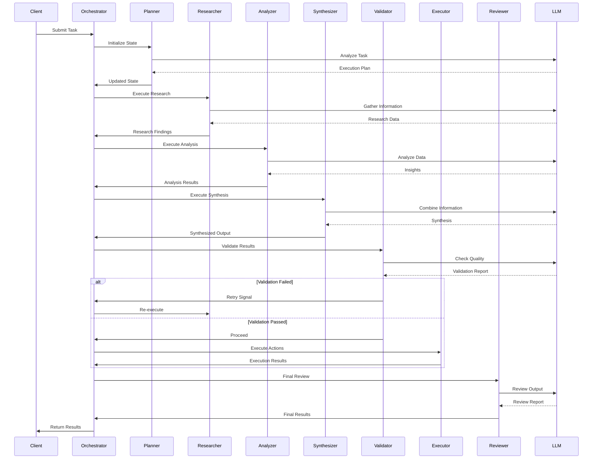
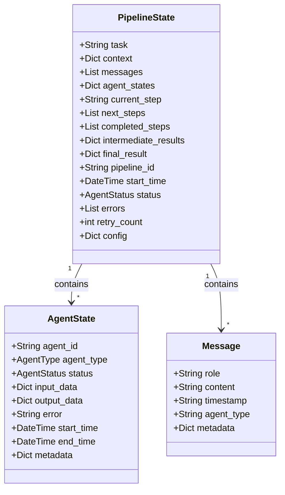

# Agentic AI Pipeline

A sophisticated, production-ready multi-agent AI system built with LangGraph and LangChain, featuring an assembly line architecture for complex task execution.

[](https://www.python.org/downloads/)
[](https://opensource.org/licenses/MIT)

## 🌟 Features

- **Multi-Agent Orchestration**: Seven specialized agents working in an assembly line
- **LangGraph Integration**: State-of-the-art graph-based workflow orchestration
- **MCP Server**: Model Context Protocol server for seamless integration
- **Production Ready**: Comprehensive logging, monitoring, and error handling
- **Cloud Deployments**: Ready-to-use configurations for AWS and Azure
- **Scalable Architecture**: Built for high-performance and concurrent execution
- **Flexible Configuration**: YAML-based configuration for easy customization

## 📋 Table of Contents

- [Architecture](#architecture)
- [System Components](#system-components)
- [Installation](#installation)
- [Quick Start](#quick-start)
- [Configuration](#configuration)
- [Deployment](#deployment)
- [MCP Server](#mcp-server)
- [API Reference](#api-reference)
- [Development](#development)
- [Monitoring](#monitoring)
- [Contributing](#contributing)

## 🏗️ Architecture

### High-Level System Architecture



### Assembly Line Agent Flow



### Data Flow Diagram



### State Management



## 🧩 System Components

### 1. Planner Agent
**Purpose**: Analyzes tasks and creates execution plans

**Responsibilities**:
- Break down complex tasks into steps
- Determine agent workflow
- Identify dependencies
- Estimate complexity

**Output**: Structured execution plan with agent sequence

### 2. Researcher Agent
**Purpose**: Gathers information from various sources

**Responsibilities**:
- Search documents and databases
- Query external APIs
- Collect relevant information
- Structure findings

**Output**: Comprehensive research findings with key points

### 3. Analyzer Agent
**Purpose**: Analyzes data and extracts insights

**Responsibilities**:
- Identify patterns and trends
- Extract meaningful insights
- Draw conclusions
- Identify information gaps

**Output**: Detailed analysis with insights and recommendations

### 4. Synthesizer Agent
**Purpose**: Combines information from multiple agents

**Responsibilities**:
- Integrate findings from all agents
- Create coherent summaries
- Resolve contradictions
- Identify actionable items

**Output**: Comprehensive synthesis with key takeaways

### 5. Validator Agent
**Purpose**: Validates results and ensures quality

**Responsibilities**:
- Check accuracy and completeness
- Assess coherence and relevance
- Identify issues
- Provide improvement suggestions

**Output**: Validation report with quality scores

### 6. Executor Agent
**Purpose**: Executes specific actions or commands

**Responsibilities**:
- Execute API calls
- Perform file operations
- Run system commands
- Handle tool interactions

**Output**: Execution results with success metrics

### 7. Reviewer Agent
**Purpose**: Final quality review and report generation

**Responsibilities**:
- Comprehensive quality assessment
- Task alignment verification
- Final recommendations
- Report generation

**Output**: Final results with quality score and recommendations

## 🚀 Installation

### Prerequisites

- Python 3.11 or higher
- pip or poetry
- Docker (for containerized deployment)
- AWS CLI or Azure CLI (for cloud deployment)

### Basic Installation

```bash
# Clone the repository
cd agentic_ai

# Install dependencies
pip install -r requirements.txt

# Set up environment variables
cp .env.example .env
# Edit .env with your API keys
```

### Development Installation

```bash
# Install with development dependencies
pip install -r requirements.txt
pip install -e .

# Install pre-commit hooks
pre-commit install
```

## 🎯 Quick Start

### Basic Usage

```python
from agentic_ai import AgenticPipeline

# Initialize pipeline
pipeline = AgenticPipeline(
    config_path="config/default_config.yaml"
)

# Run a task
result = await pipeline.run(
    task="Analyze the impact of AI on healthcare",
    context={
        "focus": "patient outcomes",
        "timeframe": "last 5 years"
    }
)

print(f"Summary: {result['summary']}")
print(f"Quality Score: {result['quality_score']}")
```

### Streaming Execution

```python
# Stream pipeline execution
async for update in pipeline.stream(
    task="Research renewable energy trends"
):
    print(f"Current step: {update['current_step']}")
    print(f"Status: {update['status']}")
```

### Using the MCP Server

```bash
# Start MCP server
python -m agentic_ai.mcp_server.server --config config/production_config.yaml
```

## ⚙️ Configuration

### Configuration File Structure

```yaml
# LLM Configuration
llm:
  provider: "openai"  # openai, anthropic, azure
  model: "gpt-4"
  temperature: 0.7
  max_tokens: 4096

# Agent Configuration
agents:
  planner:
    enabled: true
    timeout: 60
  researcher:
    enabled: true
    timeout: 120
    tools:
      - search
      - document_retriever

# Pipeline Configuration
pipeline:
  max_retries: 3
  timeout_seconds: 600
  enable_parallel: false

# Monitoring Configuration
monitoring:
  enabled: true
  log_level: "INFO"
  export_path: "logs/metrics"
```

### Environment Variables

```bash
# Required
OPENAI_API_KEY=your-openai-key
ANTHROPIC_API_KEY=your-anthropic-key

# Optional
LANGCHAIN_API_KEY=your-langchain-key
LANGCHAIN_TRACING_V2=true
LOG_LEVEL=INFO
```

## 🌐 Deployment

### AWS Deployment

```bash
cd deployments/aws

# Set environment variables
export ENVIRONMENT=production
export AWS_REGION=us-east-1
export OPENAI_API_KEY=your-key

# Run deployment script
./deploy.sh
```

**Resources Created**:
- VPC with public/private subnets
- ECS Cluster with Fargate
- Application Load Balancer
- ECR Repository
- CloudWatch Logs
- Auto Scaling configuration

### Azure Deployment

```bash
cd deployments/azure

# Set environment variables
export ENVIRONMENT=production
export AZURE_LOCATION=eastus
export OPENAI_API_KEY=your-key

# Login to Azure
az login

# Run deployment script
./deploy.sh
```

**Resources Created**:
- Container App Environment
- Azure Container Registry
- Key Vault for secrets
- Storage Account
- Cosmos DB
- Log Analytics Workspace
- Application Insights

### Docker Deployment

```bash
# Build image
docker build -t agentic-ai:latest -f deployments/aws/Dockerfile .

# Run container
docker run -d \
  -p 8080:8080 \
  -e OPENAI_API_KEY=your-key \
  -e ENVIRONMENT=production \
  --name agentic-ai \
  agentic-ai:latest
```

## 🔌 MCP Server

The Model Context Protocol (MCP) server exposes the agentic AI pipeline as a service.

### Available Tools

1. **run_pipeline**: Execute the agentic AI pipeline
2. **get_pipeline_status**: Check pipeline execution status
3. **list_pipelines**: List all active pipelines
4. **get_graph_visualization**: Get pipeline graph visualization

### Available Resources

1. **agentic://pipeline/config**: Pipeline configuration
2. **agentic://pipeline/metrics**: Execution metrics

### Available Prompts

1. **analyze_task**: Analyze and plan task execution
2. **research_topic**: Comprehensive topic research

### Example Usage

```python
from mcp import Client

# Connect to MCP server
client = Client("stdio://agentic-ai-pipeline")

# Run pipeline
result = await client.call_tool(
    "run_pipeline",
    {
        "task": "Analyze market trends",
        "context": {"industry": "technology"}
    }
)
```

## 📊 Monitoring

### Metrics Collection

The pipeline automatically collects:
- Pipeline execution counts
- Success/failure rates
- Agent execution times
- Error rates and types
- Resource utilization

### Accessing Metrics

```python
# Get metrics summary
summary = pipeline.orchestrator.monitor.get_summary()

# Export metrics to file
filepath = pipeline.orchestrator.monitor.export_metrics()

# Get agent-specific metrics
agent_metrics = pipeline.orchestrator.monitor.get_agent_metrics("researcher")
```

### CloudWatch/Application Insights

Metrics are automatically exported to:
- **AWS**: CloudWatch Logs and Metrics
- **Azure**: Application Insights and Log Analytics

### Visualization

```python
# Get Mermaid diagram of pipeline
graph = pipeline.get_graph_visualization()
print(graph)
```

## 🧪 Testing

```bash
# Run all tests
pytest

# Run with coverage
pytest --cov=agentic_ai --cov-report=html

# Run specific test file
pytest tests/test_agents.py

# Run with verbose output
pytest -v
```

## 🔧 Development

### Project Structure

```
agentic_ai/
├── __init__.py
├── agents/                 # Agent implementations
│   ├── base.py
│   ├── planner.py
│   ├── researcher.py
│   ├── analyzer.py
│   ├── synthesizer.py
│   ├── validator.py
│   ├── executor.py
│   └── reviewer.py
├── core/                   # Core pipeline components
│   ├── pipeline.py
│   ├── state.py
│   └── orchestrator.py
├── mcp_server/            # MCP server implementation
│   ├── server.py
│   └── handlers.py
├── config/                # Configuration files
│   ├── default_config.yaml
│   └── production_config.yaml
├── deployments/           # Deployment configurations
│   ├── aws/
│   └── azure/
├── utils/                 # Utility modules
│   ├── logger.py
│   └── monitoring.py
└── tests/                # Test suite
```

### Code Style

```bash
# Format code
black agentic_ai/

# Sort imports
isort agentic_ai/

# Type checking
mypy agentic_ai/

# Linting
flake8 agentic_ai/
```

## 📈 Performance

### Optimization Tips

1. **Enable Caching**: Set `enable_caching: true` in configuration
2. **Use Parallel Execution**: Set `enable_parallel: true` for independent tasks
3. **Adjust Timeouts**: Configure appropriate timeouts for each agent
4. **Resource Allocation**: Increase CPU/memory for high-load scenarios
5. **Connection Pooling**: Configure database and API connection pools

### Benchmarks

Typical performance metrics:
- Simple tasks: 10-30 seconds
- Medium complexity: 30-90 seconds
- Complex tasks: 90-180 seconds

*Actual performance depends on task complexity, LLM provider, and infrastructure.*

## 🛡️ Security

- API keys stored in Key Vault/Secrets Manager
- HTTPS/TLS encryption in transit
- Role-based access control (RBAC)
- Network isolation with private subnets
- Security scanning of container images
- Regular dependency updates

## 📝 License

This project is licensed under the MIT License - see the LICENSE file for details.

## 🤝 Contributing

Contributions are welcome! Please read our contributing guidelines before submitting PRs.

## 📞 Support

For questions and support:
- Open an issue on GitHub
- Check the documentation
- Join our community Discord

## 🙏 Acknowledgments

Built with:
- [LangChain](https://langchain.com/)
- [LangGraph](https://github.com/langchain-ai/langgraph)
- [OpenAI](https://openai.com/)
- [Anthropic](https://anthropic.com/)

---

**Made with ❤️ by the AI RAG Assistant Team**
