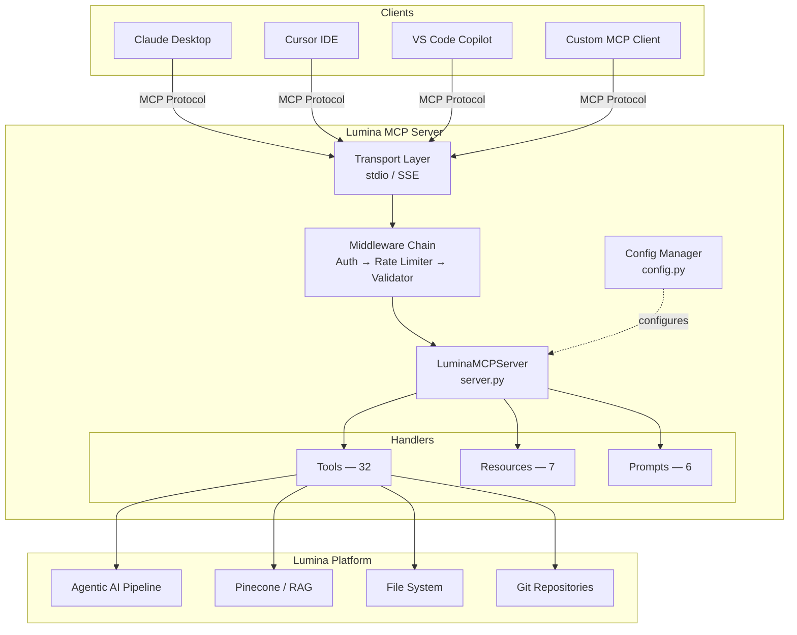

# Lumina MCP Server

[](https://modelcontextprotocol.io)
[](https://python.org)
[](../LICENSE)
[]()
[]()
[]()

A standalone, enterprise-grade **Model Context Protocol (MCP)** server for the Lumina AI platform. Exposes 32 tools, 7 resources, and 6 prompts across eight capability domains—enabling any MCP-compatible client to orchestrate agentic pipelines, query a RAG knowledge base, manipulate files, analyze code, and more.

---

## Table of Contents

- [Overview](#overview)
- [Features](#features)
- [Quick Start](#quick-start)
- [Architecture](#architecture)
- [Tool Reference](#tool-reference)
  - [Pipeline Tools](#pipeline-tools)
  - [Knowledge Tools](#knowledge-tools)
  - [Code Tools](#code-tools)
  - [File Tools](#file-tools)
  - [Web Tools](#web-tools)
  - [Data Tools](#data-tools)
  - [Git Tools](#git-tools)
  - [System Tools](#system-tools)
- [Resources Reference](#resources-reference)
- [Prompts Reference](#prompts-reference)
- [Configuration Reference](#configuration-reference)
- [Transport Protocols](#transport-protocols)
- [Middleware](#middleware)
- [Integration Guide](#integration-guide)
- [MCP Client Integration](#mcp-client-integration)
- [Development](#development)
- [API Reference Summary](#api-reference-summary)
- [Troubleshooting](#troubleshooting)
- [License](#license)

---

## Overview

The **Model Context Protocol (MCP)** is an open standard that provides a uniform interface for AI assistants to discover and invoke tools, read resources, and use prompt templates hosted by external servers. Lumina MCP Server implements this standard so that clients such as Claude Desktop, Cursor, VS Code Copilot, ChatGPT, and custom applications can interact with the full Lumina platform through a single, well-defined protocol layer.

The server is written in async Python, supports **stdio** and **SSE** transports, and ships with pluggable middleware for authentication, rate limiting, and input validation.

---

## Features

| Category | Highlights |
|---|---|
| **32 Tools** | Pipeline orchestration, RAG knowledge search, code analysis, file I/O, web retrieval, data processing, Git operations, system diagnostics |
| **7 Resources** | Live pipeline config/metrics/agents, knowledge manifest/stats, system info/capabilities |
| **6 Prompts** | Task analysis, research, code review, debugging, project summary, data analysis |
| **Dual Transport** | stdio for local IDE integration; SSE for remote/network access |
| **Middleware** | API-key authentication, token-bucket rate limiting, JSON Schema validation |
| **Dynamic Registry** | Tools, resources, and prompts auto-discovered at startup from modular handler files |
| **YAML Config** | Deep-merge configuration: defaults → file → environment variables |
| **Structured Logging** | JSON-formatted logs with configurable levels |

---

## Quick Start

### Prerequisites

- Python 3.10 or later
- pip

### Install

```bash
pip install -r mcp_server/requirements.txt
```

### Run with stdio transport (default)

```bash
python -m mcp_server
```

### Run with a custom configuration file

```bash
python -m mcp_server --config mcp_server/config/production.yaml
```

### Run with SSE transport for remote access

```bash
python -m mcp_server --transport sse --host 0.0.0.0 --port 8080
```

### CLI Flags

| Flag | Default | Description |
|---|---|---|
| `--config` | `config/default.yaml` | Path to YAML configuration file |
| `--transport` | `stdio` | Transport protocol (`stdio` or `sse`) |
| `--host` | `127.0.0.1` | Bind address (SSE only) |
| `--port` | `8080` | Listen port (SSE only) |
| `--log-level` | `INFO` | Logging level (`DEBUG`, `INFO`, `WARNING`, `ERROR`) |

---

## Architecture



### Package Structure

```
mcp_server/
├── __init__.py                  # Package init — exports LuminaMCPServer, version "1.0.0"
├── __main__.py                  # CLI entry point: python -m mcp_server
├── server.py                    # Core server class, handler registration, transport lifecycle
├── config.py                    # ServerConfig — deep merge, env overrides, dot-notation access
├── tools/
│   ├── __init__.py              # _ToolRegistry.build(cfg) — dynamic category loader
│   ├── base.py                  # Abstract ToolHandler(ABC): name, description, input_schema, handle()
│   ├── pipeline_tools.py        # 5 tools — pipeline orchestration
│   ├── knowledge_tools.py       # 4 tools — RAG knowledge base
│   ├── code_tools.py            # 3 tools — code search and analysis
│   ├── file_tools.py            # 5 tools — file system operations
│   ├── web_tools.py             # 2 tools — HTTP fetch and content extraction
│   ├── data_tools.py            # 3 tools — CSV/JSON parsing and transforms
│   ├── git_tools.py             # 4 tools — Git repository operations
│   └── system_tools.py          # 6 tools — health, metrics, diagnostics
├── resources/
│   ├── __init__.py              # ResourceRegistry.build(cfg) — dynamic loader
│   ├── base.py                  # Abstract ResourceHandler(ABC)
│   ├── pipeline_resources.py    # lumina://pipeline/{config,metrics,agents}
│   ├── knowledge_resources.py   # lumina://knowledge/{manifest,stats}
│   └── system_resources.py      # lumina://system/{info,capabilities}
├── prompts/
│   ├── __init__.py              # PromptRegistry.build(cfg) — dynamic loader
│   ├── base.py                  # Abstract PromptHandler(ABC)
│   └── prompt_library.py        # 6 prompt templates
├── middleware/
│   ├── __init__.py              # MiddlewareChain — composes auth + rate_limiter + validator
│   ├── auth.py                  # API key authentication via MCP_API_KEY
│   ├── rate_limiter.py          # Token-bucket rate limiter, per-tool and per-resource
│   └── validator.py             # JSON Schema input validation
├── utils/
│   ├── __init__.py
│   ├── errors.py                # MCPError hierarchy
│   └── logger.py                # Structured JSON logging setup
├── config/
│   ├── default.yaml             # Default configuration
│   └── production.yaml          # Production overrides
└── requirements.txt             # Dependencies: mcp>=1.0.0, pyyaml, aiohttp, etc.
```

---

## Tool Reference

The server exposes **32 tools** organized into eight categories. Each tool is implemented as a subclass of `ToolHandler(ABC)` and is auto-registered at startup by `_ToolRegistry.build(cfg)`.

### Pipeline Tools

Module: `tools/pipeline_tools.py` — orchestrate and monitor the Lumina agentic AI pipeline.

#### `run_pipeline`

Execute the agentic AI pipeline with a given task.

| Parameter | Type | Required | Default | Description |
|---|---|---|---|---|
| `task` | string | ✅ | — | Task description for the pipeline to execute |
| `context` | object | — | `{}` | Additional context passed to the pipeline agents |
| `config_overrides` | object | — | `{}` | Runtime overrides for the pipeline configuration |

#### `get_pipeline_status`

Check the execution status of a specific pipeline run.

| Parameter | Type | Required | Default | Description |
|---|---|---|---|---|
| `pipeline_id` | string | ✅ | — | Unique identifier of the pipeline run |

#### `list_pipelines`

List all tracked pipeline runs with optional filtering.

| Parameter | Type | Required | Default | Description |
|---|---|---|---|---|
| `status_filter` | string | — | — | Filter by status: `"running"`, `"completed"`, or `"failed"` |
| `limit` | integer | — | `10` | Maximum number of results to return |

#### `cancel_pipeline`

Cancel a currently running pipeline.

| Parameter | Type | Required | Default | Description |
|---|---|---|---|---|
| `pipeline_id` | string | ✅ | — | Unique identifier of the pipeline to cancel |
| `reason` | string | — | — | Human-readable cancellation reason |

#### `get_pipeline_graph`

Retrieve a visualization of the pipeline execution graph.

| Parameter | Type | Required | Default | Description |
|---|---|---|---|---|
| `format` | string | — | `"mermaid"` | Output format: `"mermaid"` or `"json"` |

---

### Knowledge Tools

Module: `tools/knowledge_tools.py` — search and retrieve documents from the RAG knowledge base.

#### `search_knowledge`

Perform a semantic search against the RAG knowledge base.

| Parameter | Type | Required | Default | Description |
|---|---|---|---|---|
| `query` | string | ✅ | — | Natural-language search query |
| `top_k` | integer | — | `5` | Number of results to return |
| `filter_type` | string | — | — | Filter results by knowledge source type |

#### `list_knowledge_sources`

List all ingested knowledge sources.

| Parameter | Type | Required | Default | Description |
|---|---|---|---|---|
| `source_type` | string | — | — | Filter by source type |
| `limit` | integer | — | `20` | Maximum number of sources to return |

#### `get_knowledge_document`

Retrieve a specific knowledge document by ID.

| Parameter | Type | Required | Default | Description |
|---|---|---|---|---|
| `document_id` | string | ✅ | — | Unique identifier of the document |
| `include_vectors` | boolean | — | `false` | Include raw embedding vectors in the response |

#### `similarity_search`

Perform a vector similarity search with configurable threshold.

| Parameter | Type | Required | Default | Description |
|---|---|---|---|---|
| `query` | string | ✅ | — | Natural-language query to embed and search |
| `top_k` | integer | — | `10` | Number of results to return |
| `threshold` | number | — | `0.7` | Minimum similarity score (0.0–1.0) |
| `namespace` | string | — | — | Pinecone namespace to search within |

---

### Code Tools

Module: `tools/code_tools.py` — search, analyze, and explore source code.

#### `search_code`

Search code files using regex patterns and glob filters.

| Parameter | Type | Required | Default | Description |
|---|---|---|---|---|
| `pattern` | string | ✅ | — | Regex pattern to search for |
| `path` | string | — | `"."` | Root directory to search from |
| `file_glob` | string | — | — | Glob pattern to filter files (e.g., `"*.py"`) |
| `max_results` | integer | — | `50` | Maximum number of matches to return |

#### `analyze_file`

Analyze a source code file for structure and complexity metrics.

| Parameter | Type | Required | Default | Description |
|---|---|---|---|---|
| `file_path` | string | ✅ | — | Path to the file to analyze |
| `include_metrics` | boolean | — | `true` | Include complexity and size metrics |

#### `get_project_structure`

Generate a directory tree of a project.

| Parameter | Type | Required | Default | Description |
|---|---|---|---|---|
| `root_path` | string | — | `"."` | Root directory of the project |
| `max_depth` | integer | — | `3` | Maximum directory depth to traverse |
| `exclude_patterns` | array\<string\> | — | — | Glob patterns to exclude (e.g., `["node_modules", ".git"]`) |

---

### File Tools

Module: `tools/file_tools.py` — read, write, and search files on the local file system.

#### `read_file`

Read the contents of a file.

| Parameter | Type | Required | Default | Description |
|---|---|---|---|---|
| `path` | string | ✅ | — | Path to the file |
| `encoding` | string | — | `"utf-8"` | Character encoding |
| `line_range` | array `[start, end]` | — | — | Return only lines in this range (1-indexed) |

#### `write_file`

Write content to a file, creating directories if needed.

| Parameter | Type | Required | Default | Description |
|---|---|---|---|---|
| `path` | string | ✅ | — | Destination file path |
| `content` | string | ✅ | — | Content to write |
| `create_dirs` | boolean | — | `false` | Create parent directories if they don't exist |
| `mode` | string | — | `"overwrite"` | Write mode: `"overwrite"` or `"append"` |

#### `list_directory`

List the contents of a directory.

| Parameter | Type | Required | Default | Description |
|---|---|---|---|---|
| `path` | string | — | `"."` | Directory path |
| `recursive` | boolean | — | `false` | List contents recursively |
| `include_hidden` | boolean | — | `false` | Include hidden files and directories |

#### `file_info`

Get metadata about a file (size, modified timestamp, MIME type).

| Parameter | Type | Required | Default | Description |
|---|---|---|---|---|
| `path` | string | ✅ | — | Path to the file |

#### `search_files`

Search for files by name pattern.

| Parameter | Type | Required | Default | Description |
|---|---|---|---|---|
| `pattern` | string | ✅ | — | Glob pattern to match file names |
| `path` | string | — | `"."` | Root directory to search from |
| `max_results` | integer | — | `100` | Maximum number of matches to return |

---

### Web Tools

Module: `tools/web_tools.py` — fetch and extract content from the web.

#### `fetch_url`

Fetch content from a URL using HTTP.

| Parameter | Type | Required | Default | Description |
|---|---|---|---|---|
| `url` | string | ✅ | — | URL to fetch |
| `method` | string | — | `"GET"` | HTTP method |
| `headers` | object | — | — | Custom HTTP headers |
| `timeout` | integer | — | `30` | Request timeout in seconds |

#### `extract_content`

Extract structured content from an HTML page.

| Parameter | Type | Required | Default | Description |
|---|---|---|---|---|
| `url` | string | ✅ | — | URL of the page to extract from |
| `selector` | string | — | — | CSS selector to target specific elements |
| `format` | string | — | `"text"` | Output format: `"text"`, `"markdown"`, or `"html"` |

---

### Data Tools

Module: `tools/data_tools.py` — parse and transform structured data.

#### `parse_csv`

Parse a CSV file into structured data.

| Parameter | Type | Required | Default | Description |
|---|---|---|---|---|
| `file_path` | string | ✅ | — | Path to the CSV file |
| `delimiter` | string | — | `","` | Column delimiter character |
| `has_header` | boolean | — | `true` | Whether the first row is a header |
| `max_rows` | integer | — | — | Maximum number of rows to parse |

#### `parse_json`

Parse a JSON file and optionally query it with JSONPath.

| Parameter | Type | Required | Default | Description |
|---|---|---|---|---|
| `file_path` | string | ✅ | — | Path to the JSON file |
| `json_path` | string | — | — | JSONPath expression to extract a subset |

#### `transform_data`

Apply a sequence of transformations to an array of data.

| Parameter | Type | Required | Default | Description |
|---|---|---|---|---|
| `data` | array | ✅ | — | Input data array |
| `operations` | array\<object\> | ✅ | — | Ordered list of operations: `{type: "filter"\|"sort"\|"group"\|"map", ...}` |

---

### Git Tools

Module: `tools/git_tools.py` — interact with Git repositories.

#### `git_status`

Get the working tree status of a repository.

| Parameter | Type | Required | Default | Description |
|---|---|---|---|---|
| `repo_path` | string | — | `"."` | Path to the Git repository |

#### `git_log`

Retrieve commit history.

| Parameter | Type | Required | Default | Description |
|---|---|---|---|---|
| `repo_path` | string | — | `"."` | Path to the Git repository |
| `max_count` | integer | — | `10` | Maximum number of commits to return |
| `branch` | string | — | — | Branch name to list commits from |
| `author` | string | — | — | Filter by author name or email |

#### `git_diff`

Get the diff between two refs.

| Parameter | Type | Required | Default | Description |
|---|---|---|---|---|
| `repo_path` | string | — | `"."` | Path to the Git repository |
| `ref1` | string | — | `"HEAD"` | First ref (commit, branch, or tag) |
| `ref2` | string | — | — | Second ref (omit for working tree diff) |
| `file_path` | string | — | — | Limit diff to a specific file |

#### `git_blame`

Get blame information for a file.

| Parameter | Type | Required | Default | Description |
|---|---|---|---|---|
| `file_path` | string | ✅ | — | Path to the file |
| `repo_path` | string | — | `"."` | Path to the Git repository |

---

### System Tools

Module: `tools/system_tools.py` — health checks, metrics, and diagnostics.

#### `health_check`

Verify the server is running and responsive. Takes no parameters.

#### `system_info`

Return system information including OS, Python version, memory, and CPU.

| Parameter | Type | Required | Default | Description |
|---|---|---|---|---|
| `include_env` | boolean | — | `false` | Include environment variables in the response |

#### `get_server_config`

Retrieve the current server configuration.

| Parameter | Type | Required | Default | Description |
|---|---|---|---|---|
| `section` | string | — | — | Return only a specific config section |

#### `get_server_metrics`

Retrieve server performance metrics.

| Parameter | Type | Required | Default | Description |
|---|---|---|---|---|
| `period` | string | — | `"1h"` | Time window: `"1h"`, `"24h"`, or `"7d"` |

#### `list_available_tools`

List all tools registered on the server.

| Parameter | Type | Required | Default | Description |
|---|---|---|---|---|
| `category` | string | — | — | Filter by tool category |

#### `environment_check`

Verify environment setup and dependency availability. Takes no parameters.

---

## Resources Reference

Resources are read-only data endpoints accessed via `lumina://` URIs. Clients call `resources/read` with the URI to retrieve structured data.

| URI | Module | Description |
|---|---|---|
| `lumina://pipeline/config` | `pipeline_resources.py` | Current pipeline configuration including agent definitions, task routing, and execution parameters |
| `lumina://pipeline/metrics` | `pipeline_resources.py` | Pipeline execution metrics: run counts, durations, success/failure rates |
| `lumina://pipeline/agents` | `pipeline_resources.py` | List of registered agents with their roles, capabilities, and status |
| `lumina://knowledge/manifest` | `knowledge_resources.py` | Complete manifest of all ingested knowledge sources, types, and sync timestamps |
| `lumina://knowledge/stats` | `knowledge_resources.py` | Knowledge base statistics: document count, vector dimensions, index size |
| `lumina://system/info` | `system_resources.py` | System information: OS, Python version, memory, CPU, uptime |
| `lumina://system/capabilities` | `system_resources.py` | Server capability summary: supported tools, resources, prompts, and protocol features |

---

## Prompts Reference

Prompts are reusable, parameterized templates that clients can discover via `prompts/list` and invoke via `prompts/get`. Each prompt returns a structured message sequence for the LLM.

| Prompt | Arguments | Description |
|---|---|---|
| `analyze_task` | `task_description` (string, required) | Analyze a task and produce a structured execution plan with steps, dependencies, and tool recommendations |
| `research_topic` | `topic` (string, required), `depth` (string, optional — default `"comprehensive"`) | Research a topic using the available tool suite and compile findings |
| `code_review` | `file_path` (string, required), `focus_areas` (string, optional — default `"all"`) | Review a source file for code quality, security vulnerabilities, and best practices |
| `debug_issue` | `issue_description` (string, required), `error_logs` (string, optional — default `""`) | Systematically debug an issue using log analysis and code inspection |
| `summarize_project` | `project_path` (string, optional — default `"."`) | Generate a comprehensive project summary including structure, dependencies, and key components |
| `analyze_data` | `data_source` (string, required), `analysis_type` (string, optional — default `"exploratory"`) | Analyze a data file and provide statistical insights, patterns, and visualizations |

---

## Configuration Reference

Configuration is loaded using a **deep-merge** strategy: defaults → config file → environment variables (highest priority).

### YAML Structure

```yaml
server:
  name: "lumina-mcp-server"
  version: "1.0.0"

tools:
  pipeline: true          # Enable/disable entire tool categories
  knowledge: true
  code: true
  file: true
  web: true
  data: true
  git: true
  system: true

resources:
  pipeline: true
  knowledge: true
  system: true

prompts:
  enabled: true

middleware:
  auth:
    enabled: false        # Set to true and provide MCP_API_KEY to enforce
  rate_limit:
    enabled: true
    requests_per_minute: 60
  validator:
    enabled: true

logging:
  level: "INFO"
  format: "json"          # "json" or "text"
```

### Environment Variable Overrides

| Variable | Config Path | Description |
|---|---|---|
| `MCP_SERVER_NAME` | `server.name` | Override the server name |
| `MCP_LOG_LEVEL` | `logging.level` | Set log level (`DEBUG`, `INFO`, `WARNING`, `ERROR`) |
| `MCP_RATE_LIMIT` | `middleware.rate_limit.requests_per_minute` | Override the global rate limit (requests per minute) |
| `MCP_API_KEY` | `middleware.auth.api_key` | API key for authentication; also enables auth middleware |

### Config File Locations

| File | Purpose |
|---|---|
| `config/default.yaml` | Shipped defaults — do not edit in production |
| `config/production.yaml` | Production overrides — committed to the repo |
| Custom path via `--config` | Any YAML file passed at startup |

### Dot-Notation Access

`ServerConfig` supports dot-notation access in code:

```python
from mcp_server.config import ServerConfig

cfg = ServerConfig("config/default.yaml")
print(cfg.server.name)                         # "lumina-mcp-server"
print(cfg.middleware.rate_limit.requests_per_minute)  # 60
```

---

## Transport Protocols

### stdio (default)

The stdio transport communicates over standard input/output and is the primary integration mode for local IDE clients. No network configuration is required.

```bash
python -m mcp_server                          # defaults to stdio
python -m mcp_server --transport stdio
```

**When to use:** Local integrations with Claude Desktop, Cursor IDE, VS Code Copilot, or any client that spawns the server as a subprocess.

### SSE (Server-Sent Events)

The SSE transport exposes an HTTP server for remote or networked access.

```bash
python -m mcp_server --transport sse --host 0.0.0.0 --port 8080
```

**When to use:** Shared development servers, remote access, multi-client scenarios, or containerized deployments where stdio is not practical.

| Endpoint | Description |
|---|---|
| `GET /sse` | SSE event stream for server-to-client messages |
| `POST /messages` | Client-to-server JSON-RPC messages |

---

## Middleware

All requests pass through a composable middleware chain before reaching the handler.

### Authentication

```yaml
middleware:
  auth:
    enabled: true
```

```bash
export MCP_API_KEY="your-secret-key"
python -m mcp_server
```

When enabled, every request must include a valid API key. Unauthenticated requests receive an `AuthError`.

### Rate Limiting

The token-bucket algorithm is applied per key, where the key is `tool:{name}` or `resource:{uri}`.

```yaml
middleware:
  rate_limit:
    enabled: true
    requests_per_minute: 60
```

Exceeding the limit returns a `RateLimitError` with a `Retry-After` hint.

### Input Validation

Every tool call is validated against the tool's `input_schema` (JSON Schema). Invalid arguments return a `ValidationError` with details about which fields failed.

```yaml
middleware:
  validator:
    enabled: true      # Enabled by default
```

### Error Hierarchy

All middleware and handler errors extend a common `MCPError` base:

| Error Class | HTTP Analogue | Raised When |
|---|---|---|
| `ToolError` | 500 | A tool handler raises an unhandled exception |
| `ResourceError` | 404 / 500 | A resource is not found or fails to load |
| `ConfigError` | 500 | Configuration is missing or malformed |
| `AuthError` | 401 | API key is missing or invalid |
| `RateLimitError` | 429 | Rate limit exceeded |
| `ValidationError` | 400 | Input fails JSON Schema validation |

---

## Integration Guide

### Claude Desktop

Add to your `claude_desktop_config.json`:

```json
{
  "mcpServers": {
    "lumina": {
      "command": "python",
      "args": ["-m", "mcp_server"],
      "cwd": "/path/to/AI-RAG-Assistant-Chatbot",
      "env": {
        "MCP_API_KEY": "your-key"
      }
    }
  }
}
```

### Cursor IDE

Add to your Cursor MCP settings:

```json
{
  "mcpServers": {
    "lumina": {
      "command": "python",
      "args": ["-m", "mcp_server", "--config", "mcp_server/config/production.yaml"],
      "cwd": "/path/to/AI-RAG-Assistant-Chatbot"
    }
  }
}
```

### VS Code Copilot

Add to `.vscode/mcp.json` in your workspace:

```json
{
  "servers": {
    "lumina": {
      "command": "python",
      "args": ["-m", "mcp_server"],
      "cwd": "${workspaceFolder}"
    }
  }
}
```

### Remote / SSE Client

For clients that connect over the network:

```bash
# Start the server
python -m mcp_server --transport sse --host 0.0.0.0 --port 8080

# Client connects to:
#   SSE stream:  http://<host>:8080/sse
#   Messages:    POST http://<host>:8080/messages
```

---

## MCP Client Integration

The `agentic_ai/` pipeline connects to the MCP server through the `mcp_client/` module, enabling agents to call tools as part of their execution workflow.


The MCP client can be configured to connect via either transport:

- **In-process (stdio):** The pipeline spawns the MCP server as a subprocess, communicating over stdin/stdout. This is the default for local development.
- **Remote (SSE):** The pipeline connects to a running SSE server over HTTP. Use this for containerized or distributed deployments.

---

## Development

### Adding a New Tool

1. **Create a handler** in the appropriate `tools/` module (or add a new module):

```python
from mcp_server.tools.base import ToolHandler

class MyTool(ToolHandler):
    name = "my_tool"
    description = "Does something useful"
    input_schema = {
        "type": "object",
        "properties": {
            "param": {"type": "string", "description": "A required param"}
        },
        "required": ["param"]
    }

    async def handle(self, arguments: dict) -> str:
        return f"Result for {arguments['param']}"
```

2. **Register it.** If you added a new module, include it in `tools/__init__.py` so `_ToolRegistry.build(cfg)` discovers it. Existing modules are auto-scanned.

3. **Test it** by starting the server and calling the tool from any MCP client.

### Adding a New Resource

Follow the same pattern in `resources/`, subclassing `ResourceHandler(ABC)`.

### Adding a New Prompt

Add a new entry in `prompts/prompt_library.py`, subclassing `PromptHandler(ABC)`.

### Code Style

- Async functions throughout (`async def handle`)
- Type hints on all public APIs
- Docstrings on handler classes

### Testing

```bash
# Compile check
python -m compileall mcp_server

# Run the server locally and test interactively
python -m mcp_server --log-level DEBUG
```

---

## API Reference Summary

| MCP Method | Server Capability | Count |
|---|---|---|
| `tools/list` | Lists all registered tools | 32 tools |
| `tools/call` | Invokes a tool by name with arguments | — |
| `resources/list` | Lists all available resources | 7 resources |
| `resources/read` | Reads a resource by URI | — |
| `prompts/list` | Lists all available prompts | 6 prompts |
| `prompts/get` | Retrieves a prompt with filled arguments | — |

---

## Troubleshooting

| Symptom | Likely Cause | Fix |
|---|---|---|
| `ModuleNotFoundError: mcp` | Dependencies not installed | Run `pip install -r mcp_server/requirements.txt` |
| `AuthError: Invalid API key` | `MCP_API_KEY` mismatch or not set | Verify the env var matches the client's configured key |
| `RateLimitError` on startup | Rate limit set too low | Increase `MCP_RATE_LIMIT` or set `middleware.rate_limit.enabled: false` |
| Server exits immediately | Config file not found | Check the `--config` path; ensure YAML syntax is valid |
| SSE connection refused | Wrong host/port or firewall | Verify `--host` and `--port`; check firewall rules |
| Tools not appearing in client | Category disabled in config | Set the category to `true` under `tools:` in config YAML |
| `ValidationError` on tool call | Arguments don't match `input_schema` | Check the tool reference above for required fields and types |
| Pipeline tools return errors | `agentic_ai` not installed or configured | Ensure the agentic pipeline dependencies are installed and config is set |
| Stale resource data | Cached responses | Restart the server or call `health_check` to verify liveness |

---

## License

This project is licensed under the MIT License. See the [LICENSE](../LICENSE) file for details.
